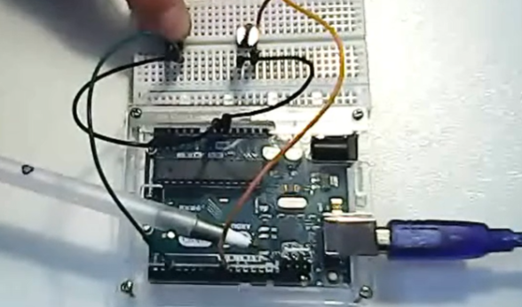
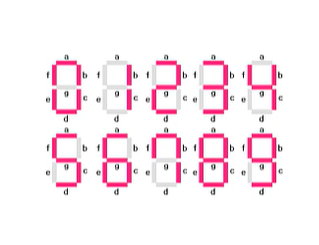
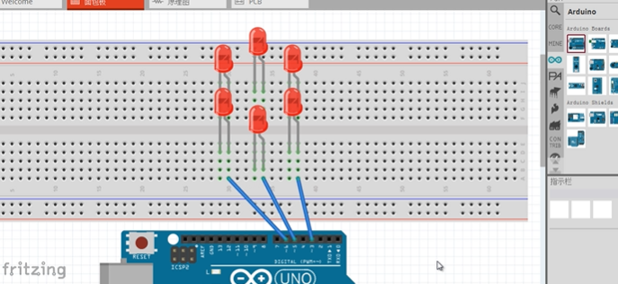

# Arduino入门

## 简介

Arduino入门知识，参考资料：

【太极创客】官网 http://www.taichi-maker.com/

【太极创客】零基础入门学用Arduino 第一部分 合辑  https://www.bilibili.com/video/BV164411J7GE

【科技传播坊】https://www.bilibili.com/video/BV1nx411U7Ht


[toc]

## **第1章	Arduino IDE**

### 1.1	官方下载地址

https://www.arduino.cc/en/software/

<center class="half">
    
    
</center>

### 1.2	程序运行流程


### 1.3	Arduino编程语句参考

【太极创客】http://www.taichi-maker.com/homepage/reference-index/arduino-code-reference/


【官方】https://www.arduino.cc/reference/en/


### 1.4	简单代码示例 OUTPUT

* 当引脚设置为**输出（OUTPUT）模式**时，引脚为低阻抗状态。这意味着Arduino可以向其它电路元器件提供电流。也就是说，Arduino引脚在输出（OUTPUT）模式下可以点亮LED或者驱动电机。（如果被驱动的电机需要超过40mA的电流，Arduino将需要三极管或其它辅助元件来驱动他们。）

```c++
// 当给开发板通电或者按下复位按钮后，setup函数运行一次
void setup() {
  // 初始化LED_BUILTIN数字引脚为输出模式 这个LED_BUILTIN在UNO对应常量13，即13号引脚
  pinMode(LED_BUILTIN, OUTPUT);
}

// loop函数永远会反复的运行
void loop() {
  digitalWrite(LED_BUILTIN, HIGH);   // 点亮LED 高电平  此处粗略理解为有电流
  delay(1000);                       // 等待1秒
  digitalWrite(LED_BUILTIN, LOW);    // 将电瓶设置为低来熄灭LED 此处粗略理解为无电流
  delay(1000);                       // 等待1秒
}
```

## **第2章	基础知识**

### 2.1	输入/输出设备


#### 2.1.1	输入设备

* **开关**
  * 功能：某种状态下“接通电路”
  * 类型：**数字**输入（开或关）
* **电位器**
  * 功能：调节“旋转”程度
  * 类型：**模拟**输入（旋转不同值不同）
* **蓝牙从**
  * 功能：无线接收数据
  * 类型：**串口**输入（向Arduino发送信息）

#### 2.1.2	输出设备

* **LED**
  * 功能：指示亮或灭
  * 类型：**数字**输出
* **马达**
  * 功能：转动
  * 类型：**模拟**输出（调整转速）
* **蓝牙主**
  * 功能：无线发送数据
  * 类型：**串口**输出


### 2.2	部分端口介绍

* **VIN** 端口：VIN 是 input voltage 的缩写，表示有外部电源时的输 入端口。

* **AREF**:Reference voltage for the analog inputs(模拟输入的基 准电压）。使用 analogReference()命令调用。 

* **ICSP**：也有称为 ISP（In System Programmer)，就是一种线上即时烧录，目前比较新的芯片都支持这种烧录模式，包括大家常听说 的 8051 系列的芯片，也都慢慢采用这种简便的烧录方式。我们都知 道传统的烧录方式，都是将被烧录的芯片，从线路板上拔起，有的焊 死在线路板上的芯片，还得先把芯片焊接下来才能烧录。为了解决这 种问题，发明了 ICSP 线上即时烧录方式。只需要准备一条 R232 线（连接烧录器），以及一条连接烧录器与烧录芯片针脚的连接线就 可以。电源的+5V，GND，两条负责传输烧录信息的针脚，再加上 一个烧录电压针脚，这样就可以烧录了。

### 2.3	函数列表

* 数字 I/O
  * pinMode(pin, mode) 
  * digitalWrite(pin, value) 

  * digitalRead(pin) 

* 模拟 I/O

  * analogRead(pin) 
  * analogWrite(pin, value) 

* 扩展 I/O

  * shiftOut(dataPin, clockPin, bitOrder, value)
  * unsigned long pulseIn(pin, value)

* 时间函数

  * unsigned long millis()
  * delay(ms) 
  * delayMicroseconds(us)

* 数学函数

  * min(x, y)；max(x, y)；abs(x)；
  * constrain(x, a, b) 约束函数，下限 a，上限 b，x 必须在 ab 之 间才能返回
  * map(value, fromLow, fromHigh, toLow, toHigh) 约束函数， value 必须在 fromLow 与 toLow 之间和 fromHigh 与 toHigh 之 间。
  * pow(base, exponent) ；sq(x) ；sqrt(x)
  * sin(rad)；cos(rad) ；tan(rad)

* 随机函数

  * randomSeed(seed)
  * long random(max) 
  * long random(min, max) 

* 外部中断函数

  * attachInterrupt(interrupt, , mode) 
  * detachInterrupt(interrupt)

* 中断使能函数

  * interrupts() 使能中断
  * noInterrupts() 禁止中断 

* 串口收发函数

  * Serial.begin(speed) 串口定义波特率函数
  * int Serial.available() 判断缓冲器状态
  * int Serial.read() 读串口并返回收到参数
  * Serial.flush() 清空缓冲器
  * Serial.print(data) 串口输出数据
  * Serial.println(data) 串口输出数据并带回车符

### 2.4	库函数

* 官方库文件
  * EEPROM -  读写程序库
  * Ethernet - 以太网控制器程序库
  * LiquidCrystal - LCD 控制程序库
  * Servo - 舵机控制程序库
  * SoftwareSerial - 任何数字 IO 口模拟串口程序库
  * Stepper - 步进电机控制程序库
  * Wire - TWI/I2C 总线程序库
  * Matrix - LED 矩阵控制程序库
  * Sprite - LED 矩阵图象处理控制程序库 
* 非官方库文件
  * DateTime - a library for keeping track of the current date and  time in software.
  * Debounce - for reading noisy digital inputs (e.g. from  buttons)
  * Firmata - for communicating with applications on the  computer using a standard serial protocol.
  * GLCD - graphics routines for LCD based on the KS0108 or  equivalent chipset.
  * LCD - control LCDs (using 8 data lines)
  * LCD 4 Bit - control LCDs (using 4 data lines) 
  * LedControl - for controlling LED matrices or seven-segment  displays with a MAX7221 or MAX7219.
  * LedControl - an alternative to the Matrix library for driving  multiple LEDs with Maxim chips. 
  * Messenger - for processing text-based messages from the  computer
  * Metro - help you time actions at regular intervals
  * MsTimer2 - uses the timer 2 interrupt to trigger an action  every N milliseconds. 
  * OneWire - control devices (from Dallas Semiconductor) that  use the One Wire protocol. 
  * PS2Keyboard - read characters from a PS2 keyboard.
  * Servo - provides software support for Servo motors on any  pins.
  * Servotimer1 - provides hardware support for Servo motors  on pins 9 and 10
  * Simple Message System - send messages between  Arduino and the computer
  * SSerial2Mobile - send text messages or emails using a cell  phone (via AT commands over software serial) 
  * TextString - handle strings
  * TLC5940 - 16 channel 12 bit PWM controller.
  * X10 - Sending X10 signals over AC power lines 

## **第3章	LED入门**

### 3.1	LED


### 3.2	面包板

#### 3.2.1	简单例子


```c++
void setup() {
  // 初始化5数字引脚为输出模式
  pinMode(5, OUTPUT);
}

// loop函数永远会反复的运行
void loop() {
  digitalWrite(5, HIGH);   // 点亮LED 高电平
  delay(1000);             // 等待1秒
  digitalWrite(5, LOW);    // 将电瓶设置为低来熄灭LED
  delay(1000);              // 等待1秒
}
```

#### 3.2.2	流水灯


* 记得要给LED连电阻哈，不然烧了(不连没事)

```c++
void setup() {
    for(int i=6; i<=11; i++){
         pinMode(i, OUTPUT);
    }   
}

void loop() {
    for(int i=6; i<=10; i++){
        digitalWrite(i, LOW);
        digitalWrite(i+1, HIGH);
        delay(200);
    }
}
```

### 3.3	按键开关 Push Button

#### 3.3.1	INPUT模式

* 当引脚设置为**输入（INPUT）模式**时，引脚为高阻抗状态（100兆欧）。此时该引脚可用于读取**传感器**信号或**开关**信号。

* **注意：当Arduino引脚设置为输入（INPUT）模式或者输入上拉（INPUT_PULLUP）模式，请勿将该引脚与负压或者高于5V的电压相连，否则可能会损坏Arduino控制器。**


* 相连不同侧，同侧不相连（同侧是指弯曲样子相互平行）

* **数字信号**------可以联想开关

* 数字输入（input）状态可以识别HIGH（高电平）和LOW（低电平）

* 可以把数字信号发送给LED，因此数字输入HIGH后，传给LED，可以读到HIGH，LED就可以亮


| 开关状态 | 引脚2 |
| :------: | :---: |
|   打开   | HIGH  |
|   关闭   |  LOW  |

* R1叫做**上拉电阻**/Pull-up Resistor (10k 欧姆)

* 如果去掉R1，闭合开关电流就不走引脚2


* **引脚悬空**（引脚设置为INPUT后，没有外接任何电路）可能会造成读取数值为随机值，高低电平都有可能

* **digitalRead(pin)**
  * 读取数字引脚的 **HIGH**(高电平  **1**）或 **LOW**（低电平  **0**）

##### 不按1(走有电阻的路)，按下0(直接短路)

```c++
// 引脚2连接有按键开关，给他一个名字：
int pushButton = 2;

// 当你按下复位按钮后，setup流程运行一次
void setup() {
  // 串口通讯初始化，每秒9600位
  Serial.begin(9600);
  // 设置按键引脚为输入
  pinMode(pushButton, INPUT);
    // 科技传播坊 认为需要设置默认值 digitalWrite(pushButton, HIGH)
    // 我个人觉得没必要，毕竟他也是老视频了，可能那时候没有那个默认上拉电阻R1
}

void loop() {
  // 读取输入引脚
  int buttonState = digitalRead(pushButton);
  // 显示按键状态
  Serial.println(buttonState);
  delay(1);        // 为确保程序稳定运行，进行短暂停止
}
```

* 串口监视器显示状态：不按1，按下0


##### 蜂鸣器电子琴


* 记得要给LED连电阻哈，不然烧了

```c++
void setup() {
    // 这边的digitalWrite(？, HIGH);必须要有，不然一开始没按的时候，不知道8，9，10是什么状态
    pinMode(8, INPUT);
    digitalWrite(8, HIGH);
    pinMode(9, INPUT);
    digitalWrite(9, HIGH);
    pinMode(10, INPUT);
    digitalWrite(10, HIGH);
    
    pinMode(11, OUTPUT);
    pinMode(12, OUTPUT);
    pinMode(13, OUTPUT);
}

void loop() {
    if(digitalRead(10) == LOW){
        tone(7, 2093); // do
        digitalWrite(13, HIGH);
    } else if(digitalRead(9) == LOW){
        tone(7, 2349); // ri
        digitalWrite(12, HIGH);
    } else if(digitalRead(8) == LOW) {
        tone(7, 2637); // mi
        digitalWrite(11, HIGH);
    } else { // 无声
        noTone(7);
    	digitalWrite(13, LOW);
    	digitalWrite(12, LOW);
    	digitalWrite(11, LOW);  
    }
}
```

#### 3.3.2	INPUT_PULLUP 模式

* **Arduino 微控制器自带内部上拉电阻**。如果你需要使用该内部上拉电阻，可以通过pinMode()将引脚设置为输入上拉（INPUT_PULLUP）模式。

* **注意：当Arduino引脚设置为输入（INPUT）模式或者输入上拉（INPUT_PULLUP）模式，请勿将该引脚与负压或者高于5V的电压相连，否则可能会损坏Arduino控制器。**

* 按下开关引脚13旁边的LED亮，不按熄灭


```c++
void setup() {
  //开始串口通讯
  Serial.begin(9600);
  //将引脚2设置为输入上拉模式
  pinMode(2, INPUT_PULLUP);
  pinMode(13, OUTPUT);
}

void loop() {
  //将开关状态数值读取到变量中
  int sensorVal = digitalRead(2);
  //输出开关状态数值
  Serial.println(sensorVal);

  // 在上拉模式下，按钮的逻辑状态是反的，即：断开为HIGH，按下为LOW
  // 这里希望按下之后(LOW)，引脚13连接的LED被点亮(HIGH)，没按(HIGH)就熄灭(LOW)
  if (sensorVal == HIGH) { 	// 如果没有按下开关
    digitalWrite(13, LOW);	// 就熄灭LED
  } else {					// 否则(即按下了)
    digitalWrite(13, HIGH);	// 就点亮LED
  }
}
```

* 使用bool型变量

```c++
bool pushButton;

void setup() {
  pinMode(2, INPUT_PULLUP);
  pinMode(13, OUTPUT);
}

void loop() {
  pushButton = digitalRead(2);

  if (pushButton) { 		// 如果没有按下开关
    digitalWrite(13, LOW);	// 就熄灭LED
  } else {					// 否则(即按下了)
    digitalWrite(13, HIGH);	// 就点亮LED
  }
}
```

* &&


```c++
bool pushButton1;
bool pushButton2;

void setup() {
  pinMode(2, INPUT_PULLUP);
  pinMode(8, INPUT_PULLUP);
  pinMode(13, OUTPUT);
}

void loop() {
  pushButton1 = digitalRead(2);
  pushButton2 = digitalRead(8);

  if (!pushButton1 && !pushButton2) { // 如果都按下了开关
    digitalWrite(13, HIGH);	// 就点亮LED
  } else {					// 否则
    digitalWrite(13, LOW);	// 就熄灭LED
  }
}
```



* ||

```c++
bool pushButton1;
bool pushButton2;

void setup() {
  pinMode(2, INPUT_PULLUP);
  pinMode(8, INPUT_PULLUP);
  pinMode(13, OUTPUT);
}

void loop() {
  pushButton1 = digitalRead(2);
  pushButton2 = digitalRead(8);

  if (!pushButton1 || !pushButton2) { 		// 只要有开关被按下
    digitalWrite(13, LOW);	// 就点亮LED
  } else {					// 否则
    digitalWrite(13, HIGH);	// 就熄灭LED
  }
}
```


## **第4章	MC猜数字**

【电路搭建地址】https://www.bilibili.com/video/BV164411J7GE?p=20&spm_id_from=pageDriver


* 所需材料
  * 杜邦线（公对公）*10
  * 面包板条线*10
  * 数码管*1
  * 按键开关*1
  * 电阻*1 （200~500 Ω）
  * Aeduino Uno R3 *1


* 测试程序
  * 默认从0循环显示到9
  * 中间可以按下开关暂停，以显示 b

```c++
void setup() {
  pinMode(2, INPUT_PULLUP);
  for (int i = 2; i <= 9; i++) {
    pinMode(i, OUTPUT);
  }

}


void loop() {
  int myNumber = 0;
  while(myNumber <= 9){
    displayNumber(myNumber);
    delay(500);
    displayClear();
    myNumber++;
    while(!digitalRead(2)){ // b
      digitalWrite(5, HIGH); 
      digitalWrite(6, HIGH); 
      digitalWrite(7, HIGH); 
      digitalWrite(8, HIGH); 
      digitalWrite(9, HIGH); 
    }
    delay(500);
  }
}

void displayClear(){
  // 清理显示内容
  digitalWrite(3, LOW);
  digitalWrite(4, LOW);
  digitalWrite(5, LOW); 
  digitalWrite(6, LOW); 
  digitalWrite(7, LOW); 
  digitalWrite(8, LOW); 
  digitalWrite(9, LOW); 
}

void displayNumber(int number){
  switch(number){
    case 1:
      digitalWrite(4, HIGH);
      digitalWrite(7, HIGH); 
      break;   
    case 2:
      digitalWrite(3, HIGH);
      digitalWrite(4, HIGH); 
      digitalWrite(5, HIGH); 
      digitalWrite(8, HIGH); 
      digitalWrite(9, HIGH); 
      break;   
    case 3:
      digitalWrite(3, HIGH);
      digitalWrite(4, HIGH); 
      digitalWrite(5, HIGH); 
      digitalWrite(7, HIGH); 
      digitalWrite(8, HIGH); 
      break;   
    case 4:
      digitalWrite(4, HIGH); 
      digitalWrite(5, HIGH); 
      digitalWrite(6, HIGH); 
      digitalWrite(7, HIGH); 
      break;  
    case 5:
      digitalWrite(3, HIGH);
      digitalWrite(5, HIGH); 
      digitalWrite(6, HIGH); 
      digitalWrite(7, HIGH); 
      digitalWrite(8, HIGH); 
      break;
    case 6:
      digitalWrite(3, HIGH);
      digitalWrite(5, HIGH); 
      digitalWrite(6, HIGH); 
      digitalWrite(7, HIGH); 
      digitalWrite(8, HIGH); 
      digitalWrite(9, HIGH); 
      break;    
    case 7:
      digitalWrite(3, HIGH);
      digitalWrite(4, HIGH); 
      digitalWrite(7, HIGH);  
      break;
    case 8:
      digitalWrite(3, HIGH);
      digitalWrite(4, HIGH);
      digitalWrite(5, HIGH); 
      digitalWrite(6, HIGH); 
      digitalWrite(7, HIGH); 
      digitalWrite(8, HIGH); 
      digitalWrite(9, HIGH); 
      break;
    case 9:
      digitalWrite(3, HIGH);
      digitalWrite(4, HIGH);
      digitalWrite(5, HIGH); 
      digitalWrite(6, HIGH); 
      digitalWrite(7, HIGH); 
      digitalWrite(8, HIGH); 
      break;
    case 0:
      digitalWrite(3, HIGH);
      digitalWrite(4, HIGH);
      digitalWrite(6, HIGH); 
      digitalWrite(7, HIGH); 
      digitalWrite(8, HIGH); 
      digitalWrite(9, HIGH); 
      break;
    default:
      digitalWrite(5, HIGH);    
    }
}
```

### 4.1	数码管

* 全称
  * 1位8段共阴极（common-cathode）LED数码管




### 4.2	显示数字

#### 4.2.1	基本代码

* 注意显示完一个要清除显示内容

```c++
void setup() {
  pinMode(3, OUTPUT);
  pinMode(4, OUTPUT);
  pinMode(5, OUTPUT);
  pinMode(6, OUTPUT);
  pinMode(7, OUTPUT);
  pinMode(8, OUTPUT);
  pinMode(9, OUTPUT);

}

void loop() {
   
   // 显示 1:
    digitalWrite(4, HIGH);
    digitalWrite(7, HIGH); 
    delay(500);  

  // 清理显示内容
    digitalWrite(3, LOW);
    digitalWrite(4, LOW);
    digitalWrite(5, LOW); 
    digitalWrite(6, LOW); 
    digitalWrite(7, LOW); 
    digitalWrite(8, LOW); 
    digitalWrite(9, LOW); 
    delay(500);
    
  // 显示 2:
    digitalWrite(3, HIGH);
    digitalWrite(4, HIGH); 
    digitalWrite(5, HIGH); 
    digitalWrite(8, HIGH); 
    digitalWrite(9, HIGH); 
    delay(500);
      
  // 清理显示内容
    digitalWrite(3, LOW);
    digitalWrite(4, LOW);
    digitalWrite(5, LOW); 
    digitalWrite(6, LOW); 
    digitalWrite(7, LOW); 
    digitalWrite(8, LOW); 
    digitalWrite(9, LOW); 
    delay(500);
       
  // 显示 3:
    digitalWrite(3, HIGH);
    digitalWrite(4, HIGH); 
    digitalWrite(5, HIGH); 
    digitalWrite(7, HIGH); 
    digitalWrite(8, HIGH); 
    delay(500);  

  // 清理显示内容
    digitalWrite(3, LOW);
    digitalWrite(4, LOW);
    digitalWrite(5, LOW); 
    digitalWrite(6, LOW); 
    digitalWrite(7, LOW); 
    digitalWrite(8, LOW); 
    digitalWrite(9, LOW); 
    delay(500);
}
```

#### 4.2.2	使用while

* 1,2,3 循环显示

```c++
void setup() {
    int pinNumber = 3;
    while(pinNumber <= 9 ){
        pinMode(pinNumber, OUTPUT);
        pinNumber++;       
    }
}

void loop() {
   
   // 显示 1:
    digitalWrite(4, HIGH);
    digitalWrite(7, HIGH); 
    delay(500);  

  // 清理显示内容
    digitalWrite(3, LOW);
    digitalWrite(4, LOW);
    digitalWrite(5, LOW); 
    digitalWrite(6, LOW); 
    digitalWrite(7, LOW); 
    digitalWrite(8, LOW); 
    digitalWrite(9, LOW); 
    delay(500);
    
  // 显示 2:
    digitalWrite(3, HIGH);
    digitalWrite(4, HIGH); 
    digitalWrite(5, HIGH); 
    digitalWrite(8, HIGH); 
    digitalWrite(9, HIGH); 
    delay(500);
      
  // 清理显示内容
    digitalWrite(3, LOW);
    digitalWrite(4, LOW);
    digitalWrite(5, LOW); 
    digitalWrite(6, LOW); 
    digitalWrite(7, LOW); 
    digitalWrite(8, LOW); 
    digitalWrite(9, LOW); 
    delay(500);
       
  // 显示 3:
    digitalWrite(3, HIGH);
    digitalWrite(4, HIGH); 
    digitalWrite(5, HIGH); 
    digitalWrite(7, HIGH); 
    digitalWrite(8, HIGH); 
    delay(500);  

  // 清理显示内容
    digitalWrite(3, LOW);
    digitalWrite(4, LOW);
    digitalWrite(5, LOW); 
    digitalWrite(6, LOW); 
    digitalWrite(7, LOW); 
    digitalWrite(8, LOW); 
    digitalWrite(9, LOW); 
    delay(500);
}
```

#### 4.2.3	使用switch case

* 随机显示1，2，3，d

```c++
void setup() {
    int pinNumber = 3;
    while(pinNumber <= 9 ){
        pinMode(pinNumber, OUTPUT);
        pinNumber++;       
    }
}

void loop() {
    int myNumber = random(0, 4); // [0, 4)
    switch(myNumber){
        case 1: // 1
          digitalWrite(4, HIGH);
          digitalWrite(7, HIGH); 
          break;   
        case 2: // 2
          digitalWrite(3, HIGH);
          digitalWrite(4, HIGH); 
          digitalWrite(5, HIGH); 
          digitalWrite(8, HIGH); 
          digitalWrite(9, HIGH); 
          break;   
        case 3: // 3
          digitalWrite(3, HIGH);
          digitalWrite(4, HIGH); 
          digitalWrite(5, HIGH); 
          digitalWrite(7, HIGH); 
          digitalWrite(8, HIGH); 
          break;
        default: // d
          digitalWrite(4, HIGH); 
          digitalWrite(5, HIGH);
          digitalWrite(7, HIGH); 
          digitalWrite(8, HIGH);
          digitalWrite(9, HIGH); 
    }
    
    delay(500);

  // 清理显示内容
    digitalWrite(3, LOW);
    digitalWrite(4, LOW);
    digitalWrite(5, LOW); 
    digitalWrite(6, LOW); 
    digitalWrite(7, LOW); 
    digitalWrite(8, LOW); 
    digitalWrite(9, LOW); 
    
    delay(500);
}
```

#### 4.2.4	使用自定义函数

* 随机显示0, 1，2，3，4, 5, 6, 7, 8, 9 ,d(错误情况)， 默认不按开关就一直显示0。

* 但单纯使用random( )是一种**伪随机**，默认每次重新调用都是同样的随机结果

* 使用randomSeed(analogRead(A0)) 让arduino复位后每次随机数字顺序是不同的

* `randomSeed(seedVal)`

  * randomSeed()函数可用来**产生随机种子**。单独使用random()函数所产生的随机数，在每一次程序重新启动后，总是重复同一组随机数字。如果希望程序重新启动后产生的随机数值与上一次程序运行时的随机数不同，则需要使用randomSeed()函数。

    在**实际应用时**，**可以通过调用analogRead()函数读取一个空引脚**，作为随机种子数值。

```c++
void setup() {
    Serial.begin(9600)
    pinMode(2, INPUT_PULLUP);
    int pinNumber = 3;
    while(pinNumber <= 9 ){
        pinMode(pinNumber, OUTPUT);
        pinNumber++;       
    }
    randomSeed(analogRead(A0));
}

void loop() {
    int myNumber;
    if(!digitalRead(2)){ // 如果按下开关，就给个随机数
        myNumber = getRandomNumber(0,10) ; // [0, 10)
    }
    displayNumber(myNumber);
    displayClear()；
}

int getRandomNumber(int minNumber, int maxNumber){
    int randomNumber;
    randomNumber = random(minNumber, maxNumber);
    // 使用 串口监视器
    Serial.print("randomNumber = ");
    Serial.println(randomNumber);
    Serial.println("");
    
    return randomNumber;
}

void displayNumber(int ledNumber) {
    switch(ledNumber){
       case 1:
      digitalWrite(4, HIGH);
      digitalWrite(7, HIGH); 
      break;   
    case 2:
      digitalWrite(3, HIGH);
      digitalWrite(4, HIGH); 
      digitalWrite(5, HIGH); 
      digitalWrite(8, HIGH); 
      digitalWrite(9, HIGH); 
      break;   
    case 3:
      digitalWrite(3, HIGH);
      digitalWrite(4, HIGH); 
      digitalWrite(5, HIGH); 
      digitalWrite(7, HIGH); 
      digitalWrite(8, HIGH); 
      break;   
    case 4:
      digitalWrite(4, HIGH); 
      digitalWrite(5, HIGH); 
      digitalWrite(6, HIGH); 
      digitalWrite(7, HIGH); 
      break;  
    case 5:
      digitalWrite(3, HIGH);
      digitalWrite(5, HIGH); 
      digitalWrite(6, HIGH); 
      digitalWrite(7, HIGH); 
      digitalWrite(8, HIGH); 
      break;
    case 6:
      digitalWrite(3, HIGH);
      digitalWrite(5, HIGH); 
      digitalWrite(6, HIGH); 
      digitalWrite(7, HIGH); 
      digitalWrite(8, HIGH); 
      digitalWrite(9, HIGH); 
      break;    
    case 7:
      digitalWrite(3, HIGH);
      digitalWrite(4, HIGH); 
      digitalWrite(7, HIGH);  
      break;
    case 8:
      digitalWrite(3, HIGH);
      digitalWrite(4, HIGH);
      digitalWrite(5, HIGH); 
      digitalWrite(6, HIGH); 
      digitalWrite(7, HIGH); 
      digitalWrite(8, HIGH); 
      digitalWrite(9, HIGH); 
      break;
    case 9:
      digitalWrite(3, HIGH);
      digitalWrite(4, HIGH);
      digitalWrite(5, HIGH); 
      digitalWrite(6, HIGH); 
      digitalWrite(7, HIGH); 
      digitalWrite(8, HIGH); 
      break;
    case 0:
      digitalWrite(3, HIGH);
      digitalWrite(4, HIGH);
      digitalWrite(6, HIGH); 
      digitalWrite(7, HIGH); 
      digitalWrite(8, HIGH); 
      digitalWrite(9, HIGH); 
      break;
    default: // d
      digitalWrite(4, HIGH);
      digitalWrite(5, HIGH); 
      digitalWrite(7, HIGH); 
      digitalWrite(8, HIGH); 
      digitalWrite(9, HIGH);    
    }
    delay(500);   
}

void displayClear() {
	// 清理显示内容
    digitalWrite(3, LOW);
    digitalWrite(4, LOW);
    digitalWrite(5, LOW); 
    digitalWrite(6, LOW); 
    digitalWrite(7, LOW); 
    digitalWrite(8, LOW); 
    digitalWrite(9, LOW); 
    delay(500);
}
```

4.2.5	Final(带作弊预测的逻辑)

```c++
int thisResult;  //存储按键按下以后显示在数码管的数字。
int nextResult;  //存储作弊数字，也就是下一次按键按下后即将显示的数字。

void setup() {
  pinMode(2, INPUT_PULLUP); //2号引脚上连接有按键开关，将2号引脚设置为输入上拉模式
  int pinNumber = 3;        //设置3-9号引脚为输出模式
  while(pinNumber <= 9){
    pinMode(pinNumber, OUTPUT);
    pinNumber = pinNumber + 1;
  }
  randomSeed(analogRead(A0)); //为了每一次复位或断电后产生不同顺序的随机数字
}

void loop() {
  if (!digitalRead(2)){      //读取2号引脚电平状态
    getRandomNumber(0,10);   //用户按下按键后，开始新一次猜数字游戏
      						 //传的参数0和10完全就是假的，没有一点用！！！！！！！在忽悠人，哈哈！！！！！
  }
  displayNumber(thisResult); //将猜数字游戏"结果"显示在数码管中
}

/*
用户在每一次按下按键后，随机产生的数字将存储于nextResult变量中。
而实际显示在数码管上的数字是thisResult变量。
当thisResult即将显示在数码管前，程序会将下一次显示的数字通过
图形暗示的形式显示在数码管上。具体程序如何显示暗示图形，
请参阅displayCheat()函数说明。
*/
void getRandomNumber(int minNumber, int maxNumber){
  thisResult = nextResult; // 下一次用thisResult显示的数字是根据nextResult预测的！！！！！
  int i; 
  while(i < 15){
    i = i + 1;
    nextResult = random(0, 10); // 这里拿到nextResult！！！！！
    displayRandom();         //显示随机图案，混淆注意力
    delay(50 + i * 10);      //让随机图案显示时间由快到慢，增加混淆
    displayClear();
  }
  displayCheat(nextResult);  // 数码管最后一次亮灯，是根据nextResult显示作弊图案，因而我们就可以得知thisResult的值！！！
    					     // 进而在loop中的displayNumber(thisResult)显示我们已然知道的数字！！！！
}

  delay(500);
  displayClear();
}

//根据参数数值在LED数码管上显示数字
void displayNumber(int ledNumber){     
  switch(ledNumber){
    case 1:  //显示1
      digitalWrite(4, HIGH);
      digitalWrite(7, HIGH); 
      break;   
    case 2:  //显示2
      digitalWrite(3, HIGH);
      digitalWrite(4, HIGH); 
      digitalWrite(5, HIGH); 
      digitalWrite(8, HIGH); 
      digitalWrite(9, HIGH); 
      break;   
    case 3:   //显示3
      digitalWrite(3, HIGH);
      digitalWrite(4, HIGH); 
      digitalWrite(5, HIGH); 
      digitalWrite(7, HIGH); 
      digitalWrite(8, HIGH); 
      break;   
    case 4:  //显示4
      digitalWrite(4, HIGH); 
      digitalWrite(5, HIGH); 
      digitalWrite(6, HIGH); 
      digitalWrite(7, HIGH); 
      break;  
    case 5:  //显示5
      digitalWrite(3, HIGH);
      digitalWrite(5, HIGH); 
      digitalWrite(6, HIGH); 
      digitalWrite(7, HIGH); 
      digitalWrite(8, HIGH); 
      break;
    case 6:  //显示6
      digitalWrite(3, HIGH);
      digitalWrite(5, HIGH); 
      digitalWrite(6, HIGH); 
      digitalWrite(7, HIGH); 
      digitalWrite(8, HIGH); 
      digitalWrite(9, HIGH); 
      break;    
    case 7:  //显示7
      digitalWrite(3, HIGH);
      digitalWrite(4, HIGH); 
      digitalWrite(7, HIGH);  
      break;
    case 8:  //显示8
      digitalWrite(3, HIGH);
      digitalWrite(4, HIGH);
      digitalWrite(5, HIGH); 
      digitalWrite(6, HIGH); 
      digitalWrite(7, HIGH); 
      digitalWrite(8, HIGH); 
      digitalWrite(9, HIGH); 
      break;
    case 9:  //显示9
      digitalWrite(3, HIGH);
      digitalWrite(4, HIGH);
      digitalWrite(5, HIGH); 
      digitalWrite(6, HIGH); 
      digitalWrite(7, HIGH); 
      digitalWrite(8, HIGH); 
      break;
    case 0:  //显示默认
      digitalWrite(3, HIGH);
      digitalWrite(4, HIGH);
      digitalWrite(6, HIGH); 
      digitalWrite(7, HIGH); 
      digitalWrite(8, HIGH); 
      digitalWrite(9, HIGH); 
      break;
    default:
        digitalWrite(4, HIGH); 
        digitalWrite(5, HIGH); 
        digitalWrite(7, HIGH); 
        digitalWrite(8, HIGH);  
        digitalWrite(9, HIGH);   
    }
}

//清理显示内容
void displayClear(){
  digitalWrite(3, LOW);
  digitalWrite(4, LOW);
  digitalWrite(5, LOW); 
  digitalWrite(6, LOW); 
  digitalWrite(7, LOW); 
  digitalWrite(8, LOW); 
  digitalWrite(9, LOW); 
}

//显示随机图案以混淆注意力
//使作弊图案显示时不易察觉。
void displayRandom(){
  int randomPin = random(3,9);
  digitalWrite(randomPin, HIGH);  
}

//显示作弊图案。 即作弊图案与真实数字有一对一的映射，记住作弊图案就相当于知道真实图案。
void displayCheat(int number){
  switch(number){
    case 1:  // 显示数字1作弊图案
      digitalWrite(3, HIGH);
      break;   
    case 2:  // 显示数字2作弊图案
      digitalWrite(6, HIGH); 
      break;   
    case 3:  // 显示数字3作弊图案
      digitalWrite(4, HIGH); ;
      break;   
    case 4:  // 显示数字4作弊图案
      digitalWrite(5, HIGH); 
      break;  
    case 5:  // 显示数字5作弊图案
      digitalWrite(9, HIGH); 
      break;
    case 6:  // 显示数字6作弊图案
      digitalWrite(7, HIGH);   
      break;    
    case 7: // 显示数字7作弊图案
      digitalWrite(8, HIGH);
      break;
    case 8: // 显示数字8作弊图案
      digitalWrite(6, HIGH);
      digitalWrite(4, HIGH);
      break;
    case 9: // 显示数字9作弊图案
      digitalWrite(9, HIGH);
      digitalWrite(7, HIGH);
      break;
    case 0: // 显示数字0作弊图案
      digitalWrite(3, HIGH);
      digitalWrite(8, HIGH); 
      break;
    }
}
```

### 4.3	电子骰子

* 所需材料
  * 数码管*1
  * 电阻*1
  * 倾斜开关*1
  * 面包板及其导线

```c++
class LedSegmentDisplays {
  private:
     int ports[8];
     int digits[10][8];

  public:
     LedSegmentDisplays(int a,int b,int c,int d,int e,int f,int g,int h) {
     // abcdefgh 8个孔
     // 让引脚和这些孔对应上
     ports[0]=a;ports[1]=b;ports[2]=c;ports[3]=d;ports[4]=e;ports[5]=f;ports[6]=g;ports[7]=h;
     
     // 需点亮的相应的孔来显示的对应的数字
     int digits_copy[10][8]={
        	{1,1,1,1,1,1,0,0},//0
        	{0,1,1,0,0,0,0,0},//1
        	{1,1,0,1,1,0,1,0},//2
        	{1,1,1,1,0,0,1,0},//3
        	{0,1,1,0,0,1,1,0},//4
        	{1,0,1,1,0,1,1,0},//5
        	{1,0,1,1,1,1,1,0},//6
        	{1,1,1,0,0,0,0,0},//7
        	{1,1,1,1,1,1,1,0},//8
        	{1,1,1,1,0,1,1,0},//9
        };
      // 给这些引脚设置输出模式
      for(int i=0;i<8;i++)
          pinMode(ports[i],OUTPUT);
	  
      // 再复制一份到digits[10][8]里
      for(int i=0;i<10;i++)
          for(int j=0;j<10;j++)
              digits[i][j]=digits_copy[i][j];
      }

  // 全部熄灭
  void noLight(){
    for(int i=0;i<8;i++)
      digitalWrite(ports[i],LOW);
  }

  // 点亮出相应的 数字
  void d(int digit){
    for(int i=0;i<8;i++)
    digitalWrite(ports[i], digits[digit][i]);
  }
};

void setup() {
    randomSeed(analogRead(A0));
    pinMode(2, INPUT);
    //digitalWrite(2, HIGH);
}

LedSegmentDisplays Disp(3, 10, 7, 8, 9, 4, 5, 6);

void loop() {
    if(digitalRead(2) == LOW){ // 如果晃动开关
        Disp.d(random(1,7)); // 就随机显示[1,6]
    }
    delay(20);
}
```


## **第5章	模拟输出/输入**

### 5.1	模拟输出

#### 5.1.1	按键开关控制亮度递增或递减


* PWM = ~ (后面会学到)
* 想调节LED亮度必须用带~的引脚
* 下图演示按下两个开关，分别降低和增加亮度


* `analogWrite(pin, value)`
  * `pin`：被读取的模拟引脚号码
  * `value`：0到255之间的PWM频率值, 0对应off, 255对应on
* 将一个模拟数值写进Arduino引脚。这个操作可以用来控制LED的亮度, 或者控制电机的转速. Arduino每一次对引脚执行analogWrite()指令，都会给该引脚一个固定频率的PWM信号。PWM信号的频率大约为490Hz.
* 在Arduino UNO控制器中，5号引脚和6号引脚的PWM频率为980Hz。在一些基于ATmega168和ATmega328的Arduino控制器中，analogWrite()函数支持以下引脚: 3, 5, 6, 9, 10, 11。
* 在调用analogWrite()函数前，您无需使用pinMode()函数来设置该引脚。**虽然可以不设置该引脚，但是设置一下可以增强代码可读性**。


```c++
bool pushButton1; // 创建布尔型变量用来存储开关按键1的电平状态
bool pushButton2; // 创建布尔型变量用来存储开关按键2的电平状态
int ledPin = 9;	// LED引脚号
int brightness = 128; // LED亮度参数

void setup() {
	pinMode(2, INPUT_PULLUP); // 将引脚2设置为输入上拉模式
	pinMode(8, INPUT_PULLUP); // 将引脚8设置为输入上拉模式
	pinMode(ledPin, OUTPUT); // 将LED引脚设置为输出模式
	Serial.begin(9600);	// 启动串口通讯
}

void loop() {
	pushButton1 = digitalRead(2); // 读取引脚2电平状态，并将其赋值给布尔变量
	pushButton2 = digitalRead(8); // 读取引脚8电平状态，并将其赋值给布尔变量
	
	if(!pushButton1 && brightness > 0){ // 按下开关1，且亮度>0
		brightness--;					// 降低亮度
	}
	
	if(!pushButton2 && brightness < 255){	// 按下开关1，且亮度<255
		brightness++;						// 增加亮度
	}
	analogWrite(ledPin, brightness); // 按照逻辑改变LED亮度
	Serial.println(brightness);	// 将LED亮度显示在串口监视器上
	delay(10);
}
```

* 数字输出和模拟输出相同之处（粗略理解为数字输出只是模拟输出的2个特例）
  * digitalWrite(pin, HIGH) ---- analogWrite(pin, 255)
  * digitalWrite(pin, LOW) ---- analogWrite(pin, 0)

#### 5.1.2	PWM

* PWM，Pulse Width Modulation，脉冲宽度调制
* 亮度的逻辑(不同的设备，这个毫秒周期大都不同)
  * 255*0.5=127 
  * 所以analogWrite(ledPin, 127)是50%亮度
  * 191-------75%


#### 5.1.3	呼吸灯

```c++
void setup() {
    pinMode(9, OUTPUT);
    Serial.begin(9600);
}

void loop() {
    // LED 由暗到明
    for (int brightness = 0; brightness <= 255; brightness++){
        analogWrite(9, brightness);
        Serial.println(brightness);
        delay(10);
    }
    // LED 由明到暗
    for (int brightness = 255; brightness >= 0; brightness--){
        analogWrite(9, brightness);
        Serial.println(brightness);
        delay(10);
    }
}
// 想让呼吸急促就改变它增加或减少的幅度 如 brightness += 5
```

#### 5.1.4	呼吸流水灯



* 只是部分图，自己能看明白的

```c++
void setup() {
    pinMode(3, OUTPUT);
    pinMode(5, OUTPUT);
    pinMode(6, OUTPUT);
    pinMode(9, OUTPUT);
    pinMode(10, OUTPUT);
    pinMode(11, OUTPUT);
}

int level = 0;
int ports[6] = {3, 5, 6, 9, 10, 11};
int idx = 0;

void loop() {
    analogWrite(ports[idx], level);
    delay(10);
    ++level %= 7; // level先+1，再level = level % 7
    ++idx %= 6; 
}
```

https://www.bilibili.com/video/BV1nx411U7Ht?p=8&spm_id_from=pageDriver   可以看12:18 处的效果

### 5.2	震荡的LED

#### 5.2.1	正确连接光敏电阻（光越强电阻越低）

```c++
void setup() {
	Serial.begin(9600);
}

void loop() {
    Serial.println(analogRead(0));
    delay(100);
}
```


#### 5.2.2	做一个反馈系统

* 一闭合左边的开关，通了电，电磁铁就把右边的“开关”吸下来，然后断电，右边“开关”又弹回去（可以把右边开关看成学校的下课铃）,这样就可以一直反复地弹啊弹。


* 把光敏电阻和LED靠近一些
* 原本LED不亮，光敏电阻阻值大
* 通电后，A0读得数值，LED亮
* LED亮了之后，光敏电阻阻值变小，A0数值就开始变小，于是LED变暗
* LED变暗，光敏电阻阻值变大，A0数值就开始变大，LED变亮
* ....变暗....变亮...变暗.........如此震荡


```c++
void setup() {
	Serial.begin(9600);
	pinMode(9, OUTPUT);
}

void loop() {
    analogWrite(9, map(analogRead(0), 400, 700, 0, 255)); // 这个400和700是根据5.2.1中的测得的数值确定的
    Serial.println(analogRead(0));
    delay(100);
}
```

### 5.3	模拟输入

#### 5.3.1	电位器


* 往哪一半转，哪一半电阻就变小，相应的，两边电压也变小


* 很简单的计算例子


#### 5.3.2	电位器运用

* 这样接“左”接地，“右”接“电源”，可以让向右转增大电位器中间引脚电压
* 这样符合大多数人的操作习惯


* 黄色线是A0

* `analogRead(pin)`

  * 本指令用于从Arduino的模拟输入引脚读取数值。Arduino控制器有多个10位数模转换通道。这意味着Arduino可以将0－5伏特的电压输入信号映射到数值0－1023。
  * 换句话说，我们可以将5伏特等分成1024份。0伏特的输入信号对应着数值0，而5伏特的输入信号对应着1023。
  * 引脚的输入范围以及解析度可以使用analogReference()指令进行调整。
  * Arduino控制器读取一次模拟输入需要消耗100微秒的时间（0.0001秒）。控制器读取模拟输入的最大频率是每秒10，000次。

  **注意：在模拟输入引脚没有任何连接的情况下，用analogRead()指令读取该引脚，这时获得的返回值为不固定的数值。这个数值可能受到多种因素影响，如将手靠近引脚也可能使得该返回值产生变化。**  当初`randomSeed(analogRead(A0))`就是这样实现随机种子的！

```c++
void setup() {
    Serial.begin(9600);
}

void loop() {
    // 读取A0的模拟输入值
    int analogInputVal = analogRead(A0);
    Serial.println(analogInputVal)
}
```


* 数值变化不稳定的原因
  * 5v分1024份，每个数值间隔其实很小，受外界干扰很容易表现出来

#### 5.3.3	电位器控制LED


在UNO板上别想着信号怎么在各个引脚传了，你就当别人收到是别人收到，别人通知是别人通知；不要以为别人收到就无改变地传给你。

也就是说，每个引脚干着自己的事，有交友需求，就相互沟通一下。

```c++
void setup() {
    Serial.begin(9600);
    pinMode(9, OUTPUT);
}

void loop() {
    // 读取A0的模拟输入值
    int analogInputVal = analogRead(A0);
    
    // 将模拟输入数值(0, 1023)等比映射到(0， 255)
    int brightness = map(analogInputVal, 0, 1023, 0, 255);
    analogWrite(9, brightness);
    
    // 也可以这样一步
    // analogWrite(9, analogInputVal/4);
}
```


* 在UNO中模拟输入/输出信号分别对应电压和PWM，在其他板上就不一定是这样对应了

  知道原理就好


## **第6章	临时**

### 6.1	温度测量


```c++
void setup(){
	Serial.begin(9600);
}

void loop() {
	Serial.println(analogRead(A0) * 0.48828125) // 5 / 1024 * 100 可以搜索 arduino lm35 摄氏度
}
```

### 6.2	红外热释传感器


```c++
void setup() {
    pinMode(7, INPUT);
    //digitalWrite(不用写，因为开关不按下会引脚悬空，而这里不会); 老视频嘛，可能没有默认R1，懂就行了。
}

void loop() {
    if(digitalRead(7) == HIGH){ // 如果有人移动
        tone(11, 2000);	// 就响
    } else { // 否则
        noTone(11); // 不响
    }
}
// 效果和便利店的欢迎光临是不是很像
```

### 6.3	74HC595芯片

* 所需材料
  * 芯片*2
  * LED*1
  * 面包板及导线

* 芯片作用
  * **扩展输出**
  * UNO 2-13引脚用完了咋办？可不得扩展嘛
* **DS**，Data Serial


* 是通过移位进来的，所以这个过程也叫8位移位寄存器


* 串入-移位实现方式**SH_CP**(SHift register Clock Pin)
  * **高电平触发**是指先给SH_CP LOW, DS 设置为1，然后给SH_CP HIGH，达到触发，1进来
  * 然后SH_CP LOW，DS 设置为0，然后给SH_CP HIGH，达到触发，0进来
  * .......


* 并出 实现方式**ST_CP**(STorage register Colck Pin)
  * DS 和 SH_CP工作完成后，ST_CP**高电平触发**，即从 LOW 到 HIGH 就把这8个一并输出


* 总结


* 芯片外观


* 引脚位置


* 一些特殊引脚的说明
  * $\overline{MR}$​​​  默认接5V，高电平，不复位。
  * $\overline{OE}$​​   默认接地，低电平，输出有效​；如果连5V，输出就都是0了。
  * $Q7'$​​​   存满再进，内部被移出去的
    * 


```c++
int DS = 7;
int SH_CP = 9;
int ST_CP = 8;

const int MSB = 1;
const int LSB = 0;


void setup() {
    pinMode(DS, OUTPUT);
    pinMode(SH_CP, OUTPUT);
    pinMode(ST_CP, OUTPUT);
}

void loop() {
   // 先关闭并出
   digitalWrite(ST_CP, LOW);  
   
   // 11011101 = 221
   shiftout(DS, SH_CP, MSB, 221); // 调用函数时会默认转换进制吗？
    // 其实系统有库函数用 shiftOut(DS, SH_CP, MSBFIRST, 221);
   // 如果级联了，可以继续输入 shiftOut(DS, SH_CP, LSBFIRST, 01110100);等等，写法、内容随意
     
   // 最后打开并出
   digitalWrite(ST_CP, LOW);  
}

void shift(int DS, int SH_CP, int x){ // 函数内部直接依赖于外部变量的话，是比较恶心的，所以让外部变量进来
    //关闭移位开关
    digitalWrite(SH_CP, LOW);
    // 给DS值
    digitalWrite(DS, x);
    // 再打开移位开关
    digitalWrite(SH_CP, HIGH);
}

void shiftout(int DS, int SH_CP, int order, byte num){ // 同理嘛
    int s;
    order == LSB ? s=1 : s=128;
    
    // 把这个二进制的8位数每一位都判断是0还是1
    for(int i=0;i<8;i++){
        // 某一位数字与1做 按位与& ，结果就是其本身，是0就是0，1就是1
        shift(DS, SH_CP, num & s);
        // s左/右移一位，这个1的位置就移到下一位了，进而判断下一位是0还是1
        order == LSB ? s <<= 1 : s >>= 1;
    }
}
```

* 测试一下LSB情况下，[Q0~Q1]对应[1,1,0,1,1,1,0,1]
  * 这个是Q1


* 自己手写上述代码的一些原理


* 为什么loop中的3条代码不继续封装？
  * 假设控制16个LED
  * 想想通过$Q7'$​​让两个芯片级联，成下图
  * 还想封装吗？封装之后就不能一次控制16个了


