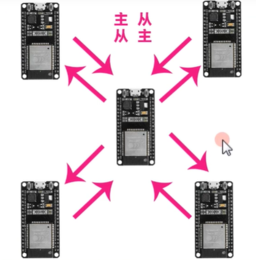
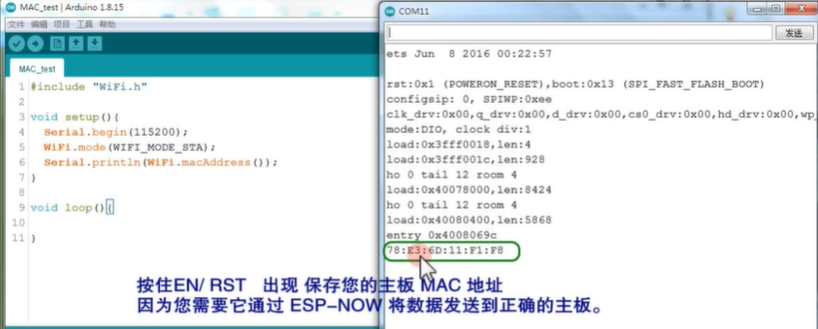

官方参考链接

[espressif/esp-now: A connectionless Wi-Fi communication protocol (github.com)](https://github.com/espressif/esp-now)

[ESP-NOW - ESP32-S3 - — ESP-IDF 编程指南 latest 文档 (espressif.com)](https://docs.espressif.com/projects/esp-idf/zh_CN/latest/esp32s3/api-reference/network/esp_now.html)

[yoursunny/WifiEspNow: ESP-NOW Arduino library for ESP8266 and ESP32 (github.com)](https://github.com/yoursunny/WifiEspNow)


参考视频[esp32 now通信协议|数据互传完整教程](https://www.bilibili.com/video/BV1fm4y1D7DH)

`1主1从` 或 `1主n从` 或 `n主1从`。这似乎没有严格的主从关系。



使用逻辑：设定三段代码

> 1、获取开发板的MAC

每个ESP开发板都有自己唯一的MAC。

通过示例程序（实际上啥程序都行）记住自己的MAC，这里给出Up主的。

**注意**，MAC地址最后输入到代码里，前面要加"**0x**"

```c++
#include "WiFi.h"
 
void setup()
{
  Serial.begin(115200);
  WiFi.mode(WIFI_MODE_STA);
  Serial.println(WiFi.macAddress());
}
 
void loop()
{

}
```



> 2、接收端代码


```c++
#include <esp_now.h>
#include <WiFi.h>
#include <ESP32Servo.h>

#define RIGHT_FRONT_SERVO_PIN  27
#define RIGHT_BACK_SERVO_PIN   26
#define LEFT_FRONT_SERVO_PIN   25
#define LEFT_BACK_SERVO_PIN    33
Servo rightFrontServo;
Servo rightBackServo;
Servo leftFrontServo;
Servo leftBackServo;

//Right motor
int enableRightMotor=22; 
int rightMotorPin1=16;
int rightMotorPin2=17;
//Left motor
int enableLeftMotor=23;
int leftMotorPin1=18;
int leftMotorPin2=19;

#define MAX_MOTOR_SPEED 200

const int PWMFreq = 1000; /* 1 KHz */
const int PWMResolution = 8;
const int PWMSpeedChannel = 4;

struct MessageData
{
  int xAxisValue;
  int yAxisValue;
  bool switchPressed;
};
MessageData messageData;

int parkCarFlag = false;

// callback function that will be executed when data is received
void OnDataRecv(const uint8_t * mac, const uint8_t *incomingData, int len) 
{
  if (len == 0)
  {
    return;
  }
  memcpy(&messageData, incomingData, sizeof(messageData));
  String inputData ;
  inputData = inputData + "values " + messageData.xAxisValue + "  " + messageData.yAxisValue + "  " + messageData.switchPressed;
  Serial.println(inputData);


  if (messageData.switchPressed == true)
  {
    if (parkCarFlag == false)
    {
      parkCarFlag = true;
      parkCar(0, 0, 180, 180);   // Park the car. Rotate servos accordingly.
    }
    else
    {
      parkCarFlag = false;
      parkCar(90, 90, 90, 90);  //No Parking. So keep servos in middle position       
    }
  }

  if (messageData.yAxisValue <= 1000)       //Move car Forward
  {
    rotateMotor(MAX_MOTOR_SPEED, MAX_MOTOR_SPEED);
  }
  else if (messageData.yAxisValue >= 3000)   //Move car Backward
  {
    rotateMotor(-MAX_MOTOR_SPEED, -MAX_MOTOR_SPEED);
  }
  else if (messageData.xAxisValue >= 3000)  //Move car Right
  {
    rotateMotor(-MAX_MOTOR_SPEED, MAX_MOTOR_SPEED);
  }
  else if (messageData.xAxisValue <= 1000)   //Move car Left
  {
    rotateMotor(MAX_MOTOR_SPEED, -MAX_MOTOR_SPEED);
  }
  else                                      //Stop the car
  {
    rotateMotor(0, 0);
  } 
}

void rotateMotor(int rightMotorSpeed, int leftMotorSpeed)
{
  if (rightMotorSpeed < 0)
  {
    digitalWrite(rightMotorPin1,LOW);
    digitalWrite(rightMotorPin2,HIGH);    
  }
  else if (rightMotorSpeed > 0)
  {
    digitalWrite(rightMotorPin1,HIGH);
    digitalWrite(rightMotorPin2,LOW);      
  }
  else
  {
    digitalWrite(rightMotorPin1,LOW);
    digitalWrite(rightMotorPin2,LOW);      
  }
  
  if (leftMotorSpeed < 0)
  {
    digitalWrite(leftMotorPin1,LOW);
    digitalWrite(leftMotorPin2,HIGH);    
  }
  else if (leftMotorSpeed > 0)
  {
    digitalWrite(leftMotorPin1,HIGH);
    digitalWrite(leftMotorPin2,LOW);      
  }
  else
  {
    digitalWrite(leftMotorPin1,LOW);
    digitalWrite(leftMotorPin2,LOW);      
  }  
}

void parkCar(int rightFrontServoValue, int rightBackServoValue, int leftFrontServoValue, int leftBackServoValue)
{
  rightFrontServo.write(rightFrontServoValue);
  rightBackServo.write(rightBackServoValue);
  leftFrontServo.write(leftFrontServoValue);
  leftBackServo.write(leftBackServoValue);  
}

void setUpPinModes()
{
       
  pinMode(enableRightMotor,OUTPUT);
  pinMode(rightMotorPin1,OUTPUT);
  pinMode(rightMotorPin2,OUTPUT);
  
  pinMode(enableLeftMotor,OUTPUT);
  pinMode(leftMotorPin1,OUTPUT);
  pinMode(leftMotorPin2,OUTPUT);

  //Set up PWM for speed
  ledcSetup(PWMSpeedChannel, PWMFreq, PWMResolution);
  ledcAttachPin(enableRightMotor, PWMSpeedChannel);
  ledcAttachPin(enableLeftMotor, PWMSpeedChannel);  
  ledcWrite(PWMSpeedChannel, MAX_MOTOR_SPEED);
  
  rotateMotor(0, 0);

  rightFrontServo.attach(RIGHT_FRONT_SERVO_PIN);
  rightBackServo.attach(RIGHT_BACK_SERVO_PIN);
  leftFrontServo.attach(LEFT_FRONT_SERVO_PIN);
  leftBackServo.attach(LEFT_BACK_SERVO_PIN);

  parkCar(90, 90, 90, 90);  
}


void setup() 
{
  setUpPinModes();
  
  Serial.begin(115200);
  WiFi.mode(WIFI_STA);

  // Init ESP-NOW
  if (esp_now_init() != ESP_OK) 
  {
    Serial.println("Error initializing ESP-NOW");
    return;
  }

  esp_now_register_recv_cb(OnDataRecv);
}
 
void loop() 
{
}
```


> 3、发射端代码


```c++
#include <esp_now.h>
#include <WiFi.h>

#define X_AXIS_PIN 32
#define Y_AXIS_PIN 33
#define SWITCH_PIN 25

// REPLACE WITH YOUR RECEIVER MAC Address
uint8_t receiverMacAddress[] = {0xAC,0x67,0xB2,0x36,0x7F,0x28};  //AC:67:B2:36:7F:28

struct MessageData
{
  int xAxisValue;
  int yAxisValue;
  bool switchPressed;
};

MessageData messageData;

// callback when data is sent
void OnDataSent(const uint8_t *mac_addr, esp_now_send_status_t status)
{
  Serial.print("\r\nLast Packet Send Status:\t ");
  Serial.println(status);
  Serial.println(status == ESP_NOW_SEND_SUCCESS ? "Message sent" : "Message failed");
}

void setup() 
{
  pinMode(SWITCH_PIN, INPUT_PULLUP);
  
  Serial.begin(115200);
  WiFi.mode(WIFI_STA);

  // Init ESP-NOW
  if (esp_now_init() != ESP_OK) 
  {
    Serial.println("Error initializing ESP-NOW");
    return;
  }
  else
  {
    Serial.println("Succes: Initialized ESP-NOW");
  }

  esp_now_register_send_cb(OnDataSent);
  
  // Register peer
  esp_now_peer_info_t peerInfo;
  memcpy(peerInfo.peer_addr, receiverMacAddress, 6);
  peerInfo.channel = 0;  
  peerInfo.encrypt = false;
  
  // Add peer        
  if (esp_now_add_peer(&peerInfo) != ESP_OK)
  {
    Serial.println("Failed to add peer");
    return;
  }
  else
  {
    Serial.println("Succes: Added peer");
  }  


}
 
void loop() 
{
  messageData.xAxisValue = analogRead(X_AXIS_PIN);
  messageData.yAxisValue = analogRead(Y_AXIS_PIN);  
  messageData.switchPressed = false; 

  if (digitalRead(SWITCH_PIN) == LOW)
  {
    messageData.switchPressed = true;
  }
  
  esp_err_t result = esp_now_send(receiverMacAddress, (uint8_t *) &messageData, sizeof(messageData));
  if (result == ESP_OK) 
  {
    Serial.println("Sent with success");
  }
  else 
  {
    Serial.println("Error sending the data");
  }    
  
  if (messageData.switchPressed == true)
  {
    delay(1000);
  }
  else
  {
    delay(50);
  }
}
```

