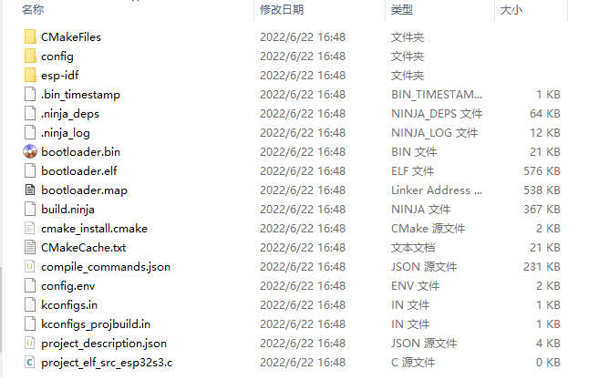

官方视频教程 [【IoT College】乐鑫物联网开发框架 ESP-IDF 开发入门](https://www.bilibili.com/video/BV1tY4y1L7HV)


# 直装ESP-IDF

官方指导：[快速入门 - ESP32-S3 - — ESP-IDF 编程指南 v4.4.1 文档 (espressif.com)](https://docs.espressif.com/projects/esp-idf/zh_CN/stable/esp32s3/get-started/index.html#get-started-get-prerequisites)

我在Windows环境下装的。

别人踩坑记录：

[【填坑】ESP-IDF 环境安装常见报错信息和解决方案_清凉简装的博客-CSDN博客](https://blog.csdn.net/qq_20515461/article/details/112275424)

## 第一步：安装准备

点击Windows进入[Windows 平台工具链的标准设置 - ESP32-S3 - — ESP-IDF 编程指南 v4.4.1 文档 (espressif.com)](https://docs.espressif.com/projects/esp-idf/zh_CN/stable/esp32s3/get-started/windows-setup.html)，最简单的方式就是再点击[ESP-IDF 工具安装器](https://dl.espressif.com/dl/esp-idf/?idf=4.4)，直接**离线**安装。**我就是这样，安装在了`E:\Espressif`**

**安装完成就可以直接跳到第五步**。

- 如果需要更新ESP-IDF就点击[在 Windows 环境下更新 ESP-IDF 工具](https://docs.espressif.com/projects/esp-idf/zh_CN/stable/esp32s3/get-started/windows-setup-update.html)

## 第二步：获取 ESP-IDF

在围绕 ESP32-S3 构建应用程序之前，先获取乐鑫提供的软件库文件 [ESP-IDF 仓库](https://github.com/espressif/esp-idf)。

获取 ESP-IDF 的本地副本：打开终端，切换到要保存 ESP-IDF 的工作目录，使用 `git clone` 命令克隆远程仓库。

### Windows 操作系统

第一步中介绍的ESP-IDF 工具安装器不仅可以安装必要工具，还顺道下载了ESP-IDF 本地副本，所以可以跳过。

想查看 ESP-IDF 不同版本的具体适用场景请前往 [ESP-IDF 版本简介](https://docs.espressif.com/projects/esp-idf/zh_CN/stable/esp32s3/versions.html)。

如果没用安装器，那么除了使用 ESP-IDF 工具安装器，也可以参考 [指南](https://docs.espressif.com/projects/esp-idf/zh_CN/stable/esp32s3/get-started/windows-setup-scratch.html#get-esp-idf-windows-command-line) 手动下载 ESP-IDF。

## 第三步：设置工具

除了 ESP-IDF 本身，您还需要安装 ESP-IDF 使用的各种工具，比如编译器、调试器、Python 包等。

### Windows 操作系统

第一步中对 Windows (ESP-IDF 工具安装器) 已经安装了所有必需工具，所以可以跳过。

如果没用安装器，那么除了使用 ESP-IDF 工具安装器，也可以通过 **命令提示符** 窗口手动安装这些工具。具体步骤见下：

```
cd %userprofile%\esp\esp-idf
install.bat esp32s3
```

或使用 Windows PowerShell

```
cd ~/esp/esp-idf
./install.ps1 esp32s3
```

> 注解

通过一次性指定多个目标，可为多个目标芯片同时安装工具，如运行 `./install.sh esp32,esp32c3,esp32s3`。 通过运行 `./install.sh` 或 `./install.sh all` 可一次性为所有支持的目标芯片安装工具。

### 下载工具备选方案

ESP-IDF 工具安装器会下载 Github 发布版本中附带的一些工具，如果访问 Github 较为缓慢，则可以设置一个环境变量，实现优先选择 Espressif 的下载服务器进行 Github 资源下载。

> 注解

该设置只影响从 Github 发布版本中下载的单个工具，它并不会改变访问任何 Git 仓库的 URL。

#### Windows 操作系统

如果希望在运行 ESP-IDF 工具安装器时优先选择 Espressif 下载服务器，请在 **Select Components** 窗口中的 **Optimization** 部分勾选 **Use Espressif download mirror instead of GitHub** 选项。

### 自定义工具安装路径

本步骤中介绍的脚本将 ESP-IDF 所需的编译工具默认安装在用户的根目录中，即 Linux 和 macOS 系统中的 `$HOME/.espressif` 和 **Windows 系统的 `%USERPROFILE%\.espressif`** (我用安装器安装在了`E:\Espressif`，环境变量也就是这个)。

此外，您可以将工具安装到其他目录中，**但请在运行安装脚本前，重新设置环境变量 `IDF_TOOLS_PATH`**。注意，请确保您的用户已经具备了读写该路径的权限。

如果修改了 `IDF_TOOLS_PATH` 变量，**请确保该变量在每次执行安装脚本 (`install.bat`、`install.ps1` 或 `install.sh`) 和导出脚本 (`export.bat`、`export.ps1` 或 `export.sh`) 均保持一致**。

## 第四步：设置环境变量

### Windows 操作系统

Windows 安装器可在“开始”菜单创建一个 “ESP-IDF Command Prompt” 快捷方式。该快捷方式可以打开命令提示符窗口，并设置所有环境变量。您可以点击该快捷方式，然后继续下一步。

此外，如果希望在当下命令提示符窗口使用 ESP-IDF，请使用下方代码：

```
%userprofile%\esp\esp-idf\export.bat
```

或使用 Windows PowerShell

```
.$HOME/esp/esp-idf/export.ps1
```

## 第五步：开始创建工程

可以开始准备开发 ESP32-S3 应用程序了。您可以从 ESP-IDF 中 `examples` 目录下的 `get-started/hello_world` 工程开始。

将 `get-started/hello_world` 工程复制至您本地的 `~/esp` (**后面重新找个地方专门放工程文件，别放在这片**)目录下。

### Windows 操作系统

```
cd %userprofile%\esp
xcopy /e /i %IDF_PATH%\examples\get-started\hello_world hello_world
```

xcopy /e /i E:\Espressif\frameworks\esp-idf-v4.4.1\examples\get-started\hello_world hello_world

当然手动复制粘贴也行。


ESP-IDF 的 `examples` 目录下有一系列示例工程，都可以按照上面的方法进行创建。可以按照上述方法复制并运行其中的任何示例，也可以直接编译示例，无需进行复制。

> 重要

ESP-IDF **编译系统不支持带有空格的路径**。

## 第六步：连接设备

将 ESP32-S3 开发板连接到 PC，并查看开发板使用的串口。

有关如何查看串口名称的详细信息，请见 [与 ESP32-S3 创建串口连接](https://docs.espressif.com/projects/esp-idf/zh_CN/stable/esp32s3/get-started/establish-serial-connection.html)。

> 与 ESP32-S3 创建串口连接

* 连接 ESP32-S3 和 PC

  * 用 USB 线将 ESP32-S3 开发板连接到 PC。如**果设备驱动程序没有自动安装**，请先**确认 ESP32-S3 开发板上的 USB 转串口芯片（或外部转串口适配器）型号**，然后**在网上搜索驱动程序，并进行手动安装**。

    以下是**乐鑫 ESP32-S3 开发板驱动程序的链接**：

    * CP210x: [CP210x USB 至 UART 桥 VCP 驱动程序](https://www.silabs.com/products/development-tools/software/usb-to-uart-bridge-vcp-drivers)
    * FTDI: [FTDI 虚拟 COM 端口驱动程序](https://www.ftdichip.com/Drivers/VCP.htm)

    以上驱动仅供参考，请参考开发板用户指南，查看开发板具体使用的 USB 转串口芯片。**一般情况下，当 ESP32-S3 开发板与 PC 连接时，对应驱动程序应该已经被打包在操作系统中，并已经自动安装。**

> 在 Windows 上查看端口

检查 Windows 设备管理器中的 COM 端口列表。断开 ESP32-S3 与 PC 的连接，然后重新连接，查看哪个端口从列表中消失后又再次出现。


要记住串口名，会在下面的步骤中用到。

> 确认串口连接

使用串口终端程序，查看重置 ESP32-S3 后终端上是否有输出，从而验证串口连接是否可用。

### Windows 和 Linux 操作系统

在本示例中，我们将使用 [PuTTY SSH Client](https://www.putty.org/)， [PuTTY SSH Client](https://www.putty.org/) 既可用于 Windows 也可用于 Linux。也可以使用其他串口程序并设置如下的通信参数。

运行终端，**配置在上述步骤中确认的串口**：`波特率 = 115200，数据位 = 8，停止位 = 1，奇偶校验 = N`。注意，这里**一定要选择在上述步骤中确认的串口进行配置**。

然后，**检查 ESP32-S3 是否有打印日志**。如有，请在终端打开串口进行查看。这里的日志内容取决于加载到 ESP32-S3 的应用程序，可以参考 [输出示例](https://docs.espressif.com/projects/esp-idf/zh_CN/stable/esp32s3/get-started/establish-serial-connection.html#id3)。

**在验证完串口通信正常后，关闭串口终端**。如果您让终端一直保持打开的状态，之后上传固件时将无法访问串口。


在某些串口接线方式下，在 ESP32-S3 启动并开始打印串口日志前，需要在终端程序中禁用串口 RTS ＆ DTR 管脚。该问题仅存在于将 RTS ＆ DTR 管脚直接连接到 EN ＆ GPIO0 管脚上的情况，绝大多数开发板（包括乐鑫所有的开发板）都没有这个问题。更多详细信息，请参考 [esptool 文档](https://github.com/espressif/esptool/wiki/ESP32-Boot-Mode-Selection#automatic-bootloader)。

## 第七步：配置

进入 `第五步：开始创建工程` 中提到的 `hello_world` 目录(我的在`E:\Espressif\frameworks\esp-idf-v4.4.1\examples\get-started\hello_world`)，并运行工程配置工具 `menuconfig`。

### Windows 操作系统

```
cd %userprofile%\esp\hello_world
idf.py set-target esp32s3
idf.py menuconfig
```

打开一个新项目后，应首先设置“目标”芯片 `idf.py set-target esp32s3`。注意，此操作将清除并初始化项目之前的编译和配置（如有）。 也可以直接将“目标”**配置为环境变量**（此时可跳过该步骤）。更多信息，请见 [选择目标芯片](https://docs.espressif.com/projects/esp-idf/zh_CN/stable/esp32s3/api-guides/build-system.html#selecting-idf-target)。


**开了新窗口，所以先配置为环境变量export.bat** 【踩坑处】

`E:\Espressif\frameworks\esp-idf-v4.4.1\export.bat`

`idf.py set-target esp32s3`


`idf.py menuconfig`

如果之前的步骤都正确，则会显示下面的菜单：终端窗口中显示出的菜单颜色可能会与图片不同。可以通过选项 `--style` 来改变外观。更多信息，请运行 `idf.py menuconfig --help` 命令。

说一下分区表配置，参考视频为这个[“分享ESP-IDF使用ESP32日常习惯，17：40附近”](https://www.bilibili.com/medialist/play/watchlater/BV1L3411777o)。

可以使用custom，然后使用`partitions_example.csv`这张表就行。很多示例文件里都有，拷贝一个改一下，如`E:\Espressif\frameworks\esp-idf-v4.4.1\examples\storage\partition_api\partition_mmap\partitions_example.csv`。

一些常用设置或默认设置，就去视频里面看，或者找博客。


可以通过此菜单设置项目的具体变量，包括 Wi-Fi 网络名称、密码和处理器速度等. `hello_world` 示例项目会以默认配置运行，因此可以跳过使用 `menuconfig` 进行项目配置这一步骤。

## 第八步：编译工程

使用以下命令，编译烧录工程：

```
idf.py build
```

运行以上命令可以编译应用程序和所有 ESP-IDF 组件，接着生成 bootloader、分区表和应用程序二进制文件。

**一次性执行构建、烧录和监视过程在第十步。**


如果一切正常，编译完成后将生成 .bin 文件。



## 第九步：烧录到设备

使用以下命令，将刚刚生成的二进制文件 (bootloader.bin, partition-table.bin 和 hello_world.bin) 烧录至 ESP32-S3 开发板（一般不会一个一个烧录，下面是直接全烧录进去）：

```
idf.py -p PORT [-b BAUD] flash
```

将 PORT 替换为 ESP32-S3 开发板的串口名称，具体可见 第六步：连接设备。

还可以将 BAUD 替换为您希望的烧录波特率。默认波特率为 `460800`。

**如果使用外部烧录工具，这几个文件的地址都要记住，复制到烧录工具里头去。**


**更多有关 idf.py 参数的详情，请见 [idf.py](https://docs.espressif.com/projects/esp-idf/zh_CN/stable/esp32s3/api-guides/build-system.html#idf-py)。**

`idf.py -p COM7 flash`


一切顺利，烧录完成后，开发板将会复位，应用程序 “hello_world” 开始运行。

> 注解

**勾选 `flash` 选项将自动编译并烧录工程，因此无需再运行 `idf.py build`。**

**一次性执行构建、烧录和监视过程在第十步。**

如果希望使用 Eclipse 或是 **VS Code IDE**，而非 `idf.py`，请参考 [Eclipse 指南](https://docs.espressif.com/projects/esp-idf/zh_CN/stable/esp32s3/get-started/eclipse-setup.html)，以及 [**VS Code 指南**](https://docs.espressif.com/projects/esp-idf/zh_CN/stable/esp32s3/get-started/vscode-setup.html)。

### 烧录过程中可能遇到的问题

https://docs.espressif.com/projects/esp-idf/zh_CN/stable/esp32s3/get-started/index.html#id30

## 第十步：监视器

可以使用 `idf.py -p PORT monitor` 命令，监视 “hello_world” 工程的运行情况。注意，不要忘记将 PORT 替换为自己的串口名称。

`idf.py -p COM7 monitor` 


可使用快捷键 `Ctrl+]`，退出 IDF 监视器。

> 注解

您也可以运行以下命令，**一次性执行构建、烧录和监视过程**：

```
idf.py -p PORT flash monitor
```

**总之，一般只输入这一句**，就一次性完成了。想加快编译速度，可以把电源选项设置成高性能模式。

```
idf.py -p PORT -b BAUD flash monitor
```

**查看编译文件大小**

```
path/to/project/idf.py size-files
```

**查看编译组件大小**

```
path/to/project/idf.py size-components
```


> 注解

如果带有八线 flash 的开发板在二级引导加载程序之前复位，请参考 [八线 flash 错误处理](https://docs.espressif.com/projects/esp-idf/zh_CN/stable/esp32s3/api-guides/flash_psram_config.html#flash-psram-error)。

此外，

- 请前往 [IDF 监视器](https://docs.espressif.com/projects/esp-idf/zh_CN/stable/esp32s3/api-guides/tools/idf-monitor.html)，了解更多使用 IDF 监视器的快捷键和其他详情。
- 请前往 [idf.py](https://docs.espressif.com/projects/esp-idf/zh_CN/stable/esp32s3/api-guides/build-system.html#idf-py)，查看更多 `idf.py` 命令和选项。

**至此，已完成 ESP32-S3 的入门学习！**

现在，可以尝试一些其他 [examples](https://github.com/espressif/esp-idf/tree/v4.4.1/examples)，或者直接开发自己的应用程序。

> 重要

一些示例程序不支持 ESP32-S3，因为 ESP32-S3 中不包含所需的硬件。

在编译示例程序前请查看 README 文件中 `Supported Targets` 表格。如果表格中包含 ESP32-S3， 或者不存在这个表格，那么即表示 ESP32-S3 支持这个示例程序。

## 更新 ESP-IDF

乐鑫会不时推出更新版本的 ESP-IDF，修复 bug 或提供新的功能。因此，在使用时，也应注意更新本地的版本。最简单的方法是：直接删除您本地的 `esp-idf` 文件夹，然后按照 [第二步：获取 ESP-IDF](https://docs.espressif.com/projects/esp-idf/zh_CN/stable/esp32s3/get-started/index.html#get-started-get-esp-idf) 中的指示，重新完成克隆。

此外，可以仅更新变更部分。具体方式，请前往 [更新](https://docs.espressif.com/projects/esp-idf/zh_CN/stable/esp32s3/versions.html#updating) 章节查看。

注意，更新完成后，请再次运行安装脚本，以防新版 ESP-IDF 所需的工具也有所更新。具体请参考 [第三步：设置工具](https://docs.espressif.com/projects/esp-idf/zh_CN/stable/esp32s3/get-started/index.html#get-started-set-up-tools)。

一旦重新安装好工具，请使用导出脚本更新环境，具体请参考 [第四步：设置环境变量](https://docs.espressif.com/projects/esp-idf/zh_CN/stable/esp32s3/get-started/index.html#get-started-set-up-env)。

## 踩坑

> idf.py 不是内部或外部命令，也不是可运行的程序

**原因和解决方法：每一个新开窗口都需要重新运行 export.bat 添加环境变量**，那么对于我来说就是 `E:\Espressif\frameworks\esp-idf-v4.4.1\export.bat`   这个只适用于CMD窗口，powershell在第四步，是`.$HOME/esp/esp-idf/export.ps1`

> 不使用安装器的情况

参考：

[【开箱即食】5分钟搞定ESP32-S3 ESP-IDF 5.0环境 (bilibili.com)](https://www.bilibili.com/medialist/play/watchlater/BV1Uu411U7eW)

所需离线文件：

https://pan.baidu.com/s/1ImwQqGLRs07F2ZPCvpi8DA 提取码：9qyf

**其实最好按照官方教程来，因为官方才是最新的**。

## 用微软Terminal配置环境

微软应用商店装上Terminal，发现它自动有ESP-IDF 4.4，但这个4.4默认打开地址就是我们装IDF的地址。

显然，我们通常需要在工程文件处打开IDF环境，因此需要自己设置一下，添加新的配置文件。

**我没有配置出CMD环境的，它那默认的是powershell的，其实也可以。想用CMD的就再找教程。**


添加右键 Windows Terminal Here，感觉以后会用到。[Windows Terminal 右键打开_Pz_mstr的博客-CSDN博客_右键打开terminal](https://blog.csdn.net/qq_35544379/article/details/104565773/)   **我这个Windows Terminal Here还是没有直接到当前路径，那就不管了，我把名字改成Open Terminal了，我手动切换行了吧。**

[Windows Terminal 安装及配置指南_Sovea的博客-CSDN博客_terminal安装](https://blog.csdn.net/qq_43606462/article/details/107458314?spm=1001.2101.3001.6650.4&utm_medium=distribute.pc_relevant.none-task-blog-2~default~CTRLIST~default-4-107458314-blog-120476117.pc_relevant_multi_platform_whitelistv1&depth_1-utm_source=distribute.pc_relevant.none-task-blog-2~default~CTRLIST~default-4-107458314-blog-120476117.pc_relevant_multi_platform_whitelistv1&utm_relevant_index=4)

# VS Code环境下


### PlatformIO添加ESP32

>准备python环境

我下载了[Python Release 3.8.10 |Python.org](https://www.python.org/downloads/release/python-3813/)

```
下载py3.8 exe文件，安装后可能需要升级pip
python -m pip install --upgrade pip -i https://pypi.douban.com/simple
安装virtualenv
pip install virtualenv -i https://pypi.douban.com/simple
安装虚拟环境(注意写对用户名)
virtualenv C:\Users\Admin\.platformio\penv
virtualenv C:\Users\Administrator\.platformio\penv
激活(注意写对用户名)
virtualenv C:\Users\Admin\.platformio\penv\Scripts\active
virtualenv C:\Users\Administrator\.platformio\penv\Scripts\active
加入环境变量
C:\Users\Admin\.platformio\penv\Scripts
```

接着在VS Code中安装`python`插件，然后【view】【command palette...】`>Python: select interpreter`选择自己的python环境，**可以用conda envs里的(我用的conda)**，也可以用上面下载的。

再把platformIO Core安装到虚拟环境

```
pip install -U platformio -i https://pypi.douban.com/simple
```

> 安装PlatformIO拓展，[科学上网](https://github.com/Alvin9999/new-pac/wiki)会快一些，备用[科学上网](https://tr2.freeair888.club/)

查看安装情况，就点击`help`->`Toggle Developper Tools` -> `console`

> 新建工程

不是报错，

PIO Core Call Error: "

The current working directory D:\\BaiduNetdiskWorkspace\\IoT\\PlatformIO\\tettt will be used for the project.

The next files/directories have been created in D:\\BaiduNetdiskWorkspace\\IoT\\PlatformIO\\tettt

include - Put project header files here 

lib - Put here project specific (private) libraries

src - Put project source files here

platformio.ini - Project Configuration File

Platform Manager: Installing espressif32 

Unpacking

Platform Manager: espressif32 @ 4.4.0 has been installed!

Error: Unknown development platform 'espressif32'"

就是卡死。

### 使用ESP-IDF扩展

首先安装ESP-IDF扩展，然后`View`->`Command palette.. `，找到`ESP-IDF: Configure ESP-IDF extension`


如果之前已经完成了`直装ESP-IDF`，它会提示让你选择已经存在的ESP-IDF。然后可以看见下面这些：


等它慢慢安装就可以了。


如果之前没有`直装ESP-IDF`，就在VS Code里面安装吧，可以参考这个[教程](https://blog.csdn.net/lt6210925/article/details/123699249)，其核心过程可以看他的gif演示。


# Arduino环境

## ESP32

参考[乐鑫的教程](https://docs.espressif.com/projects/arduino-esp32/en/latest/installing.html#installing)

安装好Arduino IED，添加`附加开发板管理网址`

- Stable release link:

  ```
  https://raw.githubusercontent.com/espressif/arduino-esp32/gh-pages/package_esp32_index.json
  ```

- Development release link:

  ```
  https://raw.githubusercontent.com/espressif/arduino-esp32/gh-pages/package_esp32_dev_index.json
  ```


然后在开发板管理器安装对应的esp就行


乐鑫的ESP32-S3，ST的STM32系列（他有自己的cubeMx），

[ELL/INSTALL-Windows.md at master · microsoft/ELL · GitHub](https://github.com/microsoft/ELL/blob/master/INSTALL-Windows.md)

