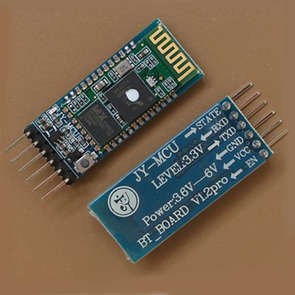
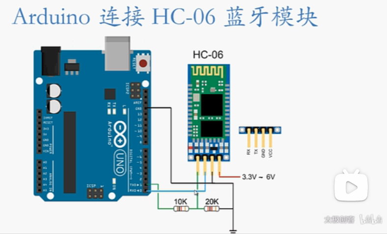
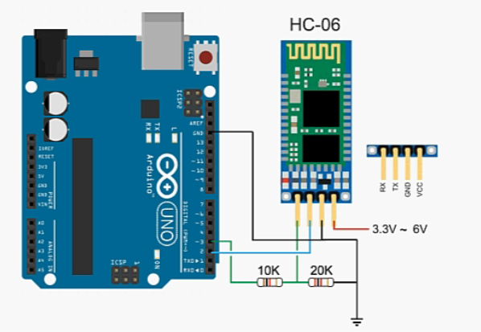

**参考视频** [零基础入门学用 Arduino 教程 - MeArm篇 -17 HC-06蓝牙模块-1](https://www.bilibili.com/video/av12203326)



该教程使用的**蓝牙控制app** [Arduino bluetooth controller_v1.apk_免费高速下载|百度网盘-分享无限制 (baidu.com)](https://pan.baidu.com/s/1pLjttSf)


作者在程序中已经说了，使用arduino uno的 TX 给HC-06的 RX 发送数据时，发送出的高电平是5v，而HC串口能接受的高电平为3.3V，所以需要使用分压电路（串联分压，电流经一个10k，再经一个20k，5V电压在二者中间约为3.2V）



>测试程序1：使用Arduino通过无线蓝牙控制Arduino引脚11的LED点亮／熄灭

使用app的`Switch`或者`Teminal`模式都可以，具体演示可以见视频。

```c++
/*
HC-06-Serial-LED-demo
此程序旨在演示如何利用HC-06蓝牙模块通过手机或平板电脑的
蓝牙功能来打开和关闭arduino开发板引脚11上连接的LED。

---- 电路连接 ---- 
HC-06     Arduino Uno R3 引脚
TX                0 (RX)  
RX                1 (TX)
VCC              +5v
GND              GND
 
注意：
1. 须使用分压电路，确保HC-06 RX信号电压为3.3伏特。
2. 须先将此程序上传至ARDUINO后，再将HC-06连接在ARDUINO开发板的串口引脚上。
   否则程序将无法正常上传。
 
*/
char serialData;
 
void setup() {
  Serial.begin(9600);
  pinMode(11, OUTPUT); //11引脚连接演示用LED
 
}
 
void loop(){
  if( Serial.available()>0 ){ 
    
    serialData =  Serial.read();   
    
    if (serialData == '1' ) {  //接收到点亮LED指令
      Serial.print("Got command: ");  Serial.println(serialData); 
      Serial.println("LED-ON");
      
      digitalWrite(11, HIGH);  //点亮LED指令
    } else {    //接收到熄灭LED指令
      Serial.print("Got command: ");  
      Serial.println(serialData); 
      Serial.println("LED-OFF");
 
      digitalWrite(11, LOW);      //熄灭LED指令  
    }      
  }
}
```


>测试程序2：使用Arduino通过无线蓝牙控制调节Arduino引脚11的LED明暗

使用app的`Dimmer`或者`Teminal`模式都可以，具体演示可以见视频。

```c++
/*
HC-06-Serial-LED-Fade
此程序旨在演示如何利用HC-06蓝牙模块通过手机或平板电脑的
蓝牙功能来设置arduino开发板上11引脚上连接LED的亮度。
 
---- 电路连接 ---- 
HC-06     Arduino Uno R3 引脚
TX                0 (RX)  
RX                1 (TX)
VCC              +5v
GND              GND
 
LED       Arduino Uno R3 引脚
 +                11 (RX) 
 -                GND (通过220欧姆限流电阻)
 
注意：
1. 须使用分压电路，确保HC-06 RX信号电压为3.3伏特。
2. 须先将此程序上传至ARDUINO后，再将HC-06连接在ARDUINO开发板的串口引脚上。
   否则程序将无法正常上传。
 
*/
int brightness;  //LED亮度变量
int serialData;  //串口数据变量
 
void setup() {
  Serial.begin(9600);
  pinMode(LED_BUILTIN, OUTPUT);
  pinMode(11, OUTPUT);
}
 
void loop(){
  if( Serial.available()>0 ){             //如果串口缓存有数据
    serialData =  Serial.parseInt();      //将串口缓存数值存储到serialData变量
    Serial.print("serialData = "); Serial.println(serialData);  
    if (serialData >=0 && serialData <= 255) {  
      if (serialData >= brightness){       //逐渐调节LED亮度
        for (brightness; brightness <= serialData; brightness++){
          analogWrite(11, brightness); 
          Serial.print("brightness = "); Serial.println(brightness);  
          delay(5);
        }      
      } else {
        for (brightness; brightness >= serialData; brightness--){
          analogWrite(11, brightness); 
          Serial.print("brightness = "); Serial.println(brightness);          
          delay(5);          
        }        
      }       
    }     
  }   
}
```

>**存在的问题**
>
>1、上传程序还得先把arduino的串口空出来
>
>2、如果有多个设备要用串口就歇菜

**参考视频** [零基础入门学用 Arduino 教程 - MeArm篇 -18 HC-06蓝牙模块-2](https://www.bilibili.com/video/av12211594)

> **解决办法**
>
> 将 开发板上其他数字输入输出引脚 用软件模拟成 串口



具体演示看作者的视频。

```c++
/*
HC-06蓝牙模块设置以及功能测试
此程序旨在演示如何通过HC-06模块使用蓝牙通讯向Arduino数字IO引脚
收发串口数据，以及如何设置HC-06蓝牙模块。
 
---- 电路连接 ---- 
HC-06     Arduino Uno R3 引脚
TX                2  
RX                3
VCC              +5v
GND              GND
注意：须使用分压电路，确保HC-06 RX信号电压为3.3伏特。
 
//  
 
---- AT指令 ---- 
 
指令               答复                        说明
AT                 OK                          通讯测试
AT+VERSION         OKlinvorV1.8                固件版本
AT+NAMEmyBTmodule  OKsetname                   设置设备名 “myBTmodule”
AT+PIN6789         OKsetPIN                    设置设备 PIN 6789
AT+BAUD1           OK1200                      设置波特率 1200
AT+BAUD2           OK2400                      设置波特率 2400
AT+BAUD3           OK4800                      设置波特率 4800
AT+BAUD4           OK9600                      设置波特率 9600
AT+BAUD5           OK19200                     设置波特率 19200
AT+BAUD6           OK38400                     设置波特率 38400
AT+BAUD7           OK57600                     设置波特率 57600
AT+BAUD8           OK115200                    设置波特率 115200
AT+BAUD9           OK230400                    设置波特率 230400
AT+BAUDA           OK460800                    设置波特率 460800
AT+BAUDB           OK921600                    设置波特率 921600
AT+BAUDC           OK1382400                   设置波特率 1382400
 
*/
 
#include <SoftwareSerial.h>
SoftwareSerial BTserial(2, 3); // 建立SoftwareSerial对象，RX引脚2, TX引脚3
 
void setup() {
  Serial.begin(9600);
  BTserial.begin(9600); // HC-06 默认波特率 9600
 
  Serial.print("HC-06 DEMO/TEST  ");
  
    /* BTserial.print("String") 
    	如果HC06已经连接到别的蓝牙设备，则他会把信息透明传输(即透传，全文发送)给他连接的设备。
    	如果他没连其他蓝牙设备，那么他就会判断这个string是不是与自己有关，进而执行相应操作，没关系就不会搭理这些字符。可见上述AT指令。
    */
  BTserial.print("AT");   //可在此处输入设置HC-06蓝牙模块的AT指令。
                          //此AT指令须在HC-06未连接蓝牙状态输入。
 
  pinMode(11, OUTPUT);                        
 
}
 
void loop(){
 
    // 通过串口监视器显示HC-06发送的数据
    if( BTserial.available()>0 ){            //如果软件串口有HC-06发来的数据
      char BTserialData =  BTserial.read();  //将软件串口中的数据赋值给变量BTserialData
      Serial.print( BTserialData );         //通过硬件串口监视器显示HC-06发来的数据
      if (BTserialData == '1') {             //判断HC-06发来的数据是否是字符1
        digitalWrite(11, HIGH);              //如果是字符1，则点亮LED
      } else if (BTserialData == '0') {      //如果不是字符0
        digitalWrite(11, LOW);               //则熄灭LED
      }
    }
 
    // 将用户通过串口监视器输入的数据发送给HC-06
    if (Serial.available()>0) {            //如果硬件串口缓存中有等待传输的数据
      char serialData =  Serial.read();    //将硬件串口中的数据赋值给变量serialData
      BTserial.print( serialData );         //将硬件串口中的数据发送给HC-06
    }
 
}
```

>软串口肯定不如硬件串口，如果软串口有数据丢失等问题，优先考虑换成硬件串口