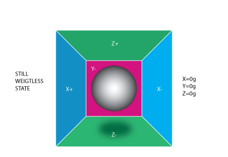

附带一些介绍视频

[MPU6050认真工作的时候， 你可以把它理解为采用压电效应的工作原理](https://www.bilibili.com/video/BV1sL411A715)

[MEMS加速度计、陀螺仪、磁力计是如何工作以及Arduino教程](https://www.bilibili.com/video/BV1ua411t7Nm)

[MPU6050介绍（干货分享）](https://www.bilibili.com/video/BV1vi4y1C74y)

### 惯导 IMU

#### 加速度计 Accelerometer

参考[A Guide To using IMU](http://www.starlino.com/imu_guide.html)【第一部分】[【翻译】版](https://www.geek-workshop.com/forum.php?mod=viewthread&tid=1695&reltid=676&pre_thread_id=0&pre_pos=1&ext=)

当我们在想象一个加速度计的时候我们可以把它想作一个圆球在一个方盒子中。我们假定这个盒子不在重力场中或者其他任何会影响球的位置的场中，球处于盒子的正中央。你可以想象盒子在外太空中，远离任何天体，如果很难想象，那就当做盒子在航天飞机中，一切东西都处于无重力状态。在图中你可以看到我们给每个轴分配了一对墙（移除了Y+以此来观察里面的情况）。设想每面墙都能感测压力。如果我们突然把盒子向左移动（加速度为1g=9.8m/s^2），那么球会撞上X-墙。然后我们检测**球撞击墙面产生的压力**，**X轴输出值为-1g**。

注意加速度计检测到得力的方向与它本身加速度的方向是相反的。这种力量通常被称为惯性力或假想力 。所以，加**速度计是通过间接测量力对一个墙面的作用来测量加速度的**，在实际应用中，可能通过弹簧等装置来测量力。

如果我们把模型放在地球上，球会落在Z-墙面上并对其施加一个1g的力，见下图。在这种情况下，盒子没有移动，但仍然读取到Z轴有-1g的值。球在墙壁上施加的压力是由引力造成的。在理论上，它可以是不同类型的力量。 例如，可以想象我们的球是铁质的，将一个磁铁放在盒子旁边那球就会撞上另一面墙。引用这个例子只是为了说明**加速度计的本质是检测力而非加速度**。**只是加速度所引起的惯性力正好能被加速度计的检测装置所捕获。**

虽然这个模型并非一个MEMS传感器的真实构造，但它用来解决与加速度计相关的问题相当有效。实际上有些类似传感器中有金属小球，它们称作倾角开关，但是它们的功能更弱，只能检测设备是否在一定程度内倾斜，却不能得到倾斜的程度。

三轴加速度计的真正价值在于它们能够检测全部三个轴的惯性力。回到盒子模型，并将盒子向右旋转45度。现在球会与两个面接触：Z-和X-，见下图。

0.71g这个值是不是任意的，它们实际上是1/2的平方根的近似值。上一个模型中引入了重力并旋转了盒子。最后的两个例子中分析了盒子在两种情况下的输出值，力矢量保持不变。虽然这有助于理解加速度计是怎么和外部力相互作用的，但如果将坐标系换为加速度的三个轴并想象矢量力在周围旋转，这会更方便计算。

想象新模型中每个轴都分别垂直于原模型中各自的墙面。矢量R是加速度计所检测的矢量（它可能是重力或上面例子中惯性力的合成）。RX，RY，RZ是矢量R在X，Y，Z上的投影。请注意下列关系，此公式等价于三维空间勾股定理。
$$
R ^ 2 = R_X ^ 2 + R_Y ^ 2 + R_Z ^ 2 \tag{公式1}
$$
还记得刚才说的1/2的平方根0.71不是个随机值吧。如果把它们代回上式，回顾一下重力加速度是1g，在公式1中简单的取代 $R=1, Rx = -SQRT(1/2), Ry = 0 , Rz = -SQRT(1/2)$，那我们就能验证。
$$
1 ^ 2 =（SQRT（1/2））^ 2 + 0 ^ 2 +（SQRT（1/2））^ 2
$$
经过一大段的理论序言后，我们和实际的加速度计很靠近了。RX，RY，RZ值是实际中加速度计输出的线性相关值，你可以用它们进行各种计算。大多数加速度计可归为两类：**数字和模拟**。**数字加速度计**可通过I2C，SPI或USART方式获取信息，而**模拟加速度计**的输出是一个在预定范围内的电压值，你需要用ADC（模拟量转数字量）模块将其转换为数字值。。例如一个10位ADC模块的输出值范围在0~1023（1023 = 2 ^ 10 -1）。一个12位ADC模块的输出值范围在0~4095（4095 = 2 ^ 12-1。

虑下一个简单的例子，假设我们从10位ADC模块得到了以下的三个轴的数据：
$$
AdcRx = 586\\
AdcRy = 630\\
AdcRz = 561
$$
每个ADC模块都有一个参考电压，假设在我们的例子中，它是3.3V。要将一个10位的ADC值转成电压值，我们使用下列公式：
$$
VoltsRx = AdcRx * \frac{VREF }{1023}
$$
将3个轴的值代入上式，得到：
$$
\begin{eqnarray}
&& VoltsRx = 586 * 3.3 / 1023 =～1.89V（结果取两位小数）\\
&& VoltsRy = 630 * 3.3 / 1023 =～2.03V\\
&& VoltsRz = 561 * 3.3 / 1023 =～1.81V
\end{eqnarray}
$$
**每个加速度计都有一个零加速度的电压值**，你可以在它的说明书中找到，**这个电压值对应于加速度为0g**。通过计算相对0g电压的偏移量我们可以得到一个有符号的电压值。比方说，0g电压值 VzeroG= 1.65V，通过下面的方式可以得到**相对0g电压的偏移量**:
$$
\begin{eqnarray}
&& DeltaVoltsRx = 1.89V - 1.65V = 0.24V\\
&& DeltaVoltsRy = 2.03V - 1.65V = 0.38V\\
&& DeltaVoltsRz = 1.81V - 1.65V = 0.16V\\
\end{eqnarray}
$$
现在得到了加速度计的电压值，但它的单位还不是g（9.8m/s^2），最后的转换，我们**还需要引入加速度计的灵敏度（Sensitivity），单位通常是 mV/g**。比方说，加速度计的灵敏度 Sensitivity= 478.5mV / g = 0.4785V /g。灵敏度值可以在加速度计说明书中找到。要获得最后的单位为g的加速度，我们使用下列公式计算：
$$
\begin{eqnarray}
&&RX = DeltaVoltsRx /Sensitivity\\
&&RX = 0.24V / 0.4785V / G =～0.5g\\
&&RY = 0.38V / 0.4785V / G =～0.79g\\
&&RZ = 0.16V / 0.4785V / G =～0.33g\\
\end{eqnarray}
$$
当然，**可以把上面ADC所有的步骤全部放在一个式子里**：
$$
\begin{eqnarray}
&& Rx = (AdcRx * Vref / 1023 – VzeroG) / Sensitivity\tag{} \\
&& Ry = (AdcRy * Vref / 1023 – VzeroG) / Sensitivity\tag{}\\
&& Rz = (AdcRz * Vref / 1023 – VzeroG) / Sensitivity\tag{公式2}
\end{eqnarray}
$$

> 计算角度

得到了惯性力矢量的三个分量，如果设备除了重力外不受任何外力影响，那我们就可以认为这个方向就是重力矢量的方向。如果你想计算设备相对于地面的倾角，可以计算这个矢量和Z轴之间的夹角。如果你对每个轴的倾角都感兴趣，你可以把这个结果分为两个分量：X轴、Y轴倾角，这可以通过计算重力矢量和X、Y轴的夹角得到。.

在得到三个矢量Rx，Ry，Rz的基础上，回到上一个加速度模型，再加一些标注上去。

我们感兴趣的角度是向量R和X，Y，Z轴之间的夹角，那就令这些角度为Axr，Ayr，Azr。观察由R和Rx组成的直角三角形：
$$
cos(Axr) = Rx / R\\cos(Ayr) = Ry / R\\cos(Azr) = Rz / R
$$
通过$arccos()$我们可以计算出所需的角度：
$$
Axr = arccos(Rx/R)\\
Ayr = arccos(Ry/R)\\
Azr = arccos(Rz/R)\\
$$

#### 陀螺仪 Gyroscope

参考[A Guide To using IMU](http://www.starlino.com/imu_guide.html)【第二部分】[【翻译】版](https://www.geek-workshop.com/forum.php?mod=viewthread&tid=1695&reltid=676&pre_thread_id=0&pre_pos=1&ext=)

陀螺仪的每个通道检测一个轴的旋转。例如，一个2轴陀螺仪检测绕X和Y轴的旋转。为了用数字来表达这些旋转，先引进一些符号。首先定义：

* Rxz – 惯性力矢量R在XZ平面上的**投影**
* Ryz – 惯性力矢量R在YZ平面的上投影

显然，运用勾股定理可得：
$$
R_{xz}^2 = R_x^2 + R_z^2 \\
R_{yz}^2 = R_y^2 + R_z^2
$$
同时易得知 $R^2 = R_{xz}^2 + R_y^2，R ^ 2 = R_{yz} ^ 2 + R_X ^ 2$ ；
相反，我们按如下方法定义**Z轴和Rxz、Ryz向量所成的夹角**：

* AXZ - Rxz（矢量R在XZ平面的投影）和Z轴所成的夹角
* AYZ - Ryz（矢量R在YZ平面的投影）和Z轴所成夹角

现在我们离陀螺仪要测量的东西又近了一步。陀螺仪测量上面定义的角度的变化率。换句话说，它会输出一个与上面这些角度变化率线性相关的值。为了解释这一点，先假设在t0时刻，已测得绕Y轴旋转的角度（也就是Axz），定义为Axz0，之后在t1时刻我们再次测量这个角度，得到Axz1。**角度变化率**按下面方法计算

$RateAxz = (Axz1 – Axz0) / (t1 – t0)$.

如果用**度来表示角度**，**秒来表示时间**，那这个值的单位就是 **度/秒**。这就是陀螺仪检测的东西。在实际运用中，陀螺仪一般都不会直接给出一个单位为度/秒的值（除非它是个特殊的数字陀螺仪)。就像加速度计一样，会给出一个ADC值并且要用类似`加速度计里面的公式2的式子`将其转换成单位为 度/秒的值。

> 陀螺仪输出值转换中的ADC部分

（假设使用10位ADC模块，如果是8位ADC，用1023代替255，如果是12为ADC用4095代替1023）
$$
\begin{eqnarray}
&&RateAxz = (AdcGyroXZ * Vref / 1023 – VzeroRate) / Sensitivity\tag{}\\
&&RateAyz = (AdcGyroYZ * Vref / 1023 – VzeroRate) / Sensitivity\tag{公式3}
\end{eqnarray}
$$

* `AdcGyroXZ，AdcGyroYZ` - 这两个值由ADC读取，它们分别代表**矢量R的投影在XZ和YZ平面内里的转角**，**也可等价的说，旋转可分解为单独绕Y和X轴的运动。**
* `Vref` – **ADC的参考电压**，上例中使用3.3V
* `VzeroRate` – 是**零变化率电压**，换句话说它是陀螺仪不受任何转动影响时的输出值，对[Acc Gyro](http://gadgetgangster.com/find-a-project/56?projectnum=213)板来说，可以认为是1.23V（**此值通常可以在说明书中找到，但千万别相信这个值**，因为大多数的陀螺仪在焊接后会有一定的偏差，所以可以使用电压计测量每个通道的输出值，通常这个值在焊接后就不会改变，如果有跳动，**在设备使用前写一个校准程序对其进行测量，用户应当在设备启动的时候保持设备静止以进行校准**）。
* `Sensitivity` –**陀螺仪的灵敏度，单位mV/(deg/s)，通常写作mV/deg/s**，它的意思就是如果旋转速度增加1°/s，陀螺仪的输出就会增加多少mV。[Acc_Gyro](http://gadgetgangster.com/find-a-project/56?projectnum=213)板的灵敏度值是2mV/deg/s或0.002V/deg/s

举个例子，假设ADC模块返回以下值：
$$
AdcGyroXZ = 571\\
AdcGyroXZ = 323
$$
用上面的公式，在代入[Acc Gyro](http://gadgetgangster.com/find-a-project/56?projectnum=213)板的参数，可得：
$$
RateAxz = (571 * 3.3V / 1023 – 1.23V) / ( 0.002V/deg/s) =~ 306 deg/s\\
RateAyz = (323 * 3.3V / 1023 – 1.23V) / ( 0.002V/deg/s) =~ -94 deg/s
$$
换句话说设备绕Y轴（也可以说在XZ平面内）以306°/s速度和绕X轴（或者说YZ平面内）以-94°/s的速度旋转。按照惯例，一个方向的旋转是正值。一份好的陀螺仪说明书会告诉你哪个方向是正的，否则就要自己测试出哪个旋转方向会使得输出脚电压增加。最好使用示波器进行测试，因为一旦停止了旋转，电压就会掉回零速率水平。如果使用的是万用表，得保持一定的旋转速度几秒钟并同时比较电压值和零速率电压值。如果值大于零速率电压值那说明这个旋转方向是正向。

#### 磁力计 Magnetometer

##### 基础知识

[磁力计（电子罗盘）](https://blog.csdn.net/wangguchao/article/details/78760095)

地球磁场（the earth magnetic field）是地球周围空间分布的[磁场](https://baike.baidu.com/item/磁场/63505)。它的**磁南极大致指向地理北极附近，磁北极大致指向地理南极附近**。[磁力线](https://baike.baidu.com/item/磁力线)分布特点是赤道附近磁场的方向是水平的，两极附近则与地表垂直。赤道处磁场最弱，两极最强。地球表面的磁场受到各种因素的影响而随时间发生变化。

**磁北极是[地球](https://baike.baidu.com/item/地球)表面[地球磁场](https://baike.baidu.com/item/地球磁场/6375102)方向垂直向下的点**。磁北极与地理北极并不相同。磁北极正在不断的改变，以每天20.5米的速度移动。另外，由于地球磁场并不是完全对称的，磁北极与[磁南极](https://baike.baidu.com/item/磁南极/9991763)并不是处在[对跖点](https://baike.baidu.com/item/对跖点)位置上。

那么指南针如何工作？我们知道，**同名磁极互相排斥，异名磁极互相吸**引这个道理，那么，地球本身就是一个巨大的磁体，它的地磁南极和地磁北极位于地球的两端。 根据磁极之间互相作用的规律，**指南针的北极与地磁南极互相吸引，指南针的南极与地磁的北极互相吸引**。所以， 指南针静止时， 它的北极总是指向地球的北端，南极指向地球的南端。

地磁场是一个矢量，对于一个固定的地点来说，这个矢量可以被分解为**两个与当地水平面平行的分量和一个与当地水平面垂直的分量（水平放置时）**。
**$H_{earth}$是三轴矢量和，$x, y, z$ 为$H_{earth}$的三轴分量，其中$x, y$ 代表水平方向，$H_{north}$为水平矢量和，总是指向地磁北极。**

罗盘中的航向角（Azimuth）就是当前方向和磁北的夹角。由于罗盘保持水平，只需要用磁力计水平方向两轴（通常为X轴和Y轴）的检测数据就可以计算出航向角。当罗盘水平旋转的时候，航向角在0º- 360º之间变化。
$$
Azimuth=arctan(\frac{H_y}{H_x})
$$

##### 理论

[磁力计校正和数据处理（校正我没写在这里面，需要就自己再去看）](https://blog.csdn.net/xian_z/article/details/78463905),这个校准[HMC5883L磁力计使用](https://blog.csdn.net/qq_25662827/article/details/119679009)也可以看看

[关于磁力计](https://blog.csdn.net/Fei_Yang_YF/article/details/90900424)

磁力计的原理就是使用霍尔元件的原理测量磁场的传感器。在实际的空间中只要不在赤道上空地磁场的方向有从南指向北的分量，还有从上指向下（或者从下指向上的分量）。霍尔元件只能测量一个方向的磁场，所以磁力计要在空间中测量磁场的话要使用三个方向的霍尔传感器测量到三个正交的方向的磁场后合成一个合磁场，再使用这个磁场的方向和地磁场的方向做对比从而可以获得传感器自身的方向和姿态。这些是基于一个比较普遍的假设：在很小的区域可以认为地磁场的方向和大小都是不变的。很小的区域相对于地球来说可能是一个或者几个国家的大小。

地球上磁力范围大概0.5-0.6高斯（GS）即50-60μT，磁力的单位是高斯(GAUSS)。
高斯（Gs，G），非国际通用的磁感应强度。单位一段导线，若放在磁感应强度均匀的磁场中，方向与磁感应强度方向垂直的长直导在线通有1电磁系单位的稳恒电流时，在每厘米长度的导线受到电磁力为1达因，则该磁感应强度就定义为1高斯。 高斯是很小的单位，10000高斯等于1特斯拉（T）。 高斯是常见非法定计量单位，特〔斯拉〕是法定计量单位．这与拉力本身没有什么关系。磁力实际上就是磁场之间的作用力。

MPU9250内嵌的磁力计，  从datasheet可以看出量程为-32760~32760（65520而非65536），同时也标有分辨率为0.15 uT，则真实数据=原始数据*0.15   1uT = 0.01GS，0.15uT = 0.0015GS, 所以真实数据=原始数据*0.0015 （GS）。

分辨率也有可能是0.6uT，所以真实数据=原始数据*0.006 （GS）如下图

`tip`：MPU9250读取AK8963时，要设置为单次读取，否则读不出来。

磁力计安装在板子上时，周围存在的电路子系统或多或少会产生额外磁场，影响了磁力计受地磁场感应读出的数据。硬铁磁场产生的罗差是固定的，表现为附加在三轴磁场强度测量值上的静态偏移量![offset =[offset_{x},offset_{y},offset_{z}]](IMU简介.assets/gif.latex)。这个偏移量可以通过校准获得。

​    三轴标度因数误差，简单来讲就是三轴归一化后增益不同，即三轴归一化后存在比例系数，校准后才是一个标准圆。

