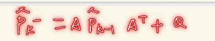
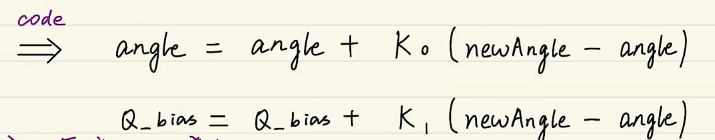

参考视频

[从放弃到精通！卡尔曼滤波从理论到实践](https://www.bilibili.com/medialist/play/watchlater/BV1Rh41117MT)

其他视频

[手写卡尔曼滤波：0.导言--什么运动跟踪](https://www.bilibili.com/video/BV1GB4y1D7P1)

## 入门

> 适用系统--线性高斯系统

* 线性(叠加性与齐次性)
  * $y=kx+b,z=ax+by,w=u^2+v^2,...$

* 高斯
  * 噪声满足高斯分布

> 宏观意义

滤波即加权。理想状态下：$信 号×1 + 噪 声×0$

如果$低 频×1 + 高 频×0$，就是低通滤波，如果$估 计×? + 观 测×?$  就是卡尔曼滤波。

## 进阶

### 状态空间表达式

> 状态方程

$$
x_k=Ax_{k-1}+Bu_k+W_k
$$

其中，$x_k$是当前状态的值，$x_{k-1}$是前一状态的值，$A$是状态转移矩阵，$u_k$是一个输入，$B$是控制矩阵，$W_k$是过程噪声。

可以认为，前两项是我们建立的理想运动方程，但现实中存在一定影响因素，导致物体运动不理想，于是加入了第三项。举个例子，以匀速直线运动为例，小车位置用$P_k$表示。此时，对应含义如图所示，其中$W_k$就是外界影响，比如风向、摩擦力。


> 观测方程

$$
y_k=Cx_k+V_k
$$

其中，$y_k$是观测量，$x_k$是状态的值，$C$是某种关系阵，$v_k$是观测噪声。


### 高斯分布

> 直观图解


> 参数分析

* $W_k\in N(0,Q_k)$，$V_k\in N(0,R_k)$
  * 这两个均为高斯白噪声

> 方差

[协方差_百度百科 (baidu.com)](https://baike.baidu.com/item/协方差/2185936?fr=aladdin)


* 噪声方差 $Q_k,R_k$

* 状态方差 $\widehat{x}_{t}^{-}$

> 超参数

$Q,R$ 就是需要慢慢调整的超参数，分别是过程的噪声和观测噪声的方差。

> 卡尔曼直观图解


$\widehat{x}_{k-1}$ 是前一时刻的最优估计值，$\widehat{x}_{k}^{-}$ 是当前时刻的估计值，$y_k$ 也就是 $x_k$，是当前时刻的观测值，即传感器直接测量出来的值。$\widehat{x}_{k}$ 是利用$\widehat{x}_{k}^{-}$和$x_k$计算出的最优估计值。

## 放弃

### 卡尔曼公式理解

> 实现过程

使用上一次的最优估计值预测当前的估计值，同时使用观测值修正当前估计值，进而得到当前时刻最优估计值。

> 预测公式

基于之前最有估计，来预测当前先验估计（并不是最终结果）
$$
\widehat{x}_{t}^{-} = F\widehat{x}_{t-1}+Bu_{t-1}
$$
先验估计协方差公式
$$
P_{t}^{-} = FP_{t-1}F^T+Q
$$

> 更新公式

卡尔曼增益
$$
K_t = P_{t}^{-}H^T(HP_{t}^{-}H^T+R)^{-1}
$$
最优估计值（最终结果）
$$
\widehat{x}_{t} = \widehat{x}_{t}^{-}+K_{t}(z_t-H\widehat{x}_{t}^{-})
$$
后验估计协方差矩阵
$$
P_t = (I-K_tH)P_{{t}^{-}}
$$

> 举个例子来理解上面的方程

先说**预测**部分


$P$ 表示位置，$V$ 表示速度，先验估计的公式就来了


协方差矩阵怎么来的？继续，先了解协方差的基本


推导一下就有


图上注释说维数可以不一样，也很好理解，就是图中，咱们不要 $Z_v$ 也没有什么不妥，$Z_t$ 就是一维的，直接写成 $Z_p$ 也可以，剩下的同理。


好的，接着进入**状态更新**部分。


其中④根据卡尔曼增益，来确定是更信任先验估计值，还是更信任观测值。

然后，⑤其实和Q与R都有关系，为方便推到，假设H是一维的，就是1，那么式子可以改写为


### 调节超参数

> Q与R的取值


想更信估计值，就需要让K变小，即分子变小或分母变大。

想更信任观测值，就需要让K变大，即分子变大或分母变小。


对于过程噪声Q，如果运动比较理想，说明噪声少，那么Q可以给小一点。

对于观测噪声R，如果传感器很贵、很准，误差小，那么R可以小一点；如果买的便宜货，可能R需要大一点。

> $P_0$ 与 $\widehat{x}_0$ 的取值

习惯取$\widehat{x}_0=0$（也可以根据实际情况定），$P$ 往小的取，方便收敛 （一般取1，不可为0）

### 卡尔曼滤波的使用

* 选择状态量、观测量
* 构建方程
* 初始化参数（$Q，R，\widehat{x}_0，P_0$）
* 代入公式送代
* 调节超参数

## 精通

### 卡尔曼滤波公式回顾


与离散控制系统进行比对，就是两种写法，含义相同


### 机器人应用举例

#### 陀螺仪滤波

>选择状态量、观测量


> 预测当前角度

由先验估计方程
$$
X(k|k-1) = AX(k-1|k-1)+BU(k)+W(k)
$$


预测当前角度值


$$
\begin{bmatrix}
 angle\\
Q_{bias}
\end{bmatrix} = \begin{bmatrix}
 1 & -dt\\
 0 & 1
\end{bmatrix}\begin{bmatrix}
 angle\\
Q_{bias}
\end{bmatrix}+\begin{bmatrix}
 dt\\
0
\end{bmatrix}*newGyro
$$
对应的代码如下（等号右侧不必写（i-1），因为代码中这就相当于旧的被换掉）

```python
angle = angle - Q_bias * dt + newGyro * dt
Q_bias = Q_bias
```

> 预测协方差矩阵

由误差协方差方程 $P(k|k-1)=AP(k-1|k-1)A^T+Q$

* 先验估计有系统参数
  
*  $A=\begin{bmatrix} 1 & -dt\\  0 & 1 \end{bmatrix}$
  
* 系统过程协方差噪声Q定义
  * 
  * 

* 设上一次最有估计的协方差矩阵$P_{k-1}$为$\begin{bmatrix} a_{k-1}^* &  b_{k-1}^*\\   c_{k-1}^* &  d_{k-1}^* \end{bmatrix}$，本次预测协方差矩阵$P_k$为$\begin{bmatrix} a_k &  b_k\\   c_k &  d_k \end{bmatrix}$

  * 将以上参数带入预测协方差公式

  * 

  * 对应代码

    * ```python
      # a_k
      p[0][0] = p[0][0] + Q_angle - (P[0][1]-p[1][0])*dt + p[1][1]*(dt)^2 # 由于(dt)^2非常小，所以本式中”p[1][1]*(dt)^2“可忽略不要
      # b_k
      p[0][1] = p[0][1] - p[1][1]*dt
      # c_k
      p[1][0] = p[1][0] - p[1][1]*dt
      # d_k
      p[1][1] = p[1][0] + Q_Gyro
      ```

> 建立测量方程

* 系统测量方程 $Z(k)=HX(k)+V(k)$，$X(k)$就是陀螺仪测量的角度

* 系统测量系数 $H=[1,0]$

写成代码

```python
measure = newAngle # 这里没有体现出噪声，是因为本身测量值里头就有噪声
```

> 计算卡尔曼增益

* 卡尔曼增益系数方程 $K_g(k)=\frac{P(k|k-1)H^T}{HP(k|k-1)H^T+R}$
* 
  *  $K_g(k)$是二维，是因为一个是angle，一个是Q_bias

写成代码


```python
K_0 = (p[0][0] / (p[0][0]+R_angle))
K_1 = (p[1][0] / (p[0][0]+R_angle))
```

> 计算当前最优估计值

* 根据最优估计值方程 $X(k|k)=X(k|k-1)+K_g(k)[Z(k)-HX(k|k-1)]$
  * 

写成代码



```python
angle = angle + K_0*(newAngle-angle)
Q_bias = Q_bias + K_1*(newAngle-angle)
```

> 更新协方差矩阵

* $P(k|k)=[I-K_g(k)H]P(k|k-1)$
  * 

写成代码


```python
p[0][0] = p[0][0] - K_0 * p[0][0]
p[0][1] = p[0][1] - K_0 * p[0][1]
p[1][0] = p[1][0] - K_1 * p[0][0]
p[1][0] = p[1][0] - K_1 * p[0][1]
```


#### 全部代码

**不一定对，也不一定含义明确，只是写出来看看，可以有个参考**

```c++
void Kalman_Filter(float newAngle, float newGyro){
    # 1 选择状态量、观测量
	angle = angle - Q_bias * dt + newGyro * dt;
    # 2 预测当前角度
	p[0][0] = p[0][0] + Q_angle - (P[0][1]-p[1][0])*dt;
	p[0][1] = p[0][1] - p[1][1]*dt;
	p[1][0] = p[1][0] - p[1][1]*dt;
	p[1][1] = p[1][0] + Q_Gyro;
    # 3 建立测量方程
    measure = newAngle;
    # 4 预测协方差矩阵
    K_0 = (p[0][0] / (p[0][0]+R_angle));
	K_1 = (p[1][0] / (p[0][0]+R_angle));
    # 5 计算当前最优估计值
    angle = angle + K_0*(newAngle-angle);
	Q_bias = Q_bias + K_1*(newAngle-angle);
    # 6 更新协方差矩阵
    p[0][0] = p[0][0] - K_0 * p[0][0];
	p[0][1] = p[0][1] - K_0 * p[0][1];
	p[1][0] = p[1][0] - K_1 * p[0][0];
	p[1][1] = p[1][1] - K_1 * p[0][1];
	
    return angle,Q_bias;
}
```

这是别人的一个python写的代码

```python
from matplotlib import pyplot
import math
import random
 
lastTimePredVal = 0  # 上次估计值
lastTimePredCovVal = 0.1  # 上次估计协方差
lastTimeRealCovVal = 0.1  # 上次实际协方差
kg = 0.0 #卡尔曼增益
 
# val: 本次测量值
def kalman(val):
    #python中如果若想在函数内部对函数外的变量进行操作，就需要在函数内部声明其为global。
    global lastTimePredVal  # 上次估计值
    global lastTimePredCovVal  # 上次估计协方差
    global lastTimeRealCovVal  # 上次实际协方差
    global kg
 
    currRealVal = val  # 本次实际值
    currPredCovVal = lastTimePredCovVal  # 本次估计协方差值
    currRealCovVal = lastTimeRealCovVal  # 本次实际协方差值
 
    # 计算本次估计值，并更新保留上次预测值的变量
    currPredVal = lastTimePredVal + kg * (currRealVal - lastTimePredVal)
    lastTimePredVal = currPredVal
 
    #计算卡尔曼增益
    kg = math.sqrt(math.pow(lastTimePredCovVal, 2) / (math.pow(lastTimePredCovVal, 2) + math.pow(lastTimeRealCovVal, 2)))
 
    # 计算下次估计和实际协方差
    lastTimePredCovVal = math.sqrt(1.0 - kg) * currPredCovVal
    lastTimeRealCovVal = math.sqrt(1.0 - kg) * currRealCovVal
 
    # 返回本次的估计值,也就是滤波输出值
    return currPredVal
 
 
if __name__ == "__main__":
    realTemp = []                   # 真实温度
    predTemp = []                   # 预测温度
 
    # 生成50个真实温度，20度到23度之间
    for i in range(50):
        realTemp.append(random.uniform(20, 23))
 
    # 卡尔曼滤波
    for t in realTemp:
        predVal = kalman(t)
        predTemp.append(predVal)
 
    # 绘制真实温度和预测温度折线图
    pyplot.figure()
    pyplot.plot(predTemp, label='predict_temp')
    pyplot.plot(realTemp, label='real_temp')
    pyplot.tick_params(axis='x', which='major', labelsize=int(len(predTemp)/10))
    pyplot.xlabel('Count')
    pyplot.ylabel('Temperature')
    pyplot.show()
```

运行的结果为：橘黄色是真实值


