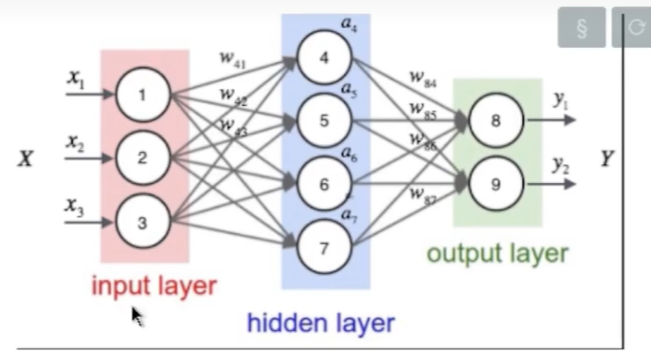
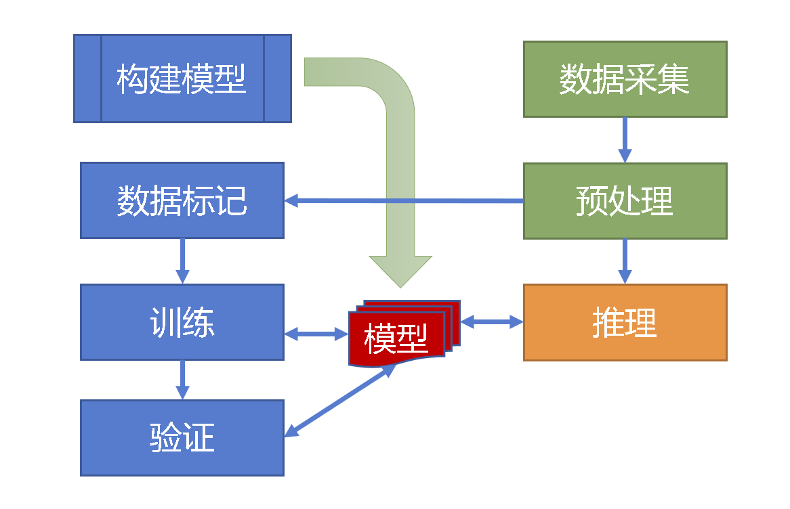
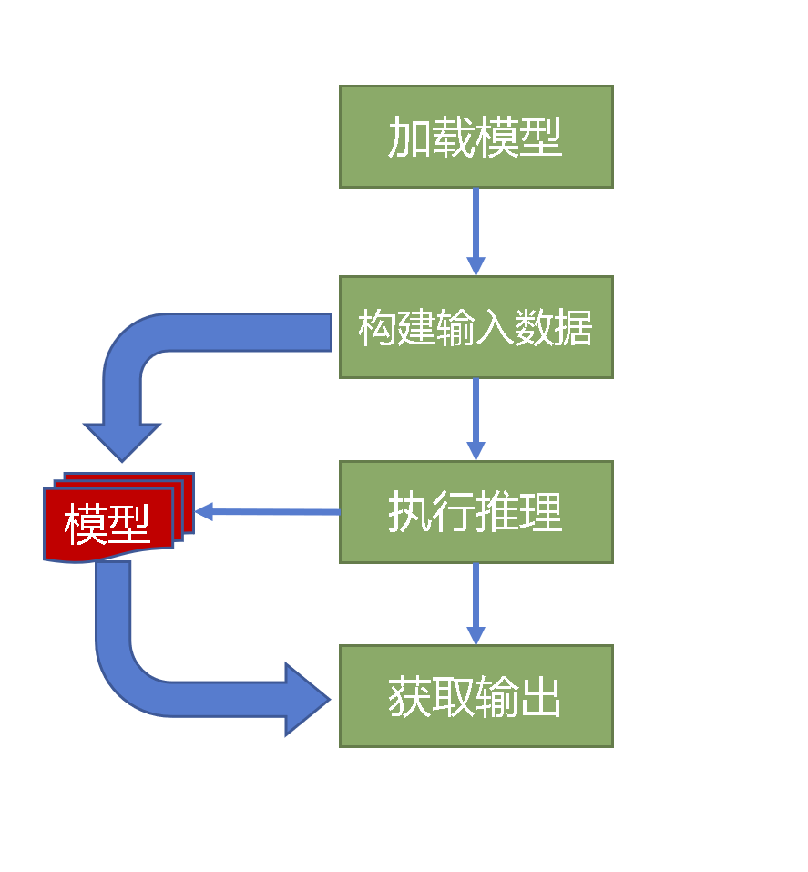

参考视频 [【Workshop】TinyML手势识别项目分享 | ESP32项目 (bilibili.com)](https://www.bilibili.com/medialist/play/watchlater/BV1mA4y1Z7p8)

项目地址 [mushroomcloud-cc/tinyml-workshop (github.com)](https://github.com/mushroomcloud-cc/tinyml-workshop)

**基于6轴传感器数据采样（加速度计和陀螺仪），识别两种手势（⚪和×）动作**


## 框架

- Tensorflow
- Keras
- Tensorflow Lite Micro

## 环境

### Python

- Python 3.8
- Tensorflow 2.9.2 （不同版本的api可能有差距，实际使用时根据需求自行修改）
- numpy 1.22.4
- PyOpenGL 3.1.6

### Arduino

Arduino 1.8

* 开发板管理需装有ESP32包（2.x）
  * 作者使用ESP32C3 Dev Module
  * USB CDC On Boot 选择 "Enable" -- 使用自带USB转串口
* 还需安装库文件 TensorFlowLite_ESP32

## 数据

* 长度 1.2s
* 频率 100Hz

## 模型

非常简单的MLP



输入大小：720（120*6轴）

输出大小：2

## 流程



数据采集

- UDP数据传输（可以不广播，会存在丢包现象）
  - 作者解决丢包的方式是插值，插入前面一个值

预处理

- 滑动平均

训练

优化、转换

推理应用



## 代码

### Host

#### SensorProcess.py

上位机接收设备发送的UDP数据，并保存数据（DataFile.py）

运行一次这个程序，就可以采集一个动作的数据。所以想采多少个，就得运行多少次。这里或许可以用一些逻辑修改，或者其他代码来调用。

```python
   from asyncio.windows_events import NULL
   import socket
   from unittest import skip
   from PerformanceCounter import PerformanceCounter
   from SensorChart import SensorChart
   from DataFile import DataFile
   
   class UdpServer:
       def __init__(self):
           self.Sample = []
           self.Data = []
           self.Idle = True
           self.SampleCount = 0
   
           self.Counter = PerformanceCounter()
           self.Chart = SensorChart()
           self.DataFile = DataFile()
   
           self.Server = socket.socket(socket.AF_INET, socket.SOCK_DGRAM)
           self.Server.setsockopt(socket.SOL_SOCKET, socket.SO_BROADCAST, 1)
           self.Server.setsockopt(socket.SOL_SOCKET, socket.SO_RCVBUF, 65536 * 16)
           self.Server.settimeout(0.5)
   
           ip = self.GetLocalIP("192.168.10")
           print(ip)
           self.Server.bind((ip, 8000)) 
   
   
       def Run(self):
           self.Chart.Run(self.Recv) 
           self.DataFile = NULL
   
       """
       核心过程，每次收到数据都会执行本方法。
       """
       def Recv(self):
           self.Data = [0] * 9
   
           try:
               # 当收到40个字节（4字节序号，9轴*4Byte整数=36字节）数据时，开始执行。
               data, address = self.Server.recvfrom(40)
   
               #print(len(data), data)
    # 整数分大端和小端两种模式(高字节位和低字节位谁在前的区别)，MCU上一般是小端模式，电脑上(尤其是x86)一般为大端模式
               reader = lambda p: int.from_bytes(data[p:p + 4], byteorder="little", signed=True)
   
               c = reader(0)    
               for i in range(9):
                  self.Data[i]  = reader((i + 1) * 4)
               
               if self.Idle: 
                   self.Sample = []
                   self.Idle = False
   			   # 如果发现本次丢包，即返回的序号要比传来的序号小，就把这条数据复制一次，挺妙啊！！！！！！！！！！
               while self.AddData(c, self.Data[:]) < c:
                   continue 
   
   
           except socket.timeout:
               if not self.Idle:
                   if len(self.Sample) == 120:
                       self.SampleCount += 1
                       for d in self.Sample:
                           self.DataFile.Write(d)
                   else:
                       self.Sample = []
                       
                   print("Sample: ", self.SampleCount)
   
               self.DataFile.Close()
               self.Counter.Reset()
               self.Idle = True
   
           except Exception as e:
               self.Data = []
               print("error", e.args)
   
   
       def AddData(self, c, d):
               self.Sample.append(d)
   
               [count, t] = self.Counter.Frame()
               print(count, int(t * 1000), c, d)
   
               self.Chart.Draw(d, self.Sample)
   
               return count
   
   
       def GetLocalIP(self, mask):
           host_name = socket.gethostname()
           ips = socket.gethostbyname_ex(host_name)[2]
   
           for ip in ips:
               if ip.startswith(mask):
                   ret = ip    
   
           return ret       
   
   
   
   if __name__ == '__main__':
       Server = UdpServer()
       Server.Run()
```

##### DataFile.py

保存数据，用的是 a+模式

单采一种动作时，可以根据动作，修改代码中的文件名，比如作者就改过"cross"和"circle"，这就相当于标注过的数据集了。

```python
import sys
import os

class DataFile:
    def __init__(self):
        self.File = None
        self.BasePath = os.path.dirname(__file__)


    def __del__(self):
        self.Close()


    def Write(self, data):
        if self.File == None:
            self.Open()

        if len(data) >= 6:
            for i in range(6):
                if i > 0: self.File.write("\t")
                self.File.write(str(data[i]))

            self.File.write("\n")   


    def Open(self):       
        self.File = None
        self.File = open(self.BasePath + "/data/data.csv", "a+")


    def Close(self):
        if self.File != None:
            self.File.flush()
            self.File.close()

        self.File = None

    
```

##### SensorChart.py

图形化显示加速度和角度的

```python
from OpenGL import GLUT, GLU, GL

AxisColor = [[1, 0, 0], [0, 1, 0], [0, 0, 1]]
BarScale = [0.00005, 0.00005, 0.00005, 0.00005, 0.00005, 0.00005, 0.0015, 0.0015, 0.0015]

class SensorChart:
    def __init__(self):
        GLUT.glutInit()
        GLUT.glutInitDisplayMode(GLUT.GLUT_SINGLE | GLUT.GLUT_RGBA)
        GLUT.glutInitWindowSize(600, 600)
        GLUT.glutCreateWindow("3D")


    def Run(self, proc):
        GLUT.glutDisplayFunc(self.Draw)
        GLUT.glutIdleFunc(proc)

        GLUT.glutMainLoop()


    def Draw(self, data=None, data_his=None):
        GL.glClear(GL.GL_COLOR_BUFFER_BIT)
        GL.glBegin(GL.GL_LINES)

        YScale = lambda y: y / 5 * 0.00001 

        # Draw Bars
        if data != None:
            for i in range(len(data)):
                x = i * 0.1 - 0.9
                y = 0.75 + YScale(data[i])
                c = AxisColor[i % 3]

                GL.glColor3f(c[0], c[1], c[2])
                GL.glVertex3f(x, 0.75, 0)
                GL.glVertex3f(x, y, 0)

        # Draw Curves
        if data_his != None and len(data_his) > 0:
            size = len(data_his)
            for i in range(6):
                c = AxisColor[i % 3]
                y0 = 0.1 if i > 2 else -0.6
                GL.glColor3f(c[0], c[1], c[2])
                    
                px = -1
                py = y0 + YScale(data_his[0][i])   
                for k in range(size - 1):
                    x = -1 + (k + 1) *  2 / 120
                    y =  y0 + YScale(data_his[k + 1][i])
                    GL.glVertex3f(px, py, 0)
                    GL.glVertex3f(x, y, 0)
                    px = x
                    py = y


        GL.glEnd()
        GL.glFlush()
```


#### tinyml.py

```python
   import numbers
   import os
   os.environ["CUDA_VISIBLE_DEVICES"] = "-1"
   
   import math
   import numpy as np
   import tensorflow as tf
   
   from tensorflow import keras
   layers = keras.layers
   
   SAMPLES_PER_GESTURE = 120
   
   Model = None
   """
   创建模型
   32，16，2的三层全连接层
   优化器为 opt_adam = keras.optimizers.Adam()
   损失函数为loss='categorical_crossentropy'
   显示方式（计算精度）为metrics=['categorical_accuracy']
   """
   def CreateModel():
       model = tf.keras.Sequential()
       # 第一个全连接层指定输入形状，可能这个版本这样写吧
       model.add(layers.Dense(32, activation='relu', input_shape=(6 * SAMPLES_PER_GESTURE,)))
       model.add(layers.Dense(16, activation='relu'))
       # 最后一层softmax输出概率值
       model.add(layers.Dense(2, activation='softmax'))
   
       opt_adam = keras.optimizers.Adam()
       model.compile(optimizer=opt_adam, loss='categorical_crossentropy', metrics=['categorical_accuracy'])   
       model.summary() # 显示模型所有信息
       return model
   
   
   def PrepareModel(model):
       SAMPLES = 100
       np.random.seed(1337)
       
       x_values = np.random.uniform(low=0, high=2 * math.pi, size=(SAMPLES, 6 * SAMPLES_PER_GESTURE))
       # shuffle and add noise
       np.random.shuffle(x_values)
       y_values = np.random.uniform(low=0, high=1, size=(SAMPLES, 2))
       #y_values = np.random.randn(*y_values.shape)
   
       return x_values, y_values
       
   """
   训练模型
   传入模型，数据集
   """
   def TrainModel(model, x, y):
       SampleCount = len(x)
   
       # 划分为train, validation, test
       TRAIN_SPLIT =  int(0.8 * SampleCount)
       x_train, x_validate = np.split(x, [TRAIN_SPLIT, ])
       y_train, y_validate = np.split(y, [TRAIN_SPLIT, ])
       # 训练
       model.fit(x_train, y_train, epochs=200, batch_size=16, validation_data=(x_validate, y_validate))
   
   """
   tf模型转化（优化）
   转化为tflite模型
   """
   def ConvertModel(model):
       converter = tf.lite.TFLiteConverter.from_keras_model(model)
       tflite_model = converter.convert()
       
       return tflite_model
   
   def SaveModel(model):
       with open("model.tflite", "wb") as f:
           f.write(model)
   
   """
   转换成c语言头文件
   """
   # Function: Convert some hex value into an array for C programming
   def Hex2H(model, h_model_name):   
       c_str = ''
       model_len = len(model)
   
       # Create header guard
       c_str += '#ifndef ' + h_model_name.upper() + '_H\n'
       c_str += '#define ' + h_model_name.upper() + '_H\n'
   
       # Add array length at top of file
       # 这里和下面的const加不加要看MCU的RAM和Flash的使用情况，具体见model.h部分
       c_str += '\nconst unsigned int ' + h_model_name + '_len = ' + str(model_len) + ';\n'
   
       # Declare C variable
       c_str += 'const unsigned char ' + h_model_name + '[] = {'
       hex_array = []
       for i, val in enumerate(model) :
           # Construct string from hex
           hex_str = format(val, '#04x')
   
           # Add formatting so each line stays within 80 characters
           if (i + 1) < model_len:
             hex_str += ','
           if (i + 1) % 12 == 0:
             hex_str += '\n '
           hex_array.append(hex_str)
   
       # Add closing brace
       c_str += '\n ' + format(' '.join(hex_array)) + '\n};\n\n'
   
       # Close out header guard
       c_str += '#endif //' + h_model_name.upper() + '_H\n'
           
       # Write TFLite model to a C source (or header) file
       base_path = os.path.dirname(__file__)
       with open(base_path + "/" + h_model_name + '.h', 'w') as file:
           file.write(c_str)   
           file.flush()

         
   """
   读取数据
   文件，标签v（⚪是1，×是0）
   """  
   def ReadDataFile(file, v):
       size = SAMPLES_PER_GESTURE * 6 # 结果应该是720吧
   
       dataX = np.empty([0, size])
       # dataY = np.empty([0,])
       dataY = np.empty([0, 2])
   
       base_path = os.path.dirname(__file__)
       file = open(base_path + "/data/" + file, "r")
   
       data = []
       for line in file.readlines():
           items = line.split()
           values = [int(v) / 32768 for v in items ]
           data += values
   
       count = len(data)
   
       for i in range(0, count, size):
           # 720为一组
           tmp = np.array(data[i: i + size])
           if len(tmp) == size:
               # 前面增加一个维度
               tmp = np.expand_dims(tmp, axis=0)
   
               dataX = np.concatenate((dataX, tmp), axis=0) # 就是现在的np.concat()
               # dataY = np.append(dataY, v)
               dataY = np.concatenate((dataY, [[1, 0]] if v == 0 else [[0, 1]]))
   
       return dataX, dataY
   
      
   """
   使用ReadDataFile读取训练数据
   """
   def ReadTrainingData():
       circle_x, circle_y = ReadDataFile("circle.csv", 1)
       cross_x, cross_y = ReadDataFile("cross.csv", 0)
   
       dataX = np.concatenate((circle_x, cross_x), axis=0)
       dataY = np.concatenate((circle_y, cross_y), axis=0)
   
       return dataX, dataY
   
   if __name__ == '__main__':
       Model = CreateModel()
       #PrepareModel(Model)
       
       x, y = ReadTrainingData()
       TrainModel(Model, x, y)
   
	   """
	   第1步：tf模型转化（优化）
	   这个模型不能直接被MCU使用，因为MCU没有文件系统
	   因此需要进行第2步，转换成c语言的头文件
	   """
       print("==== Convert Model")
       tfModel = ConvertModel(Model)
       """
	   第2步：转换成c语言的头文件
	   """
       print("==== Make Header File")
       Hex2H(tfModel, "model")
   
       print("==== Model Build Finished")
```

#### model.h

加const存在flash里，不加const就是变量，存在RAM里；自己根据开发板的RAM和Flash使用情况来改。

```c
#ifndef MODEL_H
#define MODEL_H

unsigned int model_len = 96572;
unsigned char model[] = {0x1c, 0x00, 0x00, 0x00, 0x54, 0x46, 0x4c, 0x33, 0x14, 0x00, 0x20, 0x00,........一堆这样的数据};

#endif //MODEL_H
```


> 训练结果

```
{
 "cells": [
  {
   "cell_type": "code",
   "execution_count": 1,
   "id": "5b90960c",
   "metadata": {},
   "outputs": [],
   "source": [
    "from tinyml import *\n"
   ]
  },
  {
   "cell_type": "code",
   "execution_count": 2,
   "id": "3aa59cd7",
   "metadata": {
    "scrolled": false
   },
   "outputs": [
    {
     "name": "stdout",
     "output_type": "stream",
     "text": [
      "Model: \"sequential\"\n",
      "_________________________________________________________________\n",
      " Layer (type)                Output Shape              Param #   \n",
      "=================================================================\n",
      " dense (Dense)               (None, 32)                23072     \n",
      "                                                                 \n",
      " dense_1 (Dense)             (None, 16)                528       \n",
      "                                                                 \n",
      " dense_2 (Dense)             (None, 2)                 34        \n",
      "                                                                 \n",
      "=================================================================\n",
      "Total params: 23,634\n",
      "Trainable params: 23,634\n",
      "Non-trainable params: 0\n",
      "_________________________________________________________________\n"
     ]
    }
   ],
   "source": [
    "Model = CreateModel()"
   ]
  },
  {
   "cell_type": "code",
   "execution_count": 3,
   "id": "43bcd7b1",
   "metadata": {
    "scrolled": true
   },
   "outputs": [
    {
     "name": "stdout",
     "output_type": "stream",
     "text": [
      "Epoch 1/200\n",
      "6/6 [==============================] - 1s 61ms/step - loss: 0.0338 - categorical_accuracy: 1.0000 - val_loss: 3.3762e-04 - val_categorical_accuracy: 1.0000\n",
      "Epoch 2/200\n",
      "6/6 [==============================] - 0s 9ms/step - loss: 8.1729e-05 - categorical_accuracy: 1.0000 - val_loss: 6.4333e-05 - val_categorical_accuracy: 1.0000\n",
      ......,
      ......,
      ......,
      "Epoch 199/200\n",
      "6/6 [==============================] - 0s 8ms/step - loss: 3.1604e-07 - categorical_accuracy: 1.0000 - val_loss: 8.0737e-07 - val_categorical_accuracy: 1.0000\n",
      "Epoch 200/200\n",
      "6/6 [==============================] - 0s 10ms/step - loss: 3.1327e-07 - categorical_accuracy: 1.0000 - val_loss: 8.0737e-07 - val_categorical_accuracy: 1.0000\n"
     ]
    }
   ],
   "source": [
    "x, y = ReadTrainingData()\n",
    "TrainModel(Model, x, y)"
   ]
  },
  {
   "cell_type": "code",
   "execution_count": null,
   "id": "068ca7bd",
   "metadata": {
    "scrolled": true
   },
   "outputs": [],
   "source": [
    "ConvertModel(Model)"
   ]
  },
  {
   "cell_type": "code",
   "execution_count": null,
   "id": "dffe07f9",
   "metadata": {},
   "outputs": [],
   "source": [
    "Hex2H(Model, \"model\")"
   ]
  }
 ],
 "metadata": {
  "interpreter": {
   "hash": "065a7fd65857af9b0d7d7760ab62099efda22ea2fccd7cdd83105fb1a789eaf5"
  },
  "kernelspec": {
   "display_name": "Python 3",
   "language": "python",
   "name": "python3"
  },
  "language_info": {
   "codemirror_mode": {
    "name": "ipython",
    "version": 3
   },
   "file_extension": ".py",
   "mimetype": "text/x-python",
   "name": "python",
   "nbconvert_exporter": "python",
   "pygments_lexer": "ipython3",
   "version": "3.8.10"
  }
 },
 "nbformat": 4,
 "nbformat_minor": 5
}
```


### prediect_gesture.ino

**作者将很多函数写成了CPP和C文件，以使得本代码看着更简洁**

这是常规的AIoT开发方式，模型和硬件代码是捆绑在一起的。

还有其他方式，比如模型写入到特定的flash区域，代码在其他区域。这样代码和model就解绑了，如果换模型，就不用重新同时烧录这两个，只要刷掉硬件代码即可。具体方法还没了解过。

```c++
#include <TensorFlowLite_ESP32.h>
#include <tensorflow/lite/experimental/micro/kernels/all_ops_resolver.h>
#include <tensorflow/lite/experimental/micro/micro_error_reporter.h>
#include <tensorflow/lite/experimental/micro/micro_interpreter.h>
#include <tensorflow/lite/schema/schema_generated.h>
#include <tensorflow/lite/version.h>

#include <Arduino.h>
#include <Esp.h>
#include <HardwareSerial.h>
#include <WiFi.h>
#include <WiFiUdp.h>

#include "MPU9250.h"
#include "UDPChannel.h"
#include "HRTimer.h"
#include "LED.h"

#include "model.h"

// 按钮
const int BUTTOM_PIN = 4;
// wifi
const char* AP_SSID = "iCheng";
const char* AP_PWD = "nopassword";
// 姿势
const char* GESTURES[] = {
  "cross",
  "circle"
};
const int NUM_GESTURES = sizeof(GESTURES) / sizeof(GESTURES[0]);
const int SAMPLE_COUNT = 120;

MPU9250 IMU(9, 8); // SCL,SDA
// WiFi与UDP
UDPChannel Channel;
// 计时器
HRTimer LoopTimer;
// 计时器
HRTimer ExeTimer;

// 串口缓存
char SerialBuffer[50];

int conut = 0;
unsigned char sign = 0;
unsigned char counter = 0;

// 开发板 采样缓存
short SampleData[9];
// 开发板 IMU缓存
int IMUData[9];
int LastData[9];

const float ACCELERATION_THRESHOLD = 2E6;
const int SMOTH_COUNT = 5;
// 有了这个序号，便于一定程度上解决数据丢包问题
int RecordCount = -1; // -1 表示数据采集未启动

// 开发板 更大维度的IMU缓存
float Samples[6][SAMPLE_COUNT];
// 经典8行代码
tflite::MicroErrorReporter tflErrorReporter;
tflite::ops::micro::AllOpsResolver tflOpsResolver;

const tflite::Model* tflModel = nullptr;
tflite::MicroInterpreter* tflInterpreter = nullptr;
TfLiteTensor* tflInputTensor = nullptr;
TfLiteTensor* tflOutputTensor = nullptr;

constexpr int tensorArenaSize = 8 * 1024;
byte tensorArena[tensorArenaSize];

void setup() {
  // 按钮设置为输入上拉模式
  pinMode(BUTTOM_PIN, INPUT_PULLUP);
  // 初始化串口
  Serial.begin(115200);
  // 启动WiFi和UDP的网络
  Channel.ConnectAP(AP_SSID, AP_PWD);

  Serial.println("Starting IMU...");
  // 初始化IMU
  IMU.Init();
  // 加载模型
  LoadModel();
}

void loop() {
  // 做了一个计时器，为了计算每一个loop周期消耗了多长时间，从而了解训练模式和工作模式的负载
  LoopTimer.Start();

  // TrainingMode(); // 训练模式
  PredictMode();  // 推理模式

  // 得到单次循环的ms
  // auto是c++14小技巧，类型推断，自动推断出类型，这里肯定需要浮点数，但是float，还是double，是不定的
  auto t = LoopTimer.End() / 1000.0;
  // 这是一个延迟，保证每个周期延迟10ms
  if (t < 10) {
    // 考虑到工作负载时间，得把工作时间去掉，再延迟剩下的，从而保证总延迟时间为10ms，妙啊！！！！！！！
    delay(10 - t);
  }
}

//
// Functions
//
/*加载模型*/
void LoadModel() {
  Serial.println("Loading Model");
  // model.h头文件里面定义的model
  // 这段代码会自动根据model的那一大串数组创建出模型对象
  tflModel = tflite::GetModel(model);

  int ModelVersion = tflModel->version();
  // 打印信息，保证加载的版本得和支持的版本一致
  sprintf(SerialBuffer, "Model Version: %d, TFLite Version: %d", ModelVersion, TFLITE_SCHEMA_VERSION);
  Serial.println(SerialBuffer);

  if (ModelVersion != TFLITE_SCHEMA_VERSION) {
    Serial.println("Model schema mismatch!");
  } else {
    Serial.println("Model Loaded!");
  }

  tflInterpreter = new tflite::MicroInterpreter(tflModel, tflOpsResolver, tensorArena, tensorArenaSize, &tflErrorReporter);
  tflInterpreter->AllocateTensors();
  // 输入与输出
  tflInputTensor = tflInterpreter->input(0);
  tflOutputTensor = tflInterpreter->output(0);
  // 输入和输出的形状
  sprintf(SerialBuffer, "Input Size: %d[%d, %d], Outpu Size: %d[%d, %d]", tflInputTensor->dims->size, tflInputTensor->dims->data[0], tflInputTensor->dims->data[1], tflOutputTensor->dims->size, tflOutputTensor->dims->data[0], tflOutputTensor->dims->data[1]);
  Serial.println(SerialBuffer);
}
/*训练模式*/
void TrainingMode() {
  // 先采样传感器数据
  Acquisition();

  // 按下按钮，开始计数，打开led
  if (digitalRead(BUTTOM_PIN) == LOW && RecordCount == -1) {
    RecordCount = 0;
    Led.On();
  }
 // 如果开始计数，则计数，并发送走数据
  if (RecordCount > -1) {
    RecordCount++;
    Send();
  }
  // 如果计满120个，则重置计数，关闭led
  if (RecordCount >= SAMPLE_COUNT) {
    RecordCount = -1;
    Led.Off();
  }
}
/*推理模式*/
void PredictMode()
{
  // 此部分整体过程和上面训练过程基本一致
  // 先读数据
  Acquisition();
  // 按下按钮则开始计数，亮灯
  if ((/*(DetectMotion() ||*/ digitalRead(BUTTOM_PIN) == LOW) && RecordCount == -1) {
    RecordCount = 0;
    Led.On();
  }
  // 达到120条，over，灯灭
  if (RecordCount >= SAMPLE_COUNT) {
    RecordCount = -1;
    Led.Off();
  // 如果invokeStatus == kTfLiteOk，则显示结果
    if (Inference()) Result();
  }
  else if (RecordCount > -1) { // 否则，没存满数据就继续存
    for (int i = 0; i < 9; i++) {
      // 将开发板 IMU缓存 中的数据放到开发板 更大维度的IMU缓存 中，此处用于存120个数据
      Samples[i][RecordCount] = IMUData[i] / 32768.0;
    }

    RecordCount++;
  }
}

/*检测动作*/
bool DetectMotion() {
  float sum = 0;

  for (int i = 3; i < 6; i++) {
    float a = (float)IMUData[i] - (float)LastData[i];
    sum += a * a;
  }

  for (int i = 0; i < 9; i++) {
    LastData[i] = IMUData[i];
  }

  bool ret = sum > ACCELERATION_THRESHOLD;
  // if(ret) Serial.println(sum);

  return ret;
}
/*采样数据*/
void Acquisition() {
  // 清空开发板 IMU缓存
  for (int i = 0; i < 9; i++) {
    IMUData[i] = 0;
  }
  
  for (int c = 0; c < SMOTH_COUNT; c++) {
    // 读取数据到开发板 采样缓存
    IMU.Read(SampleData);

    for (int i = 0; i < 9; i++)  {
      // 用开发板 采样缓存更新 开发板 IMU缓存
      IMUData[i] += SampleData[i];
    }
  }

  // sprintf(SerialBuffer, "%+5d\t%+5d\t%+5d | %+5d\t%+5d\t%+5d | %+5d\t%+5d\t%+5d\r\n", IMUData[0], IMUData[1], IMUData[2], IMUData[3], IMUData[4], IMUData[5], IMUData[6], IMUData[7], IMUData[8]);
  // Serial.print(SerialBuffer);
}
/*发送数据*/
void Send()
{
    // 发送序号 + 9轴数据
  Channel.Send(RecordCount, (unsigned char*)IMUData, 36);
}
/*推理*/
bool Inference()
{
  bool ret = false;

  // Copy Data to Model Input
  // 将数据送到模型的输入端口去
  for (int k = 0; k < SAMPLE_COUNT; k++) {
    for (int i = 0; i < 6; i++)  {
      // 模型的输入是1D的，所以这里用了2个循环；咱们自己输入2D，模型内部把他拉成1D也可以吧。
      tflInputTensor->data.f[k * 6 + i] = Samples[i][k];
    }
  }

  // Start Inference
  ExeTimer.Start(); // 计时器开始
  // 启动推理过程
  TfLiteStatus invokeStatus = tflInterpreter->Invoke();
  unsigned long t = ExeTimer.End(); // 计时器结束

  // Check Result
  if (invokeStatus == kTfLiteOk) {
    sprintf(SerialBuffer, "Invoke In %8.6f(ms)", t / 1000.0);
    Serial.println(SerialBuffer);

    ret = true;
  }
  else {
    Serial.println("Invoke failed!");
  }

  return ret;
}
/*结果*/
void Result()
{
  float p_threshold = 0.99;
  // 从模型输出端取得结果
  auto p_cross = tflOutputTensor->data.f[0];
  auto p_circle = tflOutputTensor->data.f[1];

  // 动作是⚪和×的概率
  sprintf(SerialBuffer, "Cross: %8.6f, Circle: %8.6f", p_cross, p_circle);
  Serial.println(SerialBuffer);

  // 达到预定的阈值，亮对应颜色
  if (p_cross > p_threshold)
  {
    Led.Red();
  }
  else if (p_circle > p_threshold)
  {
    Led.Blue();
  }
  else
  {
    Led.Blank();
  }
}
/*演示输出，没有调用的过这个函数*/
void ShowOutput()
{
  for (int i = 0; i < NUM_GESTURES; i++)
  {
    sprintf(SerialBuffer, "%s: %8.6f", GESTURES[i], tflOutputTensor->data.f[i]);
    Serial.println(SerialBuffer);
  }
}
```

####   UDPChannel.h

* 连接wifi

* 发送数据

```c
#ifndef _UDP_CHANNEL_H
#define _UDP_CHANNEL_H

#include <WiFiUdp.h>

class UDPChannel
{
public:
  UDPChannel();

  void ConnectAP(const char* ssid, const char* pwd);
  void Send(int count, unsigned char* buf, int len);
  
private:
  WiFiUDP UDP;
};

#endif
```

##### UDPChannel.cpp

```c++
#include "UDPChannel.h"

#include "LED.h"
#include <WiFi.h>


UDPChannel::UDPChannel()
{
  
}

void UDPChannel::ConnectAP(const char* ssid, const char* pwd)
{
    // WiFi.softAP(AP_SSID, AP_PWD);
    WiFi.begin(ssid, pwd);

    Serial.write("Waiting for connect to AP");
    while (!WiFi.isConnected())
    {
        Led.Toggle();
        Serial.write('.');
    }

    Led.Off();
    Serial.println("");
}
  
void UDPChannel::Send(int count, unsigned char* buf, int len)
{
    UDP.beginPacket("255.255.255.255", 8000);
    UDP.write((unsigned char*)&count, 4);
    UDP.write(buf, len);
    UDP.endPacket();
}
```

#### LED.h

```c
#ifndef _LED_H_
#define _LED_H_

const int LED_PIN = 10;
const int BLUE_PIN = 6;
const int RED_PIN = 7;

class LED {
public:
    LED();
    
    void On();
    void Off();
    void Toggle();

    void Blue();
    void Red();
    void Blank();
private:
    bool State;
};

extern LED Led;

#endif // _LED_H_
```

##### LED.cpp

```c++
#include "LED.h"

#include <Arduino.h>

LED::LED()
{
    pinMode(LED_PIN, OUTPUT);
    pinMode(BLUE_PIN, OUTPUT);
    pinMode(RED_PIN, OUTPUT);
              
    this->Off();
    this->Blank();
}

void LED::On()
{
    digitalWrite(LED_PIN, HIGH);
    this->State = true;
}

void LED::Off()
{
    digitalWrite(LED_PIN, LOW);
    this->State = true;
}
    
void LED::Toggle()
{
    this->State ? this->Off() : this->On();
}

void LED::Blue()
{
    digitalWrite(RED_PIN, HIGH);
    digitalWrite(BLUE_PIN, LOW);
}

void LED::Red()
{
    digitalWrite(BLUE_PIN, HIGH);
    digitalWrite(RED_PIN, LOW);
}

void LED::Blank()
{
    digitalWrite(BLUE_PIN, HIGH);
    digitalWrite(RED_PIN, HIGH);  
}

LED Led;
```

#### HRTimer.h

```c
#ifndef _HRTIMER_H_
#define _HRTIMER_H_

#include "MPU9250_Reg.h"

class HRTimer {
public:
    HRTimer();
    void Start();
    unsigned long End();

private:
    unsigned long LastTime;
};

#endif // _HRTIMER_H_
```


##### HRTimer.cpp

```c++
#include "HRTimer.h"

#include <Arduino.h>

HRTimer::HRTimer()
{
    this->LastTime = 0;
}

void HRTimer::Start()
{
    this->LastTime = micros();
}


unsigned long HRTimer::End()
{
    unsigned long ret; 
    unsigned long t = micros();
    
    ret = t - this->LastTime;
    if(t < this->LastTime)
    {
        ret = (unsigned long)-1 - ret + 1;
    }

    return ret;
}
```


#### MPU9250.h

```c
/*
 Note: The MPU9250 is an I2C sensor and uses the Arduino Wire library.
 Because the sensor is not 5V tolerant, we are using a 3.3 V 8 MHz Pro Mini or
 a 3.3 V Teensy 3.1. We have disabled the internal pull-ups used by the Wire
 library in the Wire.h/twi.c utility file. We are also using the 400 kHz fast
 I2C mode by setting the TWI_FREQ  to 400000L /twi.h utility file.
 */
#ifndef _MPU9250_H_
#define _MPU9250_H_

#include "MPU9250_Reg.h"

class MPU9250 {
public:
    MPU9250(int scl, int sda);
    void Init();
    void Read(short* buff);

private:
    // This function read Nbytes bytes from I2C device at address Address.
    // Put read bytes starting at register Register in the Data array.
    void I2Cread(int Address, int Register, int Nbytes, unsigned char* Data);
    // Write a byte (Data) in device (Address) at register (Register)
    void I2CwriteByte(int Address, int Register, unsigned char Data);
};

#endif // _MPU9250_H_
```

##### MPU9250_Reg.h

```c
#ifndef _MPU9250_REG_H_
#define _MPU9250_REG_H_

// See also MPU-9250 Register Map and Descriptions, Revision 4.0,
// RM-MPU-9250A-00, Rev. 1.4, 9/9/2013 for registers not listed in above
// document; the MPU9250 and MPU9150 are virtually identical but the latter has
// a different register map

#define SELF_TEST_X_GYRO 0x00
#define SELF_TEST_Y_GYRO 0x01
#define SELF_TEST_Z_GYRO 0x02

/*
#define X_FINE_GAIN      0x03 // [7:0] fine gain
#define Y_FINE_GAIN      0x04
#define Z_FINE_GAIN      0x05
#define XA_OFFSET_H      0x06 // User-defined trim values for accelerometer
#define XA_OFFSET_L_TC   0x07
#define YA_OFFSET_H      0x08
#define YA_OFFSET_L_TC   0x09
#define ZA_OFFSET_H      0x0A
#define ZA_OFFSET_L_TC   0x0B 
*/

#define SELF_TEST_X_ACCEL 0x0D
#define SELF_TEST_Y_ACCEL 0x0E
#define SELF_TEST_Z_ACCEL 0x0F

#define SELF_TEST_A       0x10

#define XG_OFFSET_H       0x13  // User-defined trim values for gyroscope
#define XG_OFFSET_L       0x14
#define YG_OFFSET_H       0x15
#define YG_OFFSET_L       0x16
#define ZG_OFFSET_H       0x17
#define ZG_OFFSET_L       0x18
#define SMPLRT_DIV        0x19
#define CONFIG            0x1A
#define GYRO_CONFIG       0x1B
#define ACCEL_CONFIG      0x1C
#define ACCEL_CONFIG2     0x1D
#define LP_ACCEL_ODR      0x1E
#define WOM_THR           0x1F

// Duration counter threshold for motion interrupt generation, 1 kHz rate,
// LSB = 1 ms
#define MOT_DUR           0x20
// Zero-motion detection threshold bits [7:0]
#define ZMOT_THR          0x21
// Duration counter threshold for zero motion interrupt generation, 16 Hz rate,
// LSB = 64 ms
#define ZRMOT_DUR         0x22

#define FIFO_EN            0x23
#define I2C_MST_CTRL       0x24
#define I2C_SLV0_ADDR      0x25
#define I2C_SLV0_REG       0x26
#define I2C_SLV0_CTRL      0x27
#define I2C_SLV1_ADDR      0x28
#define I2C_SLV1_REG       0x29
#define I2C_SLV1_CTRL      0x2A
#define I2C_SLV2_ADDR      0x2B
#define I2C_SLV2_REG       0x2C
#define I2C_SLV2_CTRL      0x2D
#define I2C_SLV3_ADDR      0x2E
#define I2C_SLV3_REG       0x2F
#define I2C_SLV3_CTRL      0x30
#define I2C_SLV4_ADDR      0x31
#define I2C_SLV4_REG       0x32
#define I2C_SLV4_DO        0x33
#define I2C_SLV4_CTRL      0x34
#define I2C_SLV4_DI        0x35
#define I2C_MST_STATUS     0x36
#define INT_PIN_CFG        0x37
#define INT_ENABLE         0x38
#define DMP_INT_STATUS     0x39  // Check DMP interrupt
#define INT_STATUS         0x3A
#define ACCEL_XOUT_H       0x3B
#define ACCEL_XOUT_L       0x3C
#define ACCEL_YOUT_H       0x3D
#define ACCEL_YOUT_L       0x3E
#define ACCEL_ZOUT_H       0x3F
#define ACCEL_ZOUT_L       0x40
#define TEMP_OUT_H         0x41
#define TEMP_OUT_L         0x42
#define GYRO_XOUT_H        0x43
#define GYRO_XOUT_L        0x44
#define GYRO_YOUT_H        0x45
#define GYRO_YOUT_L        0x46
#define GYRO_ZOUT_H        0x47
#define GYRO_ZOUT_L        0x48
#define EXT_SENS_DATA_00   0x49
#define EXT_SENS_DATA_01   0x4A
#define EXT_SENS_DATA_02   0x4B
#define EXT_SENS_DATA_03   0x4C
#define EXT_SENS_DATA_04   0x4D
#define EXT_SENS_DATA_05   0x4E
#define EXT_SENS_DATA_06   0x4F
#define EXT_SENS_DATA_07   0x50
#define EXT_SENS_DATA_08   0x51
#define EXT_SENS_DATA_09   0x52
#define EXT_SENS_DATA_10   0x53
#define EXT_SENS_DATA_11   0x54
#define EXT_SENS_DATA_12   0x55
#define EXT_SENS_DATA_13   0x56
#define EXT_SENS_DATA_14   0x57
#define EXT_SENS_DATA_15   0x58
#define EXT_SENS_DATA_16   0x59
#define EXT_SENS_DATA_17   0x5A
#define EXT_SENS_DATA_18   0x5B
#define EXT_SENS_DATA_19   0x5C
#define EXT_SENS_DATA_20   0x5D
#define EXT_SENS_DATA_21   0x5E
#define EXT_SENS_DATA_22   0x5F
#define EXT_SENS_DATA_23   0x60
#define MOT_DETECT_STATUS  0x61
#define I2C_SLV0_DO        0x63
#define I2C_SLV1_DO        0x64
#define I2C_SLV2_DO        0x65
#define I2C_SLV3_DO        0x66
#define I2C_MST_DELAY_CTRL 0x67
#define SIGNAL_PATH_RESET  0x68
#define MOT_DETECT_CTRL    0x69
#define USER_CTRL          0x6A  // Bit 7 enable DMP, bit 3 reset DMP
#define PWR_MGMT_1         0x6B // Device defaults to the SLEEP mode
#define PWR_MGMT_2         0x6C
#define DMP_BANK           0x6D  // Activates a specific bank in the DMP
#define DMP_RW_PNT         0x6E  // Set read/write pointer to a specific start address in specified DMP bank
#define DMP_REG            0x6F  // Register in DMP from which to read or to which to write
#define DMP_REG_1          0x70
#define DMP_REG_2          0x71
#define FIFO_COUNTH        0x72
#define FIFO_COUNTL        0x73
#define FIFO_R_W           0x74
#define WHO_AM_I_MPU9250   0x75 // Should return 0x71
#define XA_OFFSET_H        0x77
#define XA_OFFSET_L        0x78
#define YA_OFFSET_H        0x7A
#define YA_OFFSET_L        0x7B
#define ZA_OFFSET_H        0x7D
#define ZA_OFFSET_L        0x7E


//Magnetometer Registers

#define WHO_AM_I_AK8963  0x00 // should return 0x48
#define INFO             0x01
#define AK8963_ST1       0x02  // data ready status bit 0
#define AK8963_XOUT_L    0x03  // data
#define AK8963_XOUT_H    0x04
#define AK8963_YOUT_L    0x05
#define AK8963_YOUT_H    0x06
#define AK8963_ZOUT_L    0x07
#define AK8963_ZOUT_H    0x08
#define AK8963_ST2       0x09  // Data overflow bit 3 and data read error status bit 2
#define AK8963_CNTL      0x0A  // Power down (0000), single-measurement (0001), self-test (1000) and Fuse ROM (1111) modes on bits 3:0
#define AK8963_ASTC      0x0C  // Self test control
#define AK8963_I2CDIS    0x0F  // I2C disable
#define AK8963_ASAX      0x10  // Fuse ROM x-axis sensitivity adjustment value
#define AK8963_ASAY      0x11  // Fuse ROM y-axis sensitivity adjustment value
#define AK8963_ASAZ      0x12  // Fuse ROM z-axis sensitivity adjustment value


// eggfly added
#define PWR1_SLEEP_BIT     6

// Using the MPU-9250 breakout board, ADO is set to 0
// Seven-bit device address is 110100 for ADO = 0 and 110101 for ADO = 1

#define AK8963_ADDRESS  0x0C

#if ADO
#define MPU9250_ADDRESS 0x69  // Device address when ADO = 1
#else
#define MPU9250_ADDRESS 0x68  // Device address when ADO = 0
#endif // AD0


#define GYRO_FULL_SCALE_250_DPS 0x00
#define GYRO_FULL_SCALE_500_DPS 0x08
#define GYRO_FULL_SCALE_1000_DPS 0x10
#define GYRO_FULL_SCALE_2000_DPS 0x18

#define ACC_FULL_SCALE_2_G 0x00
#define ACC_FULL_SCALE_4_G 0x08
#define ACC_FULL_SCALE_8_G 0x10
#define ACC_FULL_SCALE_16_G 0x18

#define LPF_BANDWIDTH_FULL 0x00
#define LPF_BANDWIDTH_460 0x08
#define LPF_BANDWIDTH_184 0x09
#define LPF_BANDWIDTH_92 0x0A
#define LPF_BANDWIDTH_41 0x0B
#define LPF_BANDWIDTH_20 0x0C
#define LPF_BANDWIDTH_10 0x0D
#define LPF_BANDWIDTH_5 0x0E

#endif 
```


##### MPU9250.cpp

```c++
#include "MPU9250.h"

#include <Arduino.h>
#include <Wire.h>

#define GET_RINT(p, i) (short)(((unsigned short)p[i]) << 8 | p[i + 1]);
#define GET_INT(p, i) (short)(((unsigned short)p[i + 1]) << 8 | p[i]);

MPU9250::MPU9250(int scl, int sda)
{
    if(scl >= 0 && sda >= 0)
    {
      if(!Wire.setPins(sda, scl)) Serial.println("Wire Set Pin Faild!");
    }
    
    if(!Wire.begin()) Serial.println("Wire Begin Faild!");
}

void MPU9250::Read(short* data)
{
    unsigned char buff[25];

    // Read accelerometer and gyroscope
    I2Cread(MPU9250_ADDRESS, ACCEL_XOUT_H, 14, buff);

    unsigned char ST1;
    // Read register Status 1 and wait for the DRDY: Data Ready
    // I2Cread(AK8963_ADDRESS, AK8963_ST1, 1, &ST1);
    // if (ST1 & 0x01) 
    {
        // Read magnetometer data
        // I2Cread(AK8963_ADDRESS, AK8963_XOUT_L, 6, buff + 14);
    }

    // ax, ay, az
    data[0] = GET_RINT(buff, 0);
    data[1] = GET_RINT(buff, 2);
    data[2] = GET_RINT(buff, 4);

    // Gyroscope
    data[3] = GET_RINT(buff, 8);
    data[4] = GET_RINT(buff, 10);
    data[5] = GET_RINT(buff, 12);

    // mx, my, mz
    data[6] = GET_INT(buff, 14);
    data[7] = GET_INT(buff, 16);;
    data[8] = GET_INT(buff, 18);
}

void MPU9250::Init()
{ 
  I2CwriteByte(MPU9250_ADDRESS, PWR_MGMT_1, 0x80);  // Reset mpu9250
  I2CwriteByte(MPU9250_ADDRESS, PWR_MGMT_1, 0x01);  // Set clock of mpu9250

  I2CwriteByte(MPU9250_ADDRESS, CONFIG, LPF_BANDWIDTH_FULL);   // Set accelerometers low pass filter at 5Hz
  I2CwriteByte(MPU9250_ADDRESS, ACCEL_CONFIG2, LPF_BANDWIDTH_FULL);   // Set gyroscope low pass filter at 5Hz
  I2CwriteByte(MPU9250_ADDRESS, GYRO_CONFIG, GYRO_FULL_SCALE_250_DPS);  // Configure gyroscope range
  I2CwriteByte(MPU9250_ADDRESS, ACCEL_CONFIG, ACC_FULL_SCALE_2_G);  // Configure accelerometers range
  I2CwriteByte(MPU9250_ADDRESS, INT_PIN_CFG, 0x02);  // Set by pass mode for the magnetometers

  I2CwriteByte(AK8963_ADDRESS, AK8963_ASTC, 0x01);  // Reset magnetometer
  I2CwriteByte(AK8963_ADDRESS, AK8963_CNTL, 0x00);  // Set magnetometer power down
  delay(1);
  I2CwriteByte(AK8963_ADDRESS, AK8963_CNTL, 0x16);  // Request continuous magnetometer measurements in 16 bits

  unsigned char ID_MPU9250;
  unsigned char ID_AK8963;
  char buf[50];
  I2Cread(MPU9250_ADDRESS, WHO_AM_I_MPU9250, 1, &ID_MPU9250);
  I2Cread(MPU9250_ADDRESS, WHO_AM_I_AK8963, 1, &ID_AK8963);
  sprintf(buf, "IMU ID: %02x, Mag ID: %02x", ID_MPU9250, ID_AK8963);  
  Serial.println(buf);
}

// This function read Nbytes bytes from I2C device at address Address.
// Put read bytes starting at register Register in the Data array.
void MPU9250::I2Cread(int Address, int Register, int Nbytes, unsigned char* Data)
{
    // Set register address
    Wire.beginTransmission(Address);
    Wire.write(Register);
    Wire.endTransmission();

    // Read Nbytes
    Wire.requestFrom(Address, Nbytes);
    uint8_t index = 0;
    while (Wire.available()) 
    {
        Data[index++] = Wire.read();
    }
}

// Write a byte (Data) in device (Address) at register (Register)
void MPU9250::I2CwriteByte(int Address, int Register, unsigned char Data)
{
    // Set register address
    Wire.beginTransmission(Address);
    Wire.write(Register);
    Wire.write(Data);
    Wire.endTransmission();
}
```


## 网站

- [TensorFlow Lite for Microcontrollers](https://tensorflow.google.cn/lite/microcontrollers/overview)
- [Keras Docs](https://keras.io/api/)
- [Edge Impulse](https://www.edgeimpulse.com/)
  - 相当于SaaS平台，收费的
  - 一站式服务，傻瓜式，就是model不够自由，对新手或简单任务友好

