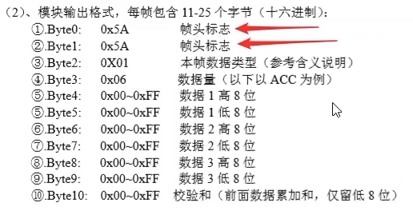
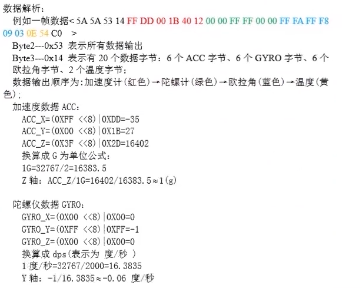

参考视频  [体感游戏的福音 - 用 TensorFlow 2.0 机器学习在 TinyML 上进行姿态识别 (bilibili.com)](https://www.bilibili.com/medialist/play/watchlater/BV1Xg4y1q7EF)


## 环境

Arduino 1.8，ESP32

GY-25 陀螺仪

## 流程

### Get Gyroscope Data 获取陀螺仪数据

将陀螺仪的数据通过串口发送

> 陀螺仪数据 measure()

```c++
Serial.print(Re_buf[i],HEX);
```


> 解析陀螺仪数据 analysis()



判断数据是否是以"5A5A"开头，将所有的无效帧进行过滤。然后解析数据




```c++
#include <HardwareSerial.h>

HardwareSerial mySerial(1);

int conut=0;
unsigned char sign=0; // 一轮采集成功为1
unsigned char Re_buf[25],counter=0;

int YPR[3];
int16_t gyro[3]={0};
int16_t acc[3]={0};
float aX, aY, aZ, gX, gY, gZ,yX,yY,yZ;
int dirty=0; // 是有效数据为1

void setup(){
  Serial.begin(115200);
  // 根据陀螺仪手册的描述，将软串口波特率设为115200，SERIAL_8N1表示数据位为8，停止位为1，15号引脚当作RX，21号引脚当作TX
  mySerial.begin(115200, SERIAL_8N1, 15, 21);
  delay(500);
  // 在完成了软串口初始化的代码后使用 mySerial.write（数据）的方法发送单个字节的数据
  // 根据陀爆仪使用手册，这款陀螺仪在使用之前需要先设置一些参数进行输出数据的配置
  // 需要对陀螺仪输入0XA5,0X55,0X57,0X51 来控制陀螺仪输出6轴的陀螺仪数据和3轴的欧拉角数据
  mySerial.write(0XA5); 
  mySerial.write(0X55);
  mySerial.write(0X57);    //初始化GY25Z,输出陀螺和欧拉角
  mySerial.write(0X51); 
  delay(100); 
  // 接着，需要对陀螺仪输入XA5，X56，0X82，0XFD 使得陀螺仪能够自动输出数据
  mySerial.write(0XA5); 
  mySerial.write(0X56);    //初始化GY25Z,连续输出模式
  mySerial.write(0X02);    //初始化GY25Z,连续输出模式
  mySerial.write(0XFD);
  delay(100);
}

void loop(){
  dirty=0; // 这dirty真的有意义吗？每次这里是0，下面while中，measure()走完dirty仍是0，sign可能为1，可能为0；但在analysis()又只干一次判断啊，dirty是0是1有啥用呢？反正下次loop又回0了。
  // 我知道了，合着相当于没借用loop，用的while当loop了。缓冲区里一直有数据，每次我就照常读，没出错我就一直读下去，出错了咱们结束while，重走loop再进while，妙啊！！！！！！！！
  while(dirty!=1){
    measure();
    analysis();
    // Serial.println(dirty); // 看看自己的数据有多少是冗余的
  }
  // 这样子，凡是经analysis()之后，dirty为1，即是有效数据，则跳出上面的while，打印这行有效数据
  // Serial.print("aX:");Serial.print(aX);
  // Serial.print("aY:");Serial.print(aY);
  // Serial.print("aZ:");Serial.print(aZ);
  // Serial.print("gX:");Serial.print(gX);
  // Serial.print("gY:");Serial.print(gY);
  // Serial.print("gZ:");Serial.print(gZ);
  // Serial.print("yX:");Serial.print(yX);
  // Serial.print("yY:");Serial.print(yY);
  // Serial.print("yZ:");Serial.print(yZ);
  Serial.println(""); 
}
/*当陀螺仪有数据发送过来时，这些数据会被暂存到开发板的串口缓冲区队列中。可以使用mySerial.avai1able()函数来判断串口缓冲区内数据的长度，以确定是否已经有数据从陀螺仪发送过来了，一旦有数据，就使用 mySerial.read()函数将这些数据以字节的方式一个一个地从串口缓冲区中读取出来。
由于陀仪的数据是持续输出的，并且根据手册说明，陀螺仪数据会以两个0x5A为结尾，而且陀螺仪的数据每一帧长
度都为25，所以就编写一个 measure() 函数专门用于获取并切割数据，如果不是0x5A就先将数据丢弃，如果是0x5A，那么就将其后的25个字节存放到Re_buf 数组中*/
void measure(){
  dirty=0;
  while (mySerial.available()) {
    Re_buf[counter]=(unsigned char)mySerial.read(); // 读一个字节
    if(counter==0&&Re_buf[0]!=0x5A){ return;} // 新一轮读数据刚开始，并且不是0x5A，就停止这个while，相当于丢弃本次读的数据（这个方法在loop中执行，所以是这个效果）。最终保证了读取的数据都能是以0x5A开发头的25个字节。
    counter++;
    if(counter==25)                //接收到数据
    {
      counter=0;                 //重新赋值，准备下一帧数据的接收 
      sign=1; // 这一轮读取成功
    }
  }
}

void analysis(){
  if(sign) // 这一轮读取成功
  {
    sign=0; // 先将其恢复为0
    if(Re_buf[0]==0x5A&&Re_buf[1]==0x5A )        //检查帧头，如果都是0x5A
    { 
      acc[0]=(Re_buf[4]<<8|Re_buf[5]);   
      acc[1]=(Re_buf[6]<<8|Re_buf[7]);
      acc[2]=(Re_buf[8]<<8|Re_buf[9]);

      gyro[0]=(Re_buf[10]<<8|Re_buf[11]);   
      gyro[1]=(Re_buf[12]<<8|Re_buf[13]);
      gyro[2]=(Re_buf[14]<<8|Re_buf[15]);

      YPR[0]=(Re_buf[16]<<8|Re_buf[17]);   
      YPR[1]=(Re_buf[18]<<8|Re_buf[19]);
      YPR[2]=(Re_buf[20]<<8|Re_buf[21]);

      for(int j=0;j<3;j++){
        if(YPR[j]>46000){
          YPR[j]=YPR[j]-29535;
        }else{
        YPR[j]=YPR[j];
        }  
      }
      aX=acc[0]/16383.5;
      aY=acc[1]/16383.5;
      aZ=acc[2]/16383.5;
      gX=gyro[0]/16.3835;
      gY=gyro[1]/16.3835;
      gZ=gyro[2]/16.3835;
      yX=YPR[0];
      yY=YPR[1];
      yZ=YPR[2];
      dirty=1; // 是有效数据，标记为1；如果没走这个if，dirty仍为0
    }
  } 
}
```


### Vibration Induction 振动感应（可选）

当检测到运动时，LED灯将会亮起

加速度，角速度

```c++
#include <Adafruit_NeoPixel.h>
#include <HardwareSerial.h>
HardwareSerial mySerial(1);

int conut=0;
unsigned char sign=0;
unsigned char Re_buf[25],counter=0;

int YPR[3];
int16_t gyro[3]={0};
int16_t acc[3]={0};
float aX, aY, aZ, gX, gY, gZ,yX,yY,yZ;
int dirty=0;

#define PIN            12 
#define NUM      1 //灯个数
Adafruit_NeoPixel pixels = Adafruit_NeoPixel(NUM, PIN, NEO_GRB + NEO_KHZ800);

void setup(){
  Serial.begin(115200);
  mySerial.begin(115200, SERIAL_8N1, 15, 21);
  delay(500);
  mySerial.write(0XA5); 
  mySerial.write(0X55);
  mySerial.write(0X57);    //初始化GY25Z,输出陀螺和欧拉角
  mySerial.write(0X51); 
  delay(100); 
  mySerial.write(0XA5); 
  mySerial.write(0X56);    //初始化GY25Z,连续输出模式
  mySerial.write(0X02);    //初始化GY25Z,连续输出模式
  mySerial.write(0XFD);
  delay(100);
  pixels.begin(); 
  pixels.clear(); //清除颜色
  pixels.show(); //打印
  pixels.setPixelColor(0, pixels.Color(0,0,0)); //调RGB颜色
  pixels.show(); //打印
}

void loop(){
  dirty=0;
  while(dirty!=1){
      measure();
      analysis();
  }
  // 先取绝对值，再缩放（需自己另外想方法映射到0-255之间，作者用加速度时直接*100，有点粗鲁）
  int xSum = fabs(gX);
  int ySum = fabs(gY);
  int zSum = fabs(gZ);
  // 设置基础阈值 最大
  if(zSum>255){
    zSum=255;
  }
  if(ySum>255){
    ySum=255;
  }
  if(xSum>255){
    xSum=255;
  }
  // 设置基础阈值 最小
  if(xSum<10){
    xSum=0;
  }
  if(ySum<10){
    ySum=0;
  }
  if(zSum<10){
    zSum=0;
  }
  pixels.setPixelColor(0, pixels.Color(xSum,ySum,zSum)); //调颜色
  pixels.show(); //打印
}

void measure(){
  dirty=0;
  while (mySerial.available()) {
    Re_buf[counter]=(unsigned char)mySerial.read();
    if(counter==0&&Re_buf[0]!=0x5A){ return;}
    counter++;
    if(counter==25)                //接收到数据
    {
      counter=0;                 //重新赋值，准备下一帧数据的接收 
      sign=1;
    }
  }
}

void analysis(){
  if(sign)
  {
    sign=0;
    if(Re_buf[0]==0x5A&&Re_buf[1]==0x5A )        //检查帧头，帧尾
    { 
      acc[0]=(Re_buf[4]<<8|Re_buf[5]);   
      acc[1]=(Re_buf[6]<<8|Re_buf[7]);
      acc[2]=(Re_buf[8]<<8|Re_buf[9]);

      gyro[0]=(Re_buf[10]<<8|Re_buf[11]);   
      gyro[1]=(Re_buf[12]<<8|Re_buf[13]);
      gyro[2]=(Re_buf[14]<<8|Re_buf[15]);

      YPR[0]=(Re_buf[16]<<8|Re_buf[17]);   
      YPR[1]=(Re_buf[18]<<8|Re_buf[19]);
      YPR[2]=(Re_buf[20]<<8|Re_buf[21]);

      for(int j=0;j<3;j++){
        if(YPR[j]>46000){
          YPR[j]=YPR[j]-29535;
        }else{
        YPR[j]=YPR[j];
        }  
      }
      aX=acc[0]/16383.5;
      aY=acc[1]/16383.5;
      aZ=acc[2]/16383.5;
      gX=gyro[0]/16.3835;
      gY=gyro[1]/16.3835;
      gZ=gyro[2]/16.3835;
      yX=YPR[0];
      yY=YPR[1];
      yZ=YPR[2];
      dirty=1;
    }
  } 
}
```

### Directional Sensing 方向感应（可选）

LED灯用不同颜色指示方向

欧拉角（颜色会突变，所以效果不太明显）

```c++
#include <Adafruit_NeoPixel.h>
#include <HardwareSerial.h>
HardwareSerial mySerial(1);

int conut=0;
unsigned char sign=0;
unsigned char Re_buf[25],counter=0;

int YPR[3];
int16_t gyro[3]={0};
int16_t acc[3]={0};
float aX, aY, aZ, gX, gY, gZ,yX,yY,yZ;
int dirty=0;

#define PIN            12 
#define NUM      1 //灯个数
Adafruit_NeoPixel pixels = Adafruit_NeoPixel(NUM, PIN, NEO_GRB + NEO_KHZ800);

void setup(){
  Serial.begin(115200);
  mySerial.begin(115200, SERIAL_8N1, 15, 21);
  delay(500);
  mySerial.write(0XA5); 
  mySerial.write(0X55);
  mySerial.write(0X57);    //初始化GY25Z,输出陀螺和欧拉角
  mySerial.write(0X51); 
  delay(100); 
  mySerial.write(0XA5); 
  mySerial.write(0X56);    //初始化GY25Z,连续输出模式
  mySerial.write(0X02);    //初始化GY25Z,连续输出模式
  mySerial.write(0XFD);
  delay(100);
  pixels.begin(); 
  pixels.clear(); //清除颜色
  pixels.show(); //打印
  pixels.setPixelColor(0, pixels.Color(0,0,0)); //调颜色
  pixels.show(); //打印
}

void loop(){
  dirty=0;
  while(dirty!=1){
      measure();
      analysis();
  }
  int xSum = fabs(yX)*125/36000;
  int ySum = fabs(yY)*125/36000;
  int zSum = fabs(yZ)*125/36000;
  pixels.setPixelColor(0, pixels.Color(xSum,ySum,zSum)); //调颜色
  pixels.show(); //打印
}

void measure(){
  dirty=0;
  while (mySerial.available()) {
    Re_buf[counter]=(unsigned char)mySerial.read();
    if(counter==0&&Re_buf[0]!=0x5A){ return;}
    counter++;
    if(counter==25)                //接收到数据
    {
      counter=0;                 //重新赋值，准备下一帧数据的接收 
      sign=1;
    }
  }
}

void analysis(){
  if(sign)
  {
    sign=0;
    if(Re_buf[0]==0x5A&&Re_buf[1]==0x5A )        //检查帧头，帧尾
    { 
      acc[0]=(Re_buf[4]<<8|Re_buf[5]);   
      acc[1]=(Re_buf[6]<<8|Re_buf[7]);
      acc[2]=(Re_buf[8]<<8|Re_buf[9]);

      gyro[0]=(Re_buf[10]<<8|Re_buf[11]);   
      gyro[1]=(Re_buf[12]<<8|Re_buf[13]);
      gyro[2]=(Re_buf[14]<<8|Re_buf[15]);

      YPR[0]=(Re_buf[16]<<8|Re_buf[17]);   
      YPR[1]=(Re_buf[18]<<8|Re_buf[19]);
      YPR[2]=(Re_buf[20]<<8|Re_buf[21]);

      for(int j=0;j<3;j++){
        if(YPR[j]>46000){
          YPR[j]=YPR[j]-29535;
        }else{
        YPR[j]=YPR[j];
        }  
      }
      aX=acc[0]/16383.5;
      aY=acc[1]/16383.5;
      aZ=acc[2]/16383.5;
      gX=gyro[0]/16.3835;
      gY=gyro[1]/16.3835;
      gZ=gyro[2]/16.3835;
      yX=YPR[0];
      yY=YPR[1];
      yZ=YPR[2];
      dirty=1;
    }
  } 
}
```

### Get Training Data 获取训练数据

收集同一手势的100次重复操作，达到100次时亮红灯，超过亮绿灯，并将csv格式的数据内容通过串口发送

> 选取合理的几个参数用于动作的描述

手腕旋转、平移等，加速度、角速度足矣。

> 相对准确地捕捉每个动作从开始到结束的数据

可以添加按钮触发，有一定缺陷。

作者使用阈值法，设定加速度阈值，超过则动作开始。低于一定阈值，则动作结束。

> 每个动作可以由多少个数据点来描述（样本容量是多少）

根据上面的阈值，自动记录每条记录的长度（样本点）。但这样样本会不一样长。所以要定义好（作者定义的是70个样本点）。

> 如何采集样本容量合适且相等的动作样本数据

上面已经定义好了每个动作的样本点个数，就按照这个标准来收集数据集。每个动作都需要收
集70个点。于是首先定义record_num来存放要收集的数据点个数，然后对三个判断进行修改，这
三个判断完成的逻辑是检测到动作发生后立刻记录70条数据，最后将这70条数摆进行串口打印。

> 数据集如何有效地记录，在这份记录中每个动作的采样次数是多少相对合适

从串口监视器里面吧数据复制出去，存到csv里。当然也有其他方式，比如网络传输，不过还是复制比较快（就是不方便）。

```c++
#include <Adafruit_NeoPixel.h>
#include <HardwareSerial.h>
HardwareSerial mySerial(1);

int conut=0;
unsigned char sign=0;
unsigned char Re_buf[25],counter=0;

int YPR[3];
int16_t gyro[3]={0};
int16_t acc[3]={0};
float aX, aY, aZ, gX, gY, gZ,yX,yY,yZ;
const float accelerationThreshold_HIGH = 3.5; // 阈值为3.5倍重力

const float accelerationThreshold_LOW= 1.9;
int smooth_count = 0; // 连续10次加速度之和小于1.9，则定义为静止状态
int record_count=0; // 记录每个动作总共有多少个点

float record_aX[300];
float record_aY[300];
float record_aZ[300];

float record_gX[300];
float record_gY[300];
float record_gZ[300];

const int record_num=70;

int data_count=0; // 记录动作已经做的次数，据此来改变灯的颜色，以提醒我们大概做了多少次动作
int n=100; //动作的次数

int dirty=0;

#define PIN            12 
#define NUM      1 //灯个数
Adafruit_NeoPixel pixels = Adafruit_NeoPixel(NUM, PIN, NEO_GRB + NEO_KHZ800);

void setup(){
  Serial.begin(115200);
  mySerial.begin(115200, SERIAL_8N1, 15, 21);
  delay(500);
  mySerial.write(0XA5); 
  mySerial.write(0X55);
  mySerial.write(0X57);    //初始化GY25Z,输出陀螺和欧拉角
  mySerial.write(0X51); 
  delay(100); 
  mySerial.write(0XA5); 
  mySerial.write(0X56);    //初始化GY25Z,连续输出模式
  mySerial.write(0X02);    //初始化GY25Z,连续输出模式
  mySerial.write(0XFD);
  delay(100);
  pixels.begin(); 
  pixels.clear(); //清除颜色
  pixels.show(); //打印
  pixels.setPixelColor(0, pixels.Color(0,0,0)); //调颜色
  pixels.show(); //打印
  record_count=-1; //防止第一次数据的错误触发
}

void loop(){
  dirty=0;
  while(dirty!=1){
      measure();
      analysis();
  }
  float aSum = fabs(aX) + fabs(aY) + fabs(aZ);

  if (aSum >= accelerationThreshold_HIGH&&record_count==-1)//动作开始
  {
    // Serial.prinln("检测到动作")；
    record_count=0;

    // 应该在判断之后data_count++;
    if(data_count==n){
      pixels.setPixelColor(0, pixels.Color(255,0,0)); //调颜色
      pixels.show(); //打印
    }else if(data_count>n){
      pixels.setPixelColor(0, pixels.Color(0,255,0)); //调颜色
      pixels.show(); //打印
    }
    data_count++;
  }

  if(record_count<record_num&&record_count!=-1)//收集70个点数据
  {
    record_aX[record_count]=aX;
    record_aY[record_count]=aY;
    record_aZ[record_count]=aZ;
    record_gX[record_count]=gX;
    record_gY[record_count]=gY;
    record_gZ[record_count]=gZ;
    record_count++;
  }

  if(record_count==record_num)//收集完成一次动作的70个点数据
  {
      for(int k=0;k<record_count;k++){
        Serial.print(record_aX[k]);
        Serial.print(",");
        Serial.print(record_aY[k]);
        Serial.print(",");
        Serial.print(record_aZ[k]);
        Serial.print(",");
        Serial.print(record_gX[k]);
        Serial.print(",");
        Serial.print(record_gY[k]);
        Serial.print(",");
        Serial.print(record_gZ[k]);
        Serial.println("");
      }
      record_count=-1;
  }
}

void measure(){
  dirty=0;
  while (mySerial.available()) {
    Re_buf[counter]=(unsigned char)mySerial.read();
    if(counter==0&&Re_buf[0]!=0x5A){ return;}
    counter++;
    if(counter==25)                //接收到数据
    {
      counter=0;                 //重新赋值，准备下一帧数据的接收 
      sign=1;
    }
  }
}

void analysis(){
  if(sign)
  {
    sign=0;
    if(Re_buf[0]==0x5A&&Re_buf[1]==0x5A )        //检查帧头，帧尾
    { 
      acc[0]=(Re_buf[4]<<8|Re_buf[5]);   
      acc[1]=(Re_buf[6]<<8|Re_buf[7]);
      acc[2]=(Re_buf[8]<<8|Re_buf[9]);

      gyro[0]=(Re_buf[10]<<8|Re_buf[11]);   
      gyro[1]=(Re_buf[12]<<8|Re_buf[13]);
      gyro[2]=(Re_buf[14]<<8|Re_buf[15]);

      YPR[0]=(Re_buf[16]<<8|Re_buf[17]);   
      YPR[1]=(Re_buf[18]<<8|Re_buf[19]);
      YPR[2]=(Re_buf[20]<<8|Re_buf[21]);

      for(int j=0;j<3;j++){
        if(YPR[j]>46000){
          YPR[j]=YPR[j]-29535;
        }else{
        YPR[j]=YPR[j];
        }  
      }
      aX=acc[0]/16383.5;
      aY=acc[1]/16383.5;
      aZ=acc[2]/16383.5;
      gX=gyro[0]/16.3835;
      gY=gyro[1]/16.3835;
      gZ=gyro[2]/16.3835;
      yX=YPR[0];
      yY=YPR[1];
      yZ=YPR[2];
      dirty=1;
    }
  } 
}
```


### Train Gesture Model 训练手势模型

使用Jupyter Notebook训练模型

```python
# In[1]
import tensorflow as tf
import tensorflow.keras as keras
import tensorflow.keras.layers as layers
import numpy as np
import pandas as pd
from tqdm import tqdm
# In[2]
punch = pd.read_csv('data/punch.csv', header = None) # 打拳
flex = pd.read_csv('data/flex.csv', header = None) # 秀肌肉
print(punch) # [7000,6]
print(flex) # [7000,6]
# In[3]
SAMPLES_PER_GESTURE = 70 # 每个动作的样本点的个数
# In[4]
def processData(d, v):
    # 输入原始数据和标签，
    dataX = np.empty([0,SAMPLES_PER_GESTURE*6])
    dataY = np.empty([0])

    data  = d.values # 直接返回一个array，就是实际数据在一维形况下的样子 7000//70 = 100
    dataNum = data.shape[0] // SAMPLES_PER_GESTURE # 整除

	# 外循环中，将内循环的结果一条条添加到dataX矩阵中
    for i in tqdm(range(dataNum)):
        tmp = []
        # 内层循环将每次的70个数据进行正规化，并存入一维数组 tmp中
        # 作者原始数据分别对应a和g，有正有负，a的绝对值不超4，g的绝对值不超2000。于是作者将a和g分别奖赏4和2000，然后再分别除以他们各自取值范围的两倍（即8和4000），使得他们最终结果都保持在[0,1]
        for j in range(SAMPLES_PER_GESTURE):
            tmp += [(data[i * SAMPLES_PER_GESTURE + j][0] + 4.0) / 8.0]
            tmp += [(data[i * SAMPLES_PER_GESTURE + j][1] + 4.0) / 8.0]
            tmp += [(data[i * SAMPLES_PER_GESTURE + j][2] + 4.0) / 8.0]
            tmp += [(data[i * SAMPLES_PER_GESTURE + j][3] + 2000.0) / 4000.0]
            tmp += [(data[i * SAMPLES_PER_GESTURE + j][4] + 2000.0) / 4000.0]
            tmp += [(data[i * SAMPLES_PER_GESTURE + j][5] + 2000.0) / 4000.0]

        tmp = np.array(tmp) # 转换成numpy形式 [70]

        tmp = np.expand_dims(tmp, axis = 0) # 在前面增加一维 [0,70]

        dataX = np.concatenate((dataX, tmp), axis = 0) # [1,70]---[dataNum,70]
        dataY = np.append(dataY, v) # [0]---[dataNum]

    return dataX, dataY

# In[5]
punchX, punchY = processData(punch, 0) # [100,70] [100]
flexX, flexY = processData(flex, 1) # [100,70] [100]
dataX = np.concatenate((punchX, flexX), axis = 0) # [2,100,70]
dataY = np.concatenate((punchY, flexY), axis = 0) # [2,100]
# In[6]
permutationTrain = np.random.permutation(dataX.shape[0]) # 0-199生成的随机排列序列
print(permutationTrain)
# In[7]
# 用前面的随机序列给数据和标签对应洗牌
dataX = dataX[permutationTrain]
dataY = dataY[permutationTrain]
print(dataY)

# In[8]
# 8:2
vfoldSize = int(dataX.shape[0]/100*20)
# 前20%作为测试集
xTest = dataX[0:vfoldSize]
yTest = dataY[0:vfoldSize]
# 剩下80%为训练集
xTrain = dataX[vfoldSize:dataX.shape[0]]
yTrain = dataY[vfoldSize:dataY.shape[0]]
# In[9]
# 模型和“【Workshop】TinyML手势识别项目分享  ESP32项目” 这个项目基本一样，就损失函数和metrics不一样 
model = keras.Sequential()
model.add(keras.layers.Dense(32, input_shape =(6*SAMPLES_PER_GESTURE,), activation='relu'))
model.add(keras.layers.Dense(16, activation='relu'))
model.add(keras.layers.Dense(2, activation='softmax'))
adam = keras.optimizers.Adam()
model.compile(loss='sparse_categorical_crossentropy',
              optimizer=adam,
              metrics=['sparse_categorical_accuracy'])
# In[10]
model.summary() # 显示模型所有信息
# In[11]
history = model.fit(xTrain, yTrain, batch_size=1, validation_data=(xTest, yTest), epochs=200, verbose=1) # verbose=1 打印进度条，要消耗资源的，改为0就可以提升一点速度，但是看不见过程，除非你胸有成竹。
# In[12]
# 经典tflite模型转化器的两行代码
converter = tf.lite.TFLiteConverter.from_keras_model(model)
tflite_model = converter.convert()
# 转换完，再将它写入本地
open("model", "wb").write(tflite_model)
# In[13]
# 使用linux命令xxd -i 将model的二进制文件内容存储在C代码静态数组内，当然如果需要直接在python3文件夹中写，可以在命令前加入一个! 
# 这里需要注意的是，这个操作不要多次执行，多次运行后model.h文件不会被覆盖，内容只会在一个model.h文件中进行堆叠！！！！！
!xxd -i model >> model.h
```

### Predict Gesture 预测手势

预测手势，将2种手势可能性通过串口发送

```c++
#include <TensorFlowLite_ESP32.h>
#include <tensorflow/lite/experimental/micro/kernels/all_ops_resolver.h>
#include <tensorflow/lite/experimental/micro/micro_error_reporter.h>
#include <tensorflow/lite/experimental/micro/micro_interpreter.h>
#include <tensorflow/lite/schema/schema_generated.h>
#include <tensorflow/lite/version.h>

#include <Adafruit_NeoPixel.h>
#include <HardwareSerial.h>
#include "model.h"
HardwareSerial mySerial(1);

int conut=0;
unsigned char sign=0;
unsigned char Re_buf[25],counter=0;

int YPR[3];
int16_t gyro[3]={0};
int16_t acc[3]={0};
float aX, aY, aZ, gX, gY, gZ,yX,yY,yZ;
const float accelerationThreshold_HIGH = 3.5; // 阈值为3.5倍重力

const float accelerationThreshold_LOW= 1.9;
int smooth_count = 0;
int record_count=0;

float record_aX[300];
float record_aY[300];
float record_aZ[300];

float record_gX[300];
float record_gY[300];
float record_gZ[300];

const int record_num=70;

tflite::MicroErrorReporter tflErrorReporter;
tflite::ops::micro::AllOpsResolver tflOpsResolver;

const tflite::Model* tflModel = nullptr;
tflite::MicroInterpreter* tflInterpreter = nullptr;
TfLiteTensor* tflInputTensor = nullptr;
TfLiteTensor* tflOutputTensor = nullptr;

constexpr int tensorArenaSize = 8 * 1024;
byte tensorArena[tensorArenaSize];

const char* GESTURES[] = {
  "punch",
  "flex"
};
#define NUM_GESTURES (sizeof(GESTURES) / sizeof(GESTURES[0]))

int dirty=0;

#define PIN            12 
#define NUM      1 //灯个数
Adafruit_NeoPixel pixels = Adafruit_NeoPixel(NUM, PIN, NEO_GRB + NEO_KHZ800);

void setup(){
  Serial.begin(115200);
  mySerial.begin(115200, SERIAL_8N1, 15, 21);
  delay(500);
  mySerial.write(0XA5); 
  mySerial.write(0X55);
  mySerial.write(0X57);    //初始化GY25Z,输出陀螺和欧拉角
  mySerial.write(0X51); 
  delay(100); 
  mySerial.write(0XA5); 
  mySerial.write(0X56);    //初始化GY25Z,连续输出模式
  mySerial.write(0X02);    //初始化GY25Z,连续输出模式
  mySerial.write(0XFD);
  delay(100);
  pixels.begin(); 
  pixels.clear(); //清除颜色
  pixels.show(); //打印
  pixels.setPixelColor(0, pixels.Color(0,0,0)); //调颜色
  pixels.show(); //打印
  record_count=-1; //防止第一次数据的错误触发
  tflModel = tflite::GetModel(model);
  if (tflModel->version() != TFLITE_SCHEMA_VERSION) {
    Serial.println("Model schema mismatch!");
    while (1);
  }
  tflInterpreter = new tflite::MicroInterpreter(tflModel, tflOpsResolver, tensorArena, tensorArenaSize, &tflErrorReporter);
  tflInterpreter->AllocateTensors();
  tflInputTensor = tflInterpreter->input(0);
  tflOutputTensor = tflInterpreter->output(0);
}

void loop(){
  dirty=0;
  while(dirty!=1){
      measure();
      analysis();
  }
  float aSum = fabs(aX) + fabs(aY) + fabs(aZ);

  if (aSum >= accelerationThreshold_HIGH&&record_count==-1)//动作开始
  {
    record_count=0;
  }

  if(record_count<record_num&&record_count!=-1)//收集70个元组数据
  {
    record_aX[record_count]=aX;
    record_aY[record_count]=aY;
    record_aZ[record_count]=aZ;
    record_gX[record_count]=gX;
    record_gY[record_count]=gY;
    record_gZ[record_count]=gZ;
    record_count++;
  }

  if(record_count==record_num)//收集完成一次动作的70个元组数据
  {
      for(int k=0;k<record_count;k++){
        tflInputTensor->data.f[k * 6 + 0] = (record_aX[k] + 4.0) / 8.0;
        tflInputTensor->data.f[k * 6 + 1] = (record_aY[k] + 4.0) / 8.0;
        tflInputTensor->data.f[k * 6 + 2] = (record_aZ[k] + 4.0) / 8.0;
        tflInputTensor->data.f[k * 6 + 3] = (record_gX[k] + 2000.0) / 4000.0;
        tflInputTensor->data.f[k * 6 + 4] = (record_gY[k] + 2000.0) / 4000.0;
        tflInputTensor->data.f[k * 6 + 5] = (record_gZ[k] + 2000.0) / 4000.0;
      }
      TfLiteStatus invokeStatus = tflInterpreter->Invoke();
      if (invokeStatus != kTfLiteOk) {
        Serial.println("Invoke failed!");
        while (1);
        return;
      }
      for (int i = 0; i < NUM_GESTURES; i++) {
        Serial.print(GESTURES[i]);
        Serial.print(": ");
        Serial.println(tflOutputTensor->data.f[i], 6);
      }
      record_count=-1;
  }
}

void measure(){
  dirty=0;
  while (mySerial.available()) {
    Re_buf[counter]=(unsigned char)mySerial.read();
    if(counter==0&&Re_buf[0]!=0x5A){ return;}
    counter++;
    if(counter==25)                //接收到数据
    {
      counter=0;                 //重新赋值，准备下一帧数据的接收 
      sign=1;
    }
  }
}

void analysis(){
  if(sign)
  {
    sign=0;
    if(Re_buf[0]==0x5A&&Re_buf[1]==0x5A )        //检查帧头，帧尾
    { 
      acc[0]=(Re_buf[4]<<8|Re_buf[5]);   
      acc[1]=(Re_buf[6]<<8|Re_buf[7]);
      acc[2]=(Re_buf[8]<<8|Re_buf[9]);

      gyro[0]=(Re_buf[10]<<8|Re_buf[11]);   
      gyro[1]=(Re_buf[12]<<8|Re_buf[13]);
      gyro[2]=(Re_buf[14]<<8|Re_buf[15]);

      YPR[0]=(Re_buf[16]<<8|Re_buf[17]);   
      YPR[1]=(Re_buf[18]<<8|Re_buf[19]);
      YPR[2]=(Re_buf[20]<<8|Re_buf[21]);

      for(int j=0;j<3;j++){
        if(YPR[j]>46000){
          YPR[j]=YPR[j]-29535;
        }else{
        YPR[j]=YPR[j];
        }  
      }
      aX=acc[0]/16383.5;
      aY=acc[1]/16383.5;
      aZ=acc[2]/16383.5;
      gX=gyro[0]/16.3835;
      gY=gyro[1]/16.3835;
      gZ=gyro[2]/16.3835;
      yX=YPR[0];
      yY=YPR[1];
      yZ=YPR[2];
      dirty=1;
    }
  } 
}
```

### Visualize Predict Gesture 可视化预测手势

预测手势，将2种手势可能性通过网页客户端进行显示

```c++
#include <TensorFlowLite_ESP32.h>
#include <tensorflow/lite/experimental/micro/kernels/all_ops_resolver.h>
#include <tensorflow/lite/experimental/micro/micro_error_reporter.h>
#include <tensorflow/lite/experimental/micro/micro_interpreter.h>
#include <tensorflow/lite/schema/schema_generated.h>
#include <tensorflow/lite/version.h>

#include <Adafruit_NeoPixel.h>
#include <HardwareSerial.h>
#include "model.h"
#include <WiFi.h>
#include <WebServer.h>
#include <WebSocketsServer.h>
#include <ArduinoJson.h>
HardwareSerial mySerial(1);

int conut=0;
unsigned char sign=0;
unsigned char Re_buf[25],counter=0;

int YPR[3];
int16_t gyro[3]={0};
int16_t acc[3]={0};
float aX, aY, aZ, gX, gY, gZ,yX,yY,yZ;
const float accelerationThreshold_HIGH = 3.5; // 阈值为3.5倍重力

const float accelerationThreshold_LOW= 1.9;
int smooth_count = 0;
int record_count=0;

float record_aX[300];
float record_aY[300];
float record_aZ[300];

float record_gX[300];
float record_gY[300];
float record_gZ[300];

const int record_num=70;
// 经典8行代码
tflite::MicroErrorReporter tflErrorReporter; // 日志记录
tflite::ops::micro::AllOpsResolver tflOpsResolver; // 操作解释器

const tflite::Model* tflModel = nullptr; // 模型指针
tflite::MicroInterpreter* tflInterpreter = nullptr; // 解释器指针
TfLiteTensor* tflInputTensor = nullptr; // 指向输入数组的指针
TfLiteTensor* tflOutputTensor = nullptr; // 指向输出数组的指针
/*
然后我们需要预先为输入、输出以及中间数组分配一定的内存。
这里我们用常量表达式进行定义，在编译的时候空间就已经分配好了。该预分配的内存是一个大小为tensorArenaSize的byte数组，这个数组的大小是根据模型的大小来定义的，一般为1024的倍数，在这里我们不妨先定义一个8192长度的空间。
*/
constexpr int tensorArenaSize = 8 * 1024;
byte tensorArena[tensorArenaSize];


// 结果标签数组
const char* GESTURES[] = {
  "punch",
  "flex"
};
// 定义一下动作总次数
#define NUM_GESTURES (sizeof(GESTURES) / sizeof(GESTURES[0]))
// 要连接的wifi名和密码（代码里写死了，如果想变动，可以使用”配网“的方式），这里应该默认是STA模式，即只能它去连接别人
/*
AP模式: Access Point，提供无线接入服务，允许其它无线设备接入，提供数据访问，一般的无线路由/网桥工作在该模式下。AP和AP之间允许相互连接

STA模式: Station, 类似于无线终端，sta本身并不接受无线的接入，它可以连接到AP，一般无线网卡即工作在该模式。
*/
const char * ssid = "Hollow_ESP32";
const char * password = "hollowman";
WebServer server(80); // 让开发板提供一个网页服务，使用默认80端口
/*
不使用webSocket，浏览器已经能够访问开发板内部的网站服务了，但那只是传输一张网页而已，并不能实时传输识别的结果数据。
所以，还需要借助WebSocket来传输这些数据。
建立一个WebSocket服务器，首先引入两个库，分别是WebSocketsServer库和ArduinoJson库，前者能够使得开发板启动WebSockets的服务，后者能够规范数据的传输
*/
WebSocketsServer webSocket = WebSocketsServer(81); // webSocket服务，使用默认81端口

// HTML，网页一加载就创建一个webSocket对象，一有数据来便可以进行解析。根据概率阈值输出对应图片（自己找图）
char webpage[] PROGMEM = R"=====(
<html>
<head>
  <script src='https://cdn.staticfile.org/jquery/1.10.2/jquery.min.js'></script>
</head>
<body onload="javascript:init()">
<p></p>
<script>
  var webSocket
  var data
  var id=0
  function init() {
    webSocket = new WebSocket('ws://' + window.location.hostname + ':81/');
    webSocket.onmessage = function(event) {
      data = JSON.parse(event.data);
      console.log(data)
      if(data.punch>data.flex){
        if(data.punch>0.6){
            $("p").append("");
            $("#"+id+"").attr('src','https://blackwalnut.zucc.edu.cn/user/images/9173cb795b45b67258984dcf7692b058.jpg');
            id=id+1
        }
      }
      if(data.flex>data.punch){
        if(data.flex>0.6){
            $("p").append("");
            $("#"+id+"").attr('src','https://blackwalnut.zucc.edu.cn/user/images/0ed4b4d78213adb0ebb399c1d57f4e39.jpg');
            id=id+1
        }
      }
    }
  }
</script>
</body>
</html>
)=====";

int dirty=0;

#define PIN            12 
#define NUM      1 //灯个数
Adafruit_NeoPixel pixels = Adafruit_NeoPixel(NUM, PIN, NEO_GRB + NEO_KHZ800);

void setup(){
  Serial.begin(115200);
  mySerial.begin(115200, SERIAL_8N1, 15, 21);
  delay(500);
  mySerial.write(0XA5); 
  mySerial.write(0X55);
  mySerial.write(0X57);    //初始化GY25Z,输出陀螺和欧拉角
  mySerial.write(0X51); 
  delay(100); 
  mySerial.write(0XA5); 
  mySerial.write(0X56);    //初始化GY25Z,连续输出模式
  mySerial.write(0X02);    //初始化GY25Z,连续输出模式
  mySerial.write(0XFD);
  delay(100);
  pixels.begin(); 
  pixels.clear(); //清除颜色
  pixels.show(); //打印
  pixels.setPixelColor(0, pixels.Color(0,0,0)); //调颜色
  pixels.show(); //打印
  record_count=-1; //防止第一次数据的错误触发
  WiFi.begin(ssid, password); // 连接wifi
  while(WiFi.status()!=WL_CONNECTED) {
    Serial.print(".");
    delay(500);
  } // 连接成功
  Serial.println("");
  Serial.print("IP Address: ");
  Serial.println(WiFi.localIP()); // 本设备在此局域网下的IP
  delay(1000);
   server.on("/",[](){ // 网页服务的加载，192.xxx.xxx.xxx/ 之后进入这里，即将写好的网页先显示过去
    server.send_P(200, "text/html", webpage);
  });
  server.begin(); // 启动网站服务
  webSocket.begin(); // 启动webSocket服务
  tflModel = tflite::GetModel(model); // 加载模型
  if (tflModel->version() != TFLITE_SCHEMA_VERSION) { // 如果模型版本和现在的解析器不匹配，就说不匹配
    Serial.println("Model schema mismatch!");
    while (1);
  }
  // 实例化推理器，将模型、操作解释器，模型的运行内存空间指针和空间大小，以及日志记录都传入到推理器中
  tflInterpreter = new tflite::MicroInterpreter(tflModel, tflOpsResolver, tensorArena, tensorArenaSize, &tflErrorReporter);
  // 推理器实例化之后，需要为模型的输入和输出张量分配内存
  tflInterpreter->AllocateTensors(); // Update allocations for all tensors. This will redim dependent tensors using the input tensor dimensionality as given. This is relatively expensive.  If you know that your sizes are not changing, you need not call this.
  tflInputTensor = tflInterpreter->input(0);
  tflOutputTensor = tflInterpreter->output(0);
}

void loop(){
  webSocket.loop(); // webSocket服务句柄
  server.handleClient(); // 网站服务句柄，保证客户端访问时，可以激活相关函数
  dirty=0;
  while(dirty!=1){
      measure();
      analysis();
  }
  float aSum = fabs(aX) + fabs(aY) + fabs(aZ);

  if (aSum >= accelerationThreshold_HIGH&&record_count==-1)//动作开始
  {
    record_count=0;
  }

  if(record_count<record_num&&record_count!=-1)//收集70个元组数据
  {
    record_aX[record_count]=aX;
    record_aY[record_count]=aY;
    record_aZ[record_count]=aZ;
    record_gX[record_count]=gX;
    record_gY[record_count]=gY;
    record_gZ[record_count]=gZ;
    record_count++;
  }

  /*
  在之前收集数据集的过程是先判断和加速度是否超过阈值，如果超过，就开始记录数据，直到记录70条数据后进行数据的输出。
  那么我们就可以将原本要输出的数据输入到模型中去推理。
  使用tflInputTensor将一组70条每条6种的数据输入到模型中。当然这些数据在输入之前需要先经过与模型训练时一样的正规化操作 
  */
  if(record_count==record_num)//收集完成一次动作的70个元组数据
  {
      for(int k=0;k<record_count;k++){
        tflInputTensor->data.f[k * 6 + 0] = (record_aX[k] + 4.0) / 8.0;
        tflInputTensor->data.f[k * 6 + 1] = (record_aY[k] + 4.0) / 8.0;
        tflInputTensor->data.f[k * 6 + 2] = (record_aZ[k] + 4.0) / 8.0;
        tflInputTensor->data.f[k * 6 + 3] = (record_gX[k] + 2000.0) / 4000.0;
        tflInputTensor->data.f[k * 6 + 4] = (record_gY[k] + 2000.0) / 4000.0;
        tflInputTensor->data.f[k * 6 + 5] = (record_gZ[k] + 2000.0) / 4000.0;
      }
	  // 推理
      TfLiteStatus invokeStatus = tflInterpreter->Invoke();
      if (invokeStatus != kTfLiteOk) { // 如果传的数据量不对，就会推理失败
        Serial.println("Invoke failed!");
        while (1);
        return;
      }
      // 显示推理成功的结果
      /*
      当所有的服务都开好的时候，需要考虑数据如何发送，如何传输？如何接收？
      当然会使用websockt服务来发送数据，但是在这之前需要先将数据使用某种格式进行封装。
      在网页应用中，常用的是json格式。
      */
      String json=""; // 定义一个json字符串
      DynamicJsonDocument jsonobj(1024); // json对象
      for (int i = 0; i < NUM_GESTURES; i++) {
        jsonobj[GESTURES[i]] = tflOutputTensor->data.f[i]; // 把模型的输出拿出来，key及其对应value这样一对对添加进json对象 {"punch":0.999975,"flex":0.000025}
      }
      serializeJson(jsonobj, json);  //将json对象打印到json字符串中，
      Serial.println(json); // 以供我们在串口中查看
      webSocket.broadcastTXT(json.c_str(), json.length()); // 然后以广播的形式在局域网中发送，以使得所有网页端都可以收到
      record_count=-1;
  }
}

void measure(){
  dirty=0;
  while (mySerial.available()) {
    Re_buf[counter]=(unsigned char)mySerial.read();
    if(counter==0&&Re_buf[0]!=0x5A){ return;}
    counter++;
    if(counter==25)                //接收到数据
    {
      counter=0;                 //重新赋值，准备下一帧数据的接收 
      sign=1;
    }
  }
}

void analysis(){
  if(sign)
  {
    sign=0;
    if(Re_buf[0]==0x5A&&Re_buf[1]==0x5A )        //检查帧头，帧尾
    { 
      acc[0]=(Re_buf[4]<<8|Re_buf[5]);   
      acc[1]=(Re_buf[6]<<8|Re_buf[7]);
      acc[2]=(Re_buf[8]<<8|Re_buf[9]);

      gyro[0]=(Re_buf[10]<<8|Re_buf[11]);   
      gyro[1]=(Re_buf[12]<<8|Re_buf[13]);
      gyro[2]=(Re_buf[14]<<8|Re_buf[15]);

      YPR[0]=(Re_buf[16]<<8|Re_buf[17]);   
      YPR[1]=(Re_buf[18]<<8|Re_buf[19]);
      YPR[2]=(Re_buf[20]<<8|Re_buf[21]);

      for(int j=0;j<3;j++){
        if(YPR[j]>46000){
          YPR[j]=YPR[j]-29535;
        }else{
        YPR[j]=YPR[j];
        }  
      }
      aX=acc[0]/16383.5;
      aY=acc[1]/16383.5;
      aZ=acc[2]/16383.5;
      gX=gyro[0]/16.3835;
      gY=gyro[1]/16.3835;
      gZ=gyro[2]/16.3835;
      yX=YPR[0];
      yY=YPR[1];
      yZ=YPR[2];
      dirty=1;
    }
  } 
}
```