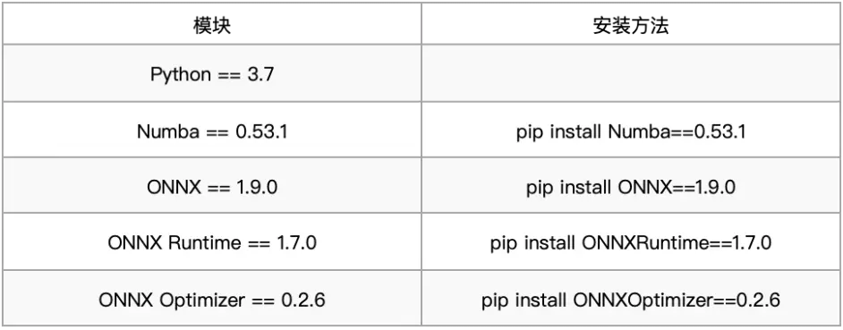

# 使用 ESP-DL 深度学习库基于 ESP32-S3 实现手势识别

2022-12-09 16:5518阅读 · 2喜欢 · 0评论

[](https://space.bilibili.com/538078399)

[乐鑫信息科技](https://space.bilibili.com/538078399)

粉丝：2.4万文章：72

已关注

人工智能改变了计算机与现实世界交互的方式。过去，人们通过微小的低功率设备和传感器获取数据，并传输至云端进行决策。这样的方式在设备连接性、成本和数据隐私方面带来了一定挑战。相对地，边缘人工智能是在物理设备上另一种处理数据的方式，它无需在设备和云之间来回发送数据，改善了信息延迟、提高了安全性、减少了对带宽的要求和功耗水平。

- 边缘人工智能：https://www.youtube.com/watch?v=DAPgDuw1uZM


乐鑫推出了深度学习开发库 ESP-DL，您可以使用它在乐鑫的 AI SoC ESP32-S3 上部署您自己的高性能深度学习模型。在这篇文章中，我们将为您介绍如何使用 ESP-DL 在 ESP32-S3 上部署深度学习模型。本文仅用于开发者学习使用，其中模型并非商业化项目。

- ESP-DL: https://github.com/espressif/esp-dl
- ESP32-S3: https://www.espressif.com/zh-hans/products/socs/esp32-s3
- 部署：https://github.com/espressif/esp-dl/tree/master/tutorial/quantization_tool_example

# **目录**

本文的主要内容为：

1. 深度学习模型开发
2. ESP-DL 格式
3. 深度学习模型部署
4. 未来的计划

# 


# **使用 ESP-DL 前的准备工作** 

在深入了解 ESP-DL 之前，我们假设读者已经具备了以下知识储备：

1.  构建和训练神经网络的知识（点此了解深度学习的相关基础知识）
2.  能够配置乐鑫物联网开发框架 ESP-IDF release 4.4 版本的开发环境（更多细节请阅读[如何搭建 ESP-IDF 开发环境](https://www.bilibili.com/video/BV1rf4y1p75s)或 ESP-IDF 工具链说明）
3.  具备基本的 C 和 C++ 编程语言知识
4. 具备模型训练后量化的知识

- 深度学习的相关基础知识：https://www.youtube.com/watch?v=WvoLTXIjBYU
- ESP-IDF release 4.4 版本：https://github.com/espressif/esp-idf/tree/release/v4.4
- ESP-IDF 工具链说明：https://blog.espressif.com/esp-idf-development-tools-guide-part-i-89af441585b
- 基本的 C 语言知识：https://www.youtube.com/watch?v=KJgsSFOSQv0&t=12665s

# 


# **1. 模型开发**

为了简单起见，我们以分类问题为例进行阐述。我们开发了一个简单的深度学习模型，并对 6 种不同的手势进行了分类。尽管有许多可以直接使用的开源预训练模型，但对于这个演示，我们从零开始建立模型，以更好地讲解模型中的每一层。

注：我们使用了 Google Co-lab 进行模型开发。

- 预训练模型：https://blog.espressif.com/hand-gesture-recognition-on-esp32-s3-with-esp-deep-learning-176d7e13fd37#2db9
- Co-lab: https://colab.research.google.com

**1.1 数据集**

针对该分类问题，我们使用了 Kaggle 手势识别数据集中的一个开源数据集。原始数据集包括 10 个类别，我们只使用了其中 6 个。这些类别更容易识别，且日常生活中更有用，如下表所示。我们的数据集较原数据集还有一处关于图像大小的区别，在原始数据集中，图像的大小为 (240, 640)，但为了方便起见，我们将数据集的大小调整为 (96, 96)。本文中使用的数据集可以在这里 (https://github.com/alibukharai/Blogs/tree/main/ESP-DL) 找到。

- Kaggle 手势识别数据：https://www.kaggle.com/datasets/gti-upm/leapgestrecog

表格 1：手势分类

**1.2 测试/训练分离**

我们需要将数据集分为测试和训练数据集。这些数据集是我们原始数据集的子集，训练数据集用于训练模型、测试数据集用于测试模型的性能。校准数据集在模型量化阶段用于校准，您可以从训练集和测试集中抽选一部分作为校准数据集。生成以上数据集的过程是相同的，我们使用了 train_test_split 以实现此目标。

- 原始数据集：https://github.com/alibukharai/Blogs/blob/main/ESP-DL/building_with_espdl.md#11-dataset
- 模型量化：https://github.com/alibukharai/Blogs/blob/main/ESP-DL/building_with_espdl.md#22-optimization-and-quantization

```python
from sklearn.model_selection import train_test_split

ts = 0.3 # Percentage of images that we want to use for testing.
X_train, X_test1, y_train, y_test1 = train_test_split(X, y, test_size=ts, random_state=42)
X_test, X_cal, y_test, y_cal = train_test_split(X_test1, y_test1, test_size=ts, random_state=42)
```

注：点击这里 (https://scikit-learn.org/stable/modules/generated/sklearn.model_selection.train_test_split.html)，了解关于 train_test_split 的更多细节

如果您需要转载本教程，您可以在此 GitHub 页面 (https://github.com/alibukharai/Blogs/tree/main/ESP-DL) 获得数据，并在您的工作环境中开放数据。

```python
import pickle

with open('X_test.pkl', 'rb') as file:
    X_test = pickle.load(file)

with open('y_test.pkl', 'rb') as file:
    y_test = pickle.load(file)

with open('X_train.pkl', 'rb') as file:
    X_train = pickle.load(file)

with open('y_train.pkl', 'rb') as file:
    y_train = pickle.load(file)
```

**1.3 建立模型**

我们为此分类问题创建了一个基本的卷积神经网络 (Convolution Neural Network, CNN)。它由 3 个卷积层组成，然后是最大池和全连接层，输出层有 6 个神经元。您可以点击这里 (https://github.com/filipefborba/HandRecognition/blob/master/project3/project3.ipynb)，了解创建 CNN 的更多内容。以下是用于建立 CNN 的代码。

```python
import tensorflow as tf
from tensorflow import keras
from keras.models import Sequential
from keras.layers.convolutional import Conv2D, MaxPooling2D
from keras.layers import Dense, Flatten, Dropout

print(tf.__version__)

model = Sequential()
model.add(Conv2D(32, (5, 5), activation='relu', input_shape=(96, 96, 1)))
model.add(MaxPooling2D((2, 2)))
model.add(Dropout(0.2))
model.add(Conv2D(64, (3, 3), activation='relu'))
model.add(MaxPooling2D((2, 2)))
model.add(Dropout(0.2))
model.add(Conv2D(64, (3, 3), activation='relu'))
model.add(MaxPooling2D((2, 2)))
model.add(Flatten())
model.add(Dense(128, activation='relu'))
model.add(Dense(6, activation='softmax'))

model.compile(optimizer='adam',loss='sparse_categorical_crossentropy',metrics=['accuracy'])

model.summary()
```

插图 1：CNN 模型

**1.4 训练模型**

该模型运行了 5 个 epochs，最终准确率为 99% 左右。

```python
history=model.fit(X_train, y_train, epochs=5, batch_size=64, verbose=1, validation_data=(X_test, y_test))
```

插图 2：训练结果

**1.5 保存模型**

将训练好的模型保存为分层数据格式 (.h5)。您可以点击这里 (https://www.tensorflow.org/guide/keras/save_and_serialize#how_to_save_and_load_a_model)，了解关于如何保存 Keras 模型的更多内容。

```python
model.save('handrecognition_model.h5')
```

**1.6 模型转化**

ESP-DL 使用开放式神经网络交换 (ONXX) 格式的模型。您可以点击这里 (https://onnx.ai)，了解 ONXX 是如何工作的。为了与 ESP-DL 兼容，请使用下方代码将训练的 .h5 格式的模型转换为 ONXX 格式。

```python
model = tf.keras.models.load_model("/content/handrecognition_model.h5")
tf.saved_model.save(model, "tmp_model")
!python -m tf2onnx.convert --saved-model tmp_model --output "handrecognition_model.onnx"
!zip -r /content/tmp_model.zip /content/tmp_model
```

最后，下载 H5 格式的模型、ONNX 格式的模型和模型检查点，以供将来使用。

```python
from google.colab import files
files.download("/content/handrecognition_model.h5")
files.download("/content/handrecognition_model.onnx")
files.download(“/content/tmp_model.zip")
```


# **2. ESP-DL 格式**

当模型的 ONNX 格式准备就绪，您可以按照以下步骤将您的模型转换为 ESP-DL 格式。

注：我们使用 Pychram IDE 进行 ESP-DL 格式转换。

- Pychram: https://www.jetbrains.com/pycharm/

**2.1 格式转换要求**

首先，您需要成功搭建环境，并安装正确的模块版本，否则将出现错误。您可以点击这里 (https://github.com/espressif/esp-dl/tree/master/tutorial/quantization_tool_example#step-121-set-up-the-environment)，阅读关于 ESP-DL 格式转换要求的更多信息。

表格 2：所需的模块和特定版本

接下来，您需要下载 ESP-DL，并从 GitHub 仓库克隆 ESP-DL。

- ESP-DL: https://github.com/espressif/esp-dl

```python
git clone --recursive https://github.com/espressif/esp-dl.git
```

**2.2 优化与量化**

为了运行 ESP-DL 提供的优化器，以 Window 系统为例，我们需要找到并将以下文件放入 pychram - IDE 的工作目录中。

- calibrator.pyd
- calibrator_acc.pyd
- evaluator.pyd
- optimizer.py

接下来，您需要将在 1.2 节中生成的校准数据集和在 1.5 节中保存的 ONNX 格式模型放在一起。您的工作目录应该是这样的。

- 1.2 节：https://github.com/alibukharai/Blogs/blob/main/ESP-DL/building_with_espdl.md#12-testtrain-split
- 1.5 节：https://github.com/alibukharai/Blogs/blob/main/ESP-DL/building_with_espdl.md#15-saving-model

插图 3：工作目录

您可以按照下面的步骤生成优化后的模型和量化参数。

**2.2.1 导入库**

```python
from optimizer import *
from calibrator import *
from evaluator import *
```

**2.2.2 加载 ONNX 模型**

```python
onnx_model = onnx.load(“handrecognition_model.onnx")
```

**2.2.3 优化 ONNX 模型**

```python
optimized_model_path = optimize_fp_model(“handrecognition_model.onnx")
```

**2.2.4 加载校准数据集**

```python
with open('X_cal.pkl', 'rb') as f:
    (test_images) = pickle.load(f)
with open('y_cal.pkl', 'rb') as f:
    (test_labels) = pickle.load(f)


    calib_dataset = test_images[0:1800:20]
pickle_file_path = 'handrecognition_calib.pickle'
```

**2.2.5 校准**

```python
model_proto = onnx.load(optimized_model_path)
print('Generating the quantization table:')

calib = Calibrator('int16', 'per-tensor', 'minmax')
# calib = Calibrator('int8', 'per-channel', 'minmax')

calib.set_providers(['CPUExecutionProvider'])

# Obtain the quantization parameter
calib.generate_quantization_table(model_proto,calib_dataset, pickle_file_path)
# Generate the coefficient files for esp32s3
calib.export_coefficient_to_cpp(model_proto, pickle_file_path, 'esp32s3', '.', 'handrecognition_coefficient', True)
```

如果一切正常，这时您可以在路径中生成两个扩展名为 .cpp 和 .hpp 的文件，如下图。

注：稍后您还将用到这个输出结果，建议先截图保存。

插图 4：优化模型的输出结果

**2.3 评估**

这一步并不是模型格式转化的必要步骤，如您希望评估优化后模型的性能，您可以使用以下代码。

```python
print('Evaluating the performance on esp32s3:')
eva = Evaluator('int16', 'per-tensor', 'esp32s3')
eva.set_providers(['CPUExecutionProvider'])
eva.generate_quantized_model(model_proto, pickle_file_path)

output_names = [n.name for n in model_proto.graph.output]
providers = ['CPUExecutionProvider']
m = rt.InferenceSession(optimized_model_path, providers=providers)

batch_size = 64
batch_num = int(len(test_images) / batch_size)
res = 0
fp_res = 0
input_name = m.get_inputs()[0].name
for i in range(batch_num):
    # int8_model
    [outputs, _] = eva.evalaute_quantized_model(test_images[i * batch_size:(i + 1) * batch_size], False)
    res = res + sum(np.argmax(outputs[0], axis=1) == test_labels[i * batch_size:(i + 1) * batch_size])

    # floating-point model
    fp_outputs = m.run(output_names, {input_name: test_images[i * batch_size:(i + 1) * batch_size].astype(np.float32)})
    fp_res = fp_res + sum(np.argmax(fp_outputs[0], axis=1) == test_labels[i * batch_size:(i + 1) * batch_size])
print('accuracy of int8 model is: %f' % (res / len(test_images)))
print('accuracy of fp32 model is: %f' % (fp_res / len(test_images)))
```

注：请点击这里 (https://github.com/espressif/esp-dl/blob/master/tools/quantization_tool/quantization_tool_api.md)，了解更多关于 ESP-DL API 的信息。


# **3. 模型部署**

模型部署是最后的关键步骤。在这里，我们将在 ESP32-S3 微控制器上运行模型并得到结果。

注：我们使用 Visual Studio Code 在 ESP32-S3 上部署模型。

- ESP32-S3: https://www.espressif.com/en/products/socs/esp32-s3
- Visual Studio Code: https://code.visualstudio.com

**3.1 ESP-IDF 项目的层次结构**

- 首先，您需要在 VSCode 中创建一个基于 ESP-IDF 标准的新项目。您可以观看此视频 (https://www.youtube.com/watch?v=Lc6ausiKvQM)，或阅读本文档 (https://docs.espressif.com/projects/esp-idf/en/latest/esp32/get-started/linux-macos-setup.html)，了解如何基于 ESP32 系列芯片创建 VSCode 项目。
- 其次，您需要将前面 2.2 节 (https://github.com/alibukharai/Blogs/blob/main/ESP-DL/building_with_espdl.md#22-optimization-and-quantization)中生成的 .cpp 和 .hpp 文件复制到当前的工作目录中。
- 再次，请您将所有依赖的组件添加到工作目录下的组件文件夹中。
- 最后，sdkconfig 文件是 ESP-WHO 示例 (https://github.com/espressif/esp-who/tree/master/examples/human_face_recognition/terminal)中的默认文件，您可以在 GitHub 仓库 (https://github.com/alibukharai/Blogs/tree/main/ESP-DL)中找到它。

项目目录如下图所示：

```python
├── CMakeLists.txt
├── components
│   ├── esp-dl
├── dependencies.lock
├── main
│   ├── app_main.cpp
│   └── CMakeLists.txt
├── model
│   ├── handrecognition_coefficient.cpp
│   ├── handrecognition_coefficient.hpp
│   └── model_define.hpp
├── partitions.csv
├── sdkconfig
├── sdkconfig.defaults
├── sdkconfig.defaults.esp32
├── sdkconfig.defaults.esp32s2
└── sdkconfig.defaults.esp32s3
```

注：ESP-WHO 不是本教程必须的项目。

**3.2 模型定义**

我们将在 “model_define.hpp” 文件中定义模型，您可以依照下面的步骤进行操作。

**3.2.1 导入库**

首先导入所有相关的库。接下来您需要知道模型的具体结构，您可以使用开源工具 Netron 查看前面 2.2 节结束时优化生成的 ONNX 模型。您可以在这里 (https://github.com/espressif/esp-dl/tree/master/include/layer) 查看 ESP-DL 目前支持的所有库。

- Netron: https://netron.app
- ESP-DL: https://github.com/espressif/esp-dl

```cpp
#pragma once
#include <stdint.h>
#include "dl_layer_model.hpp"
#include "dl_layer_base.hpp"
#include "dl_layer_max_pool2d.hpp"
#include "dl_layer_conv2d.hpp"
#include "dl_layer_reshape.hpp"
#include "dl_layer_softmax.hpp"
#include "handrecognition_coefficient.hpp"

using namespace dl;
using namespace layer;
using namespace handrecognition_coefficient;
```

**3.2.2 定义层**

接下来是定义每个层。

- 我们一般不认为输入是一个独立的层，在这里我们没有对其作定义。
- 除了输出层，所有层都定义为私有层。
- 在建立模型时，请按照前面 1.3 节 (https://github.com/alibukharai/Blogs/blob/main/ESP-DL/building_with_espdl.md#13-building-a-model) 中定义的顺序放置各层。

```cpp
class HANDRECOGNITION : public Model<int16_t>
{
private:
    Conv2D<int16_t> l1;
    MaxPool2D<int16_t> l2;
    Conv2D<int16_t> l3;
    MaxPool2D<int16_t> l4;
    Conv2D<int16_t> l5;
    MaxPool2D<int16_t> l6;
    Reshape<int16_t> l7;
    Conv2D<int16_t> l8;
    Conv2D<int16_t> l9;
public:
    Softmax<int16_t> l10; // output layer
```

**3.2.3 初始化层**

在定义了各层之后，我们需要初始化每个层的权重、偏置激活函数和形状。我们可以逐层进行检查。

在详述细节前，让我们先在 Netron 里打开模型，导入该模型的目的是获得一些初始化的参数。

插图 5：优化后的模型视图

- 图中的第一层是 reshape 层（输入没有被作为单独的层）。这一层的输入是 (96, 96, 1)，顺序是 (H, W, C)，输出的形状是 (1, 96, 96)，顺序变为了 (C, H, W)。在之前 1.3 节的训练代码中，我们没有加入 reshape 层，但优化后的 ONNX 模型出现了 reshape 层，这是因为 ONNX 要求的运算（例如卷积层）张量顺序为 (C, H, W)，在 1.6 节模型转化所述的过程中会添加 reshape 层来满足要求。我们的训练平台与 ESP-DL 要求的顺序是一致的，为 (H, W, C)，与输入的顺序一致，因此不需要在部署的代码里添加 reshape 层，您可以点击此 GitHub 链接 (https://github.com/espressif/esp-dl/blob/master/docs/zh_CN/about_type_define.md) 了解更多。
- 对于二维卷积层，我们可以从前面 2.2 节末尾生成的 .hpp 文件中获得该层的过滤器、偏置项和激活函数的名称。但是对于指数，我们需要检查 2.2.5 节中生成的输出。
- 对于最大池化层 (max-pooling layer)，我们可以使用与建立模型时相同的参数，请参见本文的 1.3 节。另一种了解参数和层的方法是使用开源工具 Netron 打开您在 2.2 节结束时优化生成的 ONNX 模型。
- 对于密集层或全连接层，我们使用了二维卷积模块。我们可以从前面 2.2 节末尾生成的 .hpp 文件中获得该层的过滤器、偏置项和激活函数的名称。但是对于指数，我们需要检查 2.2.5 节中生成的输出。
- 输出层是一个 SoftMax 层权重，其名称可以从 2.2.5 节的输出中获取。

```cpp
HANDRECOGNITION () :
                         l1(Conv2D<int16_t>(-8, get_statefulpartitionedcall_sequential_1_conv2d_3_biasadd_filter(), get_statefulpartitionedcall_sequential_1_conv2d_3_biasadd_bias(), get_statefulpartitionedcall_sequential_1_conv2d_3_biasadd_activation(), PADDING_VALID, {}, 1,1, "l1")),
                         l2(MaxPool2D<int16_t>({2,2},PADDING_VALID, {}, 2, 2, "l2")),
                         l3(Conv2D<int16_t>(-9, get_statefulpartitionedcall_sequential_1_conv2d_4_biasadd_filter(), get_statefulpartitionedcall_sequential_1_conv2d_4_biasadd_bias(), get_statefulpartitionedcall_sequential_1_conv2d_4_biasadd_activation(), PADDING_VALID,{}, 1,1, "l3")),
                         l4(MaxPool2D<int16_t>({2,2},PADDING_VALID,{}, 2, 2, "l4")),
                         l5(Conv2D<int16_t>(-9, get_statefulpartitionedcall_sequential_1_conv2d_5_biasadd_filter(), get_statefulpartitionedcall_sequential_1_conv2d_5_biasadd_bias(), get_statefulpartitionedcall_sequential_1_conv2d_5_biasadd_activation(), PADDING_VALID,{}, 1,1, "l5")),
                         l6(MaxPool2D<int16_t>({2,2},PADDING_VALID,{}, 2, 2, "l6")),
                         l7(Reshape<int16_t>({1,1,6400},"l7_reshape")),
                         l8(Conv2D<int16_t>(-9, get_fused_gemm_0_filter(), get_fused_gemm_0_bias(), get_fused_gemm_0_activation(), PADDING_VALID, {}, 1, 1, "l8")),
                         l9(Conv2D<int16_t>(-9, get_fused_gemm_1_filter(), get_fused_gemm_1_bias(), NULL, PADDING_VALID,{}, 1,1, "l9")),
                         l10(Softmax<int16_t>(-14,"l10")){}
```

**3.2.4 构建层**

下一步是建立每个层。请点击这里 (https://github.com/espressif/esp-dl/tree/master/include/layer)，了解构建每层的构建函数。

```cpp
void build(Tensor<int16_t> &input)
    {
        this->l1.build(input);
        this->l2.build(this->l1.get_output());
        this->l3.build(this->l2.get_output());
        this->l4.build(this->l3.get_output());
        this->l5.build(this->l4.get_output());
        this->l6.build(this->l5.get_output());
        this->l7.build(this->l6.get_output());
        this->l8.build(this->l7.get_output());
        this->l9.build(this->l8.get_output());
        this->l10.build(this->l9.get_output());
    }
```

**3.2.5 调用层**

最后，我们需要将这些层连接起来，并通过调用函数逐一调用它们。请点击这里 (https://github.com/espressif/esp-dl/tree/master/include/layer)，了解每层的调用函数。

```cpp
void call(Tensor<int16_t> &input)
    {
        this->l1.call(input);
        input.free_element();

        this->l2.call(this->l1.get_output());
        this->l1.get_output().free_element();

        this->l3.call(this->l2.get_output());
        this->l2.get_output().free_element();

        this->l4.call(this->l3.get_output());
        this->l3.get_output().free_element();

        this->l5.call(this->l4.get_output());
        this->l4.get_output().free_element();

        this->l6.call(this->l5.get_output());
        this->l5.get_output().free_element();

        this->l7.call(this->l6.get_output());
        this->l6.get_output().free_element();

        this->l8.call(this->l7.get_output());
        this->l7.get_output().free_element();

        this->l9.call(this->l8.get_output());
        this->l8.get_output().free_element();

        this->l10.call(this->l9.get_output());
        this->l9.get_output().free_element();
    }
};
```

**3.3 模型运行**

在模型建立后，需要给定输入并运行模型来进行推理。您可以将生成的输入内容放在 “app_main.cpp”文件里，然后在 ESP32-S3 上运行模型。

**3.3.1 导入库**

```cpp
#include <stdio.h>
#include <stdlib.h>
#include "esp_system.h"
#include "freertos/FreeRTOS.h"
#include "freertos/task.h"
#include "dl_tool.hpp"
#include “model_define.hpp"
```

**3.3.2 输入声明**

我们训练好的模型的输入大小为 (96, 96, 1)，详情请见 1.3 节。input_exponent 可以从 2.2.5 节生成的输出中获得其指数值。您可以把输入/测试图片的像素写在这里。

```cpp
int input_height = 96;
int input_width = 96;
int input_channel = 1;
int input_exponent = -7;

__attribute__((aligned(16))) int16_t example_element[] = {

    //add your input/test image pixels
};
```

**3.3.3 设置输入参数**

每个输入的像素将根据上面声明的 input_exponent 进行调整。

```cpp
extern "C" void app_main(void)
{
Tensor<int16_t> input;
                input.set_element((int16_t *)example_element).set_exponent(input_exponent).set_shape({input_height,input_width,input_channel}).set_auto_free(false);
```

**3.3.4. 调用模型**

通过调用 forward 函数并传入输入来调用模型。延迟时间 (Latency) 用于计算 ESP32-S3 运行神经网络的时间。

```cpp
HANDRECOGNITION model;
                dl::tool::Latency latency;
                latency.start();
                model.forward(input);
                latency.end();
                latency.print("\nSIGN", "forward");
```

**3.3.5. 监测输出**

输出来自公共层，例如 l10，您可以在终端打印结果。

```cpp
float *score = model.l10.get_output().get_element_ptr();
                float max_score = score[0];
                int max_index = 0;
                for (size_t i = 0; i < 6; i++)
                {
                    printf("%f, ", score[i]*100);
                    if (score[i] > max_score)
                    {
                        max_score = score[i];
                        max_index = i;
                    }
                }
                printf("\n");

                switch (max_index)
                {
                    case 0:
                    printf("Palm: 0");
                    break;
                    case 1:
                    printf("I: 1");
                    break;
                    case 2:
                    printf("Thumb: 2");
                    break;
                    case 3:
                    printf("Index: 3");
                    break;
                    case 4:
                    printf("ok: 4");
                    break;
                    case 5:
                    printf("C: 5");
                    break;
                    default:
                    printf("No result");
                }
                printf("\n");

}
```

插图 6 显示了输出结果，在 ESP32-S3 上，模型的延迟时间约为 0.7 秒，每个神经元的输出和最后的预测结果都能够显示出来。

插图 6：输出结果

# **4. 未来的计划**

接下来，我们将为 ESP32-S3-EYE 开发板设计一个模型，它可以实时捕捉图像并进行手势识别。未来您可以在此 GitHub 页面查看相关代码。

- ESP32-S3-EYE: https://www.espressif.com/en/products/devkits/esp-eye/resourceswww.espressif.com2
- 此 GitHub 页面：https://github.com/alibukharai/Blogs/tree/main/ESP-DL