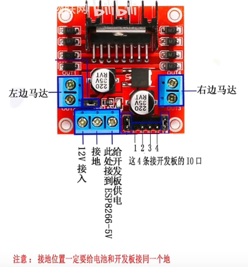

学习视频：[阿秋电子物联网的个人空间_哔哩哔哩_bilibili](https://space.bilibili.com/1648662880/video)


# 如何使用ESP8266物联网模块改造一辆远程控制小车

## [1 初介绍](https://www.bilibili.com/video/BV1wF411J7K4)

* 模块 ESP8266-CH340

* 驱动 L298N

* 车子

* 电池 18650-12V


## [2 简介接线](https://www.bilibili.com/video/BV15u411X735)

L298N接线逻辑



开发板的部分引脚


## [3 接线与细节](https://www.bilibili.com/video/BV1YT4y1Q7Br)

电池接控制开关


电机驱动这三个接线处都引出一条线来，左一接电池的12V供电；中间的不仅要接电池地线，还要接开发板GND，即保证开发板和驱动共地；右1负责给开发板供5V电VIN（3.3V~5V均可，此开发板可以承受）。


使用开发板 `D0，D1，D2，D4` 引脚（D3已被开发板占用），分别对应驱动的 `IN1~IN4` 


开发板和驱动的连线，驱动与开发板共地，同时驱动给开发板5V供电


## [4 工作原理介绍](https://www.bilibili.com/video/BV1Ym4y1R7AA)

电池与驱动共地


关闭开关，然后连接上电池的12V


out1，out2分别接一侧电机，out3，out4同理。每一侧都不用管是否接反了，这些担忧后期可以通过代码逻辑调整


接电压器（**可不接，这只是方便看电压**），正极接开关的一头，负极随便接个地就可以了


## [5 检查8266+固件更新](https://www.bilibili.com/video/BV1NP4y1g7Hi)

### 检查8266

方法1：复位键检擦

方法2：AT指令检查


前期准备：


* 安装CH341或者CP2102驱动（自己找地方下，确保安装成功）
* 打开安信可串口调试工具（其实其他串口调试工具也可以），插上开发板
* 调整串口工具信息、波特率，并打开串口

> 复位键检查方法

按下8266左下角RST，查看是否有回传信息

如果有回传，但是乱码，属正常现象

若无回传，需检查PC的USB接口或更换数据线

> AT指令检查方法

发送区域发送：AT 查看回传信息

当收到：OK 表示正常

否则需检查PC的USB接口或更换数据线

### 烧录固件

> 为什么烧录固件

因为操作中出现故障无法排出，代码无法运行等，需要重新烧录固件，保证8266正常运行，这就类似系统更新

开始烧录，首先要点击找到要烧录的固件


后面填写 0x00000，左侧勾上，选对COM口，选对波特率（很多都是115200），然后START，等待完成即可


烧录完成，要重新插拔一下开发板，然后就可以检查板子了

## [6 电脑准备](https://www.bilibili.com/video/BV1XY411g73F)

开发平台 Arduino

* 加入8266开发板管理器（离线或在线均可安装）

* 加入Blinker库

* 本开发板为 ESP-8266-NodeMCU 1.0 （ESP12E），配置好COM口等

手机安装点灯[点灯科技 (diandeng.tech)](https://www.diandeng.tech/home)app[**需要说明的是，电灯科技有较大的延迟，所以后期建议使用其他方式进行控制**]

## [7 代码逻辑](https://www.bilibili.com/video/BV1UL411w7sw)

一侧轮：		OUT1---------16				OUT2---------5

另一侧：		OUT3---------4				  OUT4---------2

```c++
#define BLINKER_PRINT Serial
#define BLINKER_WIFI
// #define BLINKER_ESP_SMARTCONFIG//
#include <Blinker.h>

char auth[] = "填写电灯科技给的密钥";
char asid[] = "WIFI名";
char pawd[] = "WIFI密码";

// 定义按键
#define BUTTON_1 "b1"
#define BUTTON_2 "b2"
#define BUTTON_3 "b3"
#define BUTTON_4 "b4"
#define BUTTON_5 "b5"
#define BUTTON_6 "b6"
#define BUTTON_7 "b7"
#define BUTTON_8 "b8"
#define BUTTON_9 "b9"

// 定义滑块
#define slider_0 "r1"
#define slider_1 "r2"

// 实例化按键
BlinkerButton Button1(BUTTON_1);
BlinkerButton Button2(BUTTON_2);
BlinkerButton Button3(BUTTON_3);
BlinkerButton Button4(BUTTON_4);
BlinkerButton Button5(BUTTON_5);
BlinkerButton Button6(BUTTON_6);
BlinkerButton Button7(BUTTON_7);
BlinkerButton Button8(BUTTON_8);
BlinkerButton Button9(BUTTON_9);
    
// 实例化滑块
BlinkerSlider Slider0(slider_0);
BlinkerSlider Slider1(slider_1);

// 轮子转速，方便调速
int pwm1 = 60;
int pwm2 = 60;

// 判断当前状态
int flag;

/*各种方法*/
// 
void botton1_callback(const String &state){
    digitalWrite(12, LOW);
}
// 前进
void botton2_callback(const String &state){
    BLINKER_LOG("get button state: ", state);
    if (state != "pressup"){
        analogWrite(16, pwm1); // out1
    	digitalWrite(5, LOW); // out2
   	 	analogWrite(4, pwm2); // out3
    	digitalWrite(2, LOW); // out4
    }
    flag = 1;
    
}

// 左转，左轮后退，右轮前进
void botton3_callback(const String &state){
    BLINKER_LOG("get button state: ", state);
    if (state != "pressup"){
    	flag = 4;
    	analogWrite(16, pwm1); // out1
    	digitalWrite(5, LOW); // out2
    	analogWrite(4, LOW); // out3
    	digitalWrite(2, pwm2); // out4
    }
}
// 停止，全HIGH或全LOW
void botton5_callback(const String &state){
    BLINKER_LOG("get button state: ", state);
    if (state != "pressup"){
    	digitaWrite(16, HIGH); // out1
    	digitalWrite(5, HIGH); // out2
    	digitaWrite(4, HIGH); // out3
    	digitalWrite(2, HIGH); // out4
        flag = 5;
    }
}

.......
    
// 后退，和前进反着转就行了
void botton8_callback(const String &state){
    BLINKER_LOG("get button state: ", state);
    if (state != "pressup"){
        analogWrite(5, pwm1); // out2
    	digitalWrite(16, LOW); // out1
    	analogWrite(2, pwm2); // out4
    	digitalWrite(4, LOW); // out3
        flag = 2;
    }
    
}

......很多，可以自己写逻辑
    
void blinker_car_init(){
    pinMode(16, OUTPUT);
    pinMode(5, OUTPUT);
    pinMode(4, OUTPUT);
    pinMode(2, OUTPUT);
    pinMode(12, OUTPUT);
    pinMode(13, OUTPUT);
}
void setup(){
    blinker_car_init();
    
    analogWriteRange(100);
    analogWriteFreq(50);
    
    digitalWrite(D0,HIGH);
    digitalWrite(D1,HIGH);
    digitalWrite(D2,HIGH);
    digitalWrite(D4,HIGH);
    
    //绑定按钮事件
    Button.attach(button1_callback);
    ....剩下也都是这样
    // 绑定滑块事件
    Slider0.attach(slider0_callback);
    Slider1.attach(slider1_callback);
    
    Blinker.begin(auth,asid,pswd);
}

void loop(){
    Blinker.run();
}
```

演示视频：

[ESP8266远程遥控车做好啦，快来康康吧_哔哩哔哩_bilibili](https://www.bilibili.com/video/BV1qS4y1S7FD)

[ESP8266配合点灯科技做的远程遥控车，摇杆代码控制前后左右_哔哩哔哩_bilibili](https://www.bilibili.com/video/BV1rL411P7r6)