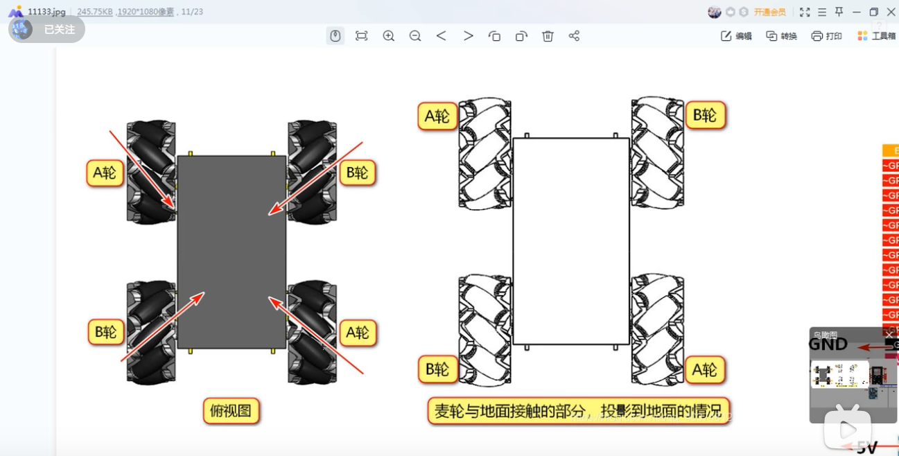
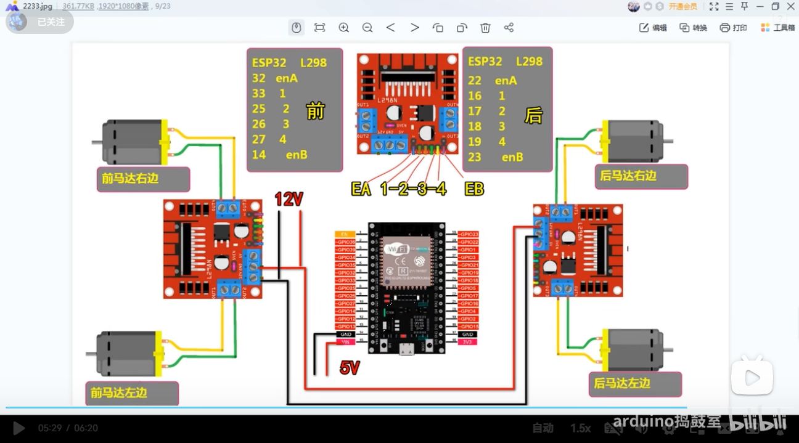
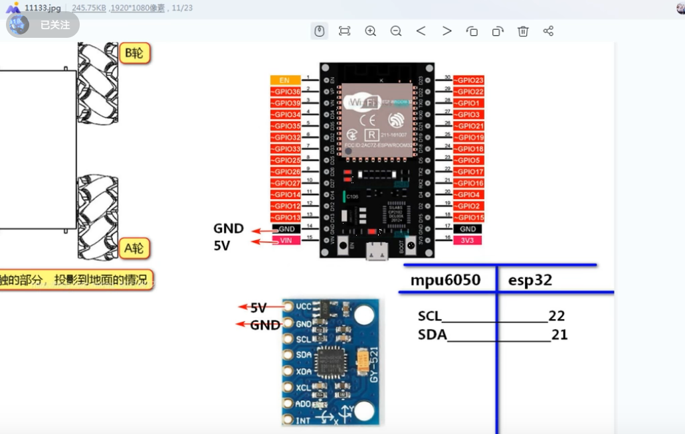

参考视频 [B站首辆espnow协议手势控制的麦克纳姆小车教程附代码](https://www.bilibili.com/video/BV1sB4y1e799)




## 拿到接收板MAC地址

```c++
//获取接收板的MAC地址  并记录下来

#include "WiFi.h"
 
void setup()
{
  Serial.begin(115200);
  WiFi.mode(WIFI_MODE_STA);
  Serial.println(WiFi.macAddress());
}
 
void loop()
{

}

```

## 接收端代码



```c++
#include <esp_now.h>
#include <WiFi.h>

#define FORWARD 1
#define BACKWARD 2
#define LEFT 3
#define RIGHT 4
#define FORWARD_LEFT 5
#define FORWARD_RIGHT 6
#define BACKWARD_LEFT 7
#define BACKWARD_RIGHT 8
#define TURN_LEFT 9
#define TURN_RIGHT 10
#define STOP 0

#define BACK_RIGHT_MOTOR 0
#define BACK_LEFT_MOTOR 1
#define FRONT_RIGHT_MOTOR 2
#define FRONT_LEFT_MOTOR 3

struct MOTOR_PINS
{
  int pinIN1;
  int pinIN2;
  int pinEn; 
  int pwmSpeedChannel;
};

std::vector<MOTOR_PINS> motorPins = 
{
  {16, 17, 22, 4},  //
  {18, 19, 23, 5},  //
  {26, 27, 14, 6},  //
  {33, 25, 32, 7},  //  
};

#define MAX_MOTOR_SPEED 200

const int PWMFreq = 1000; /* 1 KHz */
const int PWMResolution = 8;

#define SIGNAL_TIMEOUT 1000  // 
unsigned long lastRecvTime = 0;

struct PacketData
{
  byte xAxisValue;
  byte yAxisValue;
  byte zAxisValue;
};
PacketData receiverData;

// callback function that will be executed when data is received
void OnDataRecv(const uint8_t * mac, const uint8_t *incomingData, int len) 
{
  if (len == 0)
  {
    return;
  }
  memcpy(&receiverData, incomingData, sizeof(receiverData));
  String inputData ;
  inputData = inputData + "values " + receiverData.xAxisValue + "  " + receiverData.yAxisValue + "  " + receiverData.zAxisValue;
  Serial.println(inputData);

  if ( receiverData.xAxisValue < 75 && receiverData.yAxisValue < 75)
  {
    processCarMovement(FORWARD_LEFT);    
  }
  else if ( receiverData.xAxisValue > 175 && receiverData.yAxisValue < 75)
  {
    processCarMovement(FORWARD_RIGHT);    
  } 
  else if ( receiverData.xAxisValue < 75 && receiverData.yAxisValue > 175)
  {
    processCarMovement(BACKWARD_LEFT);    
  }
  else if ( receiverData.xAxisValue > 175 && receiverData.yAxisValue > 175)
  {
    processCarMovement(BACKWARD_RIGHT);    
  }  
  else if (receiverData.zAxisValue > 175)
  {
    processCarMovement(TURN_RIGHT);
  }
  else if (receiverData.zAxisValue < 75)
  {
    processCarMovement(TURN_LEFT);
  }
  else if (receiverData.yAxisValue < 75)
  {
    processCarMovement(FORWARD);  
  }
  else if (receiverData.yAxisValue > 175)
  {
    processCarMovement(BACKWARD);     
  }
  else if (receiverData.xAxisValue > 175)
  {
    processCarMovement(RIGHT);   
  }
  else if (receiverData.xAxisValue < 75)
  {
    processCarMovement(LEFT);    
  } 
  else
  {
    processCarMovement(STOP);     
  }

  lastRecvTime = millis();   
}

void processCarMovement(int inputValue)
{
  switch(inputValue)
  {
    case FORWARD:
      rotateMotor(FRONT_RIGHT_MOTOR, MAX_MOTOR_SPEED);
      rotateMotor(BACK_RIGHT_MOTOR, MAX_MOTOR_SPEED);
      rotateMotor(FRONT_LEFT_MOTOR, MAX_MOTOR_SPEED);
      rotateMotor(BACK_LEFT_MOTOR, MAX_MOTOR_SPEED);                  
      break;
  
    case BACKWARD:
      rotateMotor(FRONT_RIGHT_MOTOR, -MAX_MOTOR_SPEED);
      rotateMotor(BACK_RIGHT_MOTOR, -MAX_MOTOR_SPEED);
      rotateMotor(FRONT_LEFT_MOTOR, -MAX_MOTOR_SPEED);
      rotateMotor(BACK_LEFT_MOTOR, -MAX_MOTOR_SPEED);   
      break;
  
    case LEFT:
      rotateMotor(FRONT_RIGHT_MOTOR, MAX_MOTOR_SPEED);
      rotateMotor(BACK_RIGHT_MOTOR, -MAX_MOTOR_SPEED);
      rotateMotor(FRONT_LEFT_MOTOR, -MAX_MOTOR_SPEED);
      rotateMotor(BACK_LEFT_MOTOR, MAX_MOTOR_SPEED);   
      break;
  
    case RIGHT:
      rotateMotor(FRONT_RIGHT_MOTOR, -MAX_MOTOR_SPEED);
      rotateMotor(BACK_RIGHT_MOTOR, MAX_MOTOR_SPEED);
      rotateMotor(FRONT_LEFT_MOTOR, MAX_MOTOR_SPEED);
      rotateMotor(BACK_LEFT_MOTOR, -MAX_MOTOR_SPEED);  
      break;
  
    case FORWARD_LEFT:
      rotateMotor(FRONT_RIGHT_MOTOR, MAX_MOTOR_SPEED);
      rotateMotor(BACK_RIGHT_MOTOR, STOP);
      rotateMotor(FRONT_LEFT_MOTOR, STOP);
      rotateMotor(BACK_LEFT_MOTOR, MAX_MOTOR_SPEED);  
      break;
  
    case FORWARD_RIGHT:
      rotateMotor(FRONT_RIGHT_MOTOR, STOP);
      rotateMotor(BACK_RIGHT_MOTOR, MAX_MOTOR_SPEED);
      rotateMotor(FRONT_LEFT_MOTOR, MAX_MOTOR_SPEED);
      rotateMotor(BACK_LEFT_MOTOR, STOP);  
      break;
  
    case BACKWARD_LEFT:
      rotateMotor(FRONT_RIGHT_MOTOR, STOP);
      rotateMotor(BACK_RIGHT_MOTOR, -MAX_MOTOR_SPEED);
      rotateMotor(FRONT_LEFT_MOTOR, -MAX_MOTOR_SPEED);
      rotateMotor(BACK_LEFT_MOTOR, STOP);   
      break;
  
    case BACKWARD_RIGHT:
      rotateMotor(FRONT_RIGHT_MOTOR, -MAX_MOTOR_SPEED);
      rotateMotor(BACK_RIGHT_MOTOR, STOP);
      rotateMotor(FRONT_LEFT_MOTOR, STOP);
      rotateMotor(BACK_LEFT_MOTOR, -MAX_MOTOR_SPEED);   
      break;
  
    case TURN_LEFT:
      rotateMotor(FRONT_RIGHT_MOTOR, MAX_MOTOR_SPEED);
      rotateMotor(BACK_RIGHT_MOTOR, MAX_MOTOR_SPEED);
      rotateMotor(FRONT_LEFT_MOTOR, -MAX_MOTOR_SPEED);
      rotateMotor(BACK_LEFT_MOTOR, -MAX_MOTOR_SPEED);  
      break;
  
    case TURN_RIGHT:
      rotateMotor(FRONT_RIGHT_MOTOR, -MAX_MOTOR_SPEED);
      rotateMotor(BACK_RIGHT_MOTOR, -MAX_MOTOR_SPEED);
      rotateMotor(FRONT_LEFT_MOTOR, MAX_MOTOR_SPEED);
      rotateMotor(BACK_LEFT_MOTOR, MAX_MOTOR_SPEED);   
      break;
  
    case STOP:
      rotateMotor(FRONT_RIGHT_MOTOR, STOP);
      rotateMotor(BACK_RIGHT_MOTOR, STOP);
      rotateMotor(FRONT_LEFT_MOTOR, STOP);
      rotateMotor(BACK_LEFT_MOTOR, STOP);    
      break;
  
    default:
      rotateMotor(FRONT_RIGHT_MOTOR, STOP);
      rotateMotor(BACK_RIGHT_MOTOR, STOP);
      rotateMotor(FRONT_LEFT_MOTOR, STOP);
      rotateMotor(BACK_LEFT_MOTOR, STOP);    
      break;
  }
}

void rotateMotor(int motorNumber, int motorSpeed)
{
  if (motorSpeed < 0)
  {
    digitalWrite(motorPins[motorNumber].pinIN1, LOW);
    digitalWrite(motorPins[motorNumber].pinIN2, HIGH);    
  }
  else if (motorSpeed > 0)
  {
    digitalWrite(motorPins[motorNumber].pinIN1, HIGH);
    digitalWrite(motorPins[motorNumber].pinIN2, LOW);       
  }
  else
  {
    digitalWrite(motorPins[motorNumber].pinIN1, LOW);
    digitalWrite(motorPins[motorNumber].pinIN2, LOW);      
  }
  
  ledcWrite(motorPins[motorNumber].pwmSpeedChannel, abs(motorSpeed));
}

void setUpPinModes()
{
  for (int i = 0; i < motorPins.size(); i++)
  {
    pinMode(motorPins[i].pinIN1, OUTPUT);
    pinMode(motorPins[i].pinIN2, OUTPUT);  
    //Set up PWM for motor speed
    ledcSetup(motorPins[i].pwmSpeedChannel, PWMFreq, PWMResolution);  
    ledcAttachPin(motorPins[i].pinEn, motorPins[i].pwmSpeedChannel);     
    rotateMotor(i, STOP);  
  }
}

void setup() 
{
  setUpPinModes();
  
  Serial.begin(115200);
  WiFi.mode(WIFI_STA);

  // Init ESP-NOW
  if (esp_now_init() != ESP_OK) 
  {
    Serial.println("Error initializing ESP-NOW");
    return;
  }

  esp_now_register_recv_cb(OnDataRecv);
}
 
void loop() 
{
  //Check Signal lost.
  unsigned long now = millis();
  if ( now - lastRecvTime > SIGNAL_TIMEOUT ) 
  {
    processCarMovement(STOP); 
  }
}
```

## 发射端代码



```c++
//根据需要下载要的库 可以根据编译查看结果
#include <esp_now.h>
#include <WiFi.h>

//需要的安装库
#include "I2Cdev.h"
#include "MPU6050_6Axis_MotionApps20.h"
#if I2CDEV_IMPLEMENTATION == I2CDEV_ARDUINO_WIRE
    #include "Wire.h"
#endif

// MPU control/status vars
MPU6050 mpu;
bool dmpReady = false;  // 
uint8_t devStatus;      // 
uint8_t fifoBuffer[64]; //
Quaternion q;           // [w, x, y, z]         
VectorFloat gravity;    // [x, y, z]           
float ypr[3];           // [yaw, pitch, roll]   

// 接收板MAC地址 // 34:94:54:25:84:74
uint8_t receiverMacAddress[] = {0x34,0x94,0x54,0x25,0x84,0x74};  

struct PacketData 
{
  byte xAxisValue;
  byte yAxisValue;
  byte zAxisValue;  
};
PacketData data;

// callback when data is sent
void OnDataSent(const uint8_t *mac_addr, esp_now_send_status_t status)
{
  //Serial.println(status == ESP_NOW_SEND_SUCCESS ? "Message sent" : "Message failed");
}

void setupMPU()
{
  // join I2C bus (I2Cdev library doesn't do this automatically)
  #if I2CDEV_IMPLEMENTATION == I2CDEV_ARDUINO_WIRE
      Wire.begin();
      Wire.setClock(400000); // 400kHz I2C clock. Comment this line if having compilation difficulties
  #elif I2CDEV_IMPLEMENTATION == I2CDEV_BUILTIN_FASTWIRE
      Fastwire::setup(400, true);
  #endif

  mpu.initialize();
  devStatus = mpu.dmpInitialize();
  // make sure it worked (returns 0 if so)
  if (devStatus == 0) 
  {
      // Calibration Time: generate offsets and calibrate our MPU6050
      mpu.CalibrateAccel(6);
      mpu.CalibrateGyro(6);
      mpu.setDMPEnabled(true);
      dmpReady = true;
  } 
}

void setup()
{
  Serial.begin(115200);
  WiFi.mode(WIFI_STA);
  // Init ESP-NOW
  if (esp_now_init() != ESP_OK) 
  {
    Serial.println("Error initializing ESP-NOW");
    return;
  }
  else
  {
    Serial.println("Succes: Initialized ESP-NOW");
  }

  esp_now_register_send_cb(OnDataSent);
  
  // Register peer
  esp_now_peer_info_t peerInfo;
  memcpy(peerInfo.peer_addr, receiverMacAddress, 6);
  peerInfo.channel = 0;  
  peerInfo.encrypt = false;
  
  // Add peer        
  if (esp_now_add_peer(&peerInfo) != ESP_OK)
  {
    Serial.println("Failed to add peer");
    return;
  }
  else
  {
    Serial.println("Succes: Added peer");
  }   

  //This is to set up MPU6050 sensor
  setupMPU();  
}

void loop() 
{
  // if programming failed, don't try to do anything
  if (!dmpReady) return;
  // read a packet from FIFO. Get the Latest packet
  if (mpu.dmpGetCurrentFIFOPacket(fifoBuffer)) 
  {  
    mpu.dmpGetQuaternion(&q, fifoBuffer);
    mpu.dmpGetGravity(&gravity, &q);
    mpu.dmpGetYawPitchRoll(ypr, &q, &gravity);

    int xAxisValue = constrain(ypr[2] * 180/M_PI, -90, 90);
    int yAxisValue = constrain(ypr[1] * 180/M_PI, -90, 90);
    int zAxisValue = constrain(ypr[0] * 180/M_PI, -90, 90);    
    data.xAxisValue = map(xAxisValue, -90, 90, 0, 254); 
    data.yAxisValue = map(yAxisValue, -90, 90, 0, 254);
    data.zAxisValue = map(zAxisValue, -90, 90, 0, 254);    

    esp_err_t result = esp_now_send(receiverMacAddress, (uint8_t *) &data, sizeof(data));

    String inputData  = inputData + "values " + xAxisValue + "  " + yAxisValue + "  " + zAxisValue;
    Serial.println(inputData);
    delay(50);            
  }
}
```

