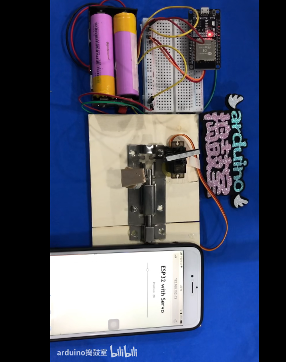

参考视频[ESP32局域网登录精准控制舵机角度演示](https://www.bilibili.com/video/BV1cQ4y1Y76Q)

## 整体图



里面有个库必须要下载  **Servo.h**，我放在本级目录了。评论区有人说会和Arduino自带的servo库冲突，由于我没试过，所以持保留意见。

就算冲突，用原有的应该也可以。

 ## 代码

```c++
#include <WiFi.h>
#include <Servo.h> //★★★★★★ 要有这个库文件★★★★★★

Servo myservo;  // 创建伺服对象来控制伺服
//
// 舵机所连接的 GPIO
static const int servoPin = 13;

// 替换为您的网络凭据

const char* ssid     = "自己的WIFI账号";
const char* password = "自己的WIFI密码";

// 设置 Web 服务器端口号为 80
WiFiServer server(80);

// 用于存储 HTTP 请求的变量
String header;

// 解码 HTTP GET 值
String valueString = String(5);
int pos1 = 0;
int pos2 = 0;

// 当前时间
unsigned long currentTime = millis();
// 上一次时间
unsigned long previousTime = 0;
// 以毫秒为单位定义超时时间
const long timeoutTime = 2000;

void setup() {
  Serial.begin(115200);

  myservo.attach(servoPin);  // 将servoPin上的伺服附加到伺服对象

  // 使用 SSID 和密码连接到 Wi-Fi 网络
  Serial.print("Connecting to ");
  Serial.println(ssid);
  WiFi.begin(ssid, password);
  while (WiFi.status() != WL_CONNECTED) {
    delay(500);
    Serial.print(".");
  }
  //打印本地IP地址并启动Web服务器
  Serial.println("");
  Serial.println("WiFi connected.");
  Serial.println("IP address: ");
  Serial.println(WiFi.localIP());
  server.begin();
}

void loop(){
  WiFiClient client = server.available();   //

  if (client) {                             //
    currentTime = millis();
    previousTime = currentTime;
    Serial.println("New Client.");          //
    String currentLine = "";                //
    while (client.connected() && currentTime - previousTime <= timeoutTime) { //在客户端连接时循环
      currentTime = millis();
      if (client.available()) {             //
        char c = client.read();             //
        Serial.write(c);                    //
        header += c;
        if (c == '\n') {                    //
          //如果当前行为空，则连续有两个换行符。
          //这就是客户端 HTTP 请求的结束，所以发送一个响应：
          if (currentLine.length() == 0) {
            // HTTP 标头始终以响应代码开头（例如 HTTP/1.1 200 OK）
            //和一个内容类型，以便客户端知道接下来会发生什么，然后是一个空行：
            client.println("HTTP/1.1 200 OK");
            client.println("Content-type:text/html");
            client.println("Connection: close");
            client.println();

            //显示 HTML 网页
            // 我觉得这一片的网页可以自己写好，然后整个复制过来，直接client.println("所有HTML代码");
            client.println("<!DOCTYPE html><html>");
            client.println("<head><meta name=\"viewport\" content=\"width=device-width, initial-scale=1\">");
            client.println("<link rel=\"icon\" href=\"data:,\">");
            // CSS 来设置开/关按钮的样式
            // 随意更改背景颜色和字体大小属性以适合您的喜好
            client.println("<style>body { text-align: center; font-family: \"Trebuchet MS\", Arial; margin-left:auto; margin-right:auto;}");
            client.println(".slider { width: 300px; }</style>");
            client.println("<script src=\"https://ajax.googleapis.com/ajax/libs/jquery/3.3.1/jquery.min.js\"></script>");

            //
            client.println("</head><body><h1>ESP32 with Servo</h1>");
            client.println("<p>Position: <span id=\"servoPos\"></span></p>");
            client.println("<input type=\"range\" min=\"0\" max=\"180\" class=\"slider\" id=\"servoSlider\" onchange=\"servo(this.value)\" value=\""+valueString+"\"/>");

            client.println("<script>var slider = document.getElementById(\"servoSlider\");");
            client.println("var servoP = document.getElementById(\"servoPos\"); servoP.innerHTML = slider.value;");
            client.println("slider.oninput = function() { slider.value = this.value; servoP.innerHTML = this.value; }");
            client.println("$.ajaxSetup({timeout:1000}); function servo(pos) { ");
            client.println("$.get(\"/?value=\" + pos + \"&\"); {Connection: close};}</script>");
            client.println("</body></html>"); // 网页结束

            //GET /?value=180& HTTP/1.1
            if(header.indexOf("GET /?value=")>=0) { // 下有函数说明。此处意思为只要正常请求，都不是-1，所以>=0就行
              pos1 = header.indexOf('=');
              pos2 = header.indexOf('&');
              valueString = header.substring(pos1+1, pos2); // 下有函数说明。此处意思为截取请求的参数，这个参数位于"GET /?value="的"="后面，且在“&”的前面。即，就是/?value=\" + pos + \"&\"中的这个pos

              //旋转舵机
              myservo.write(valueString.toInt());
              Serial.println(valueString);
            }
            // The HTTP response ends with another blank line
            client.println();
            // Break out of the while loop
            break;
          } else { // if you got a newline, then clear currentLine
            currentLine = "";
          }
        } else if (c != '\r') {  // if you got anything else but a carriage return character,
          currentLine += c;      // add it to the end of the currentLine
        }
      }
    }
    // Clear the header variable
    header = "";
    // Close the connection
    client.stop();
    Serial.println("Client disconnected.");
    Serial.println("");
  }
}
```

## indexOf

是从左向右进行查

**句法格式：**

```
myString.indexOf(val)`
`myString.indexOf(val, x)
```

**参数说明：**

`myString`: 类型的变量`String`。
`val`：要查找的值。允许的数据类型：`char`, `String`.
`x`: 开始搜索的索引。

## lastIndexOf()

是从右向左进行查

**语法格式：**

```
myString.lastIndexOf(val)`
`myString.lastIndexOf(val, x)
```

**参数说明：**

`myString`: 类型的变量`String`。
`val`：要查找的值。允许的数据类型：`char`, `String`.
`x`: 开始搜索的索引。

## **substring()**

**语法格式：**

```c++
myString.substring(from)//从开始
myString.substring(from, to)//第一个参数int为开始的索引，对应String数字中的开始位置;第二个参数是截止的索引位置，对应String中的结束位置
```

**参数说明：**
`myString`：类型的变量。
`from`： 从开始位置索引。
`to（可选）`：截止的索引位置。

## **client.read()**

官方说明[WiFi - client.read() - Arduino Reference](https://www.arduino.cc/reference/en/libraries/wifi/client.read/)

Read the next byte received from the server the client is connected to (after the last call to read()).

read() inherits from the Stream utility class.

**参数说明：**

none

**Returns:**

The next byte (or character), or -1 if none is available.