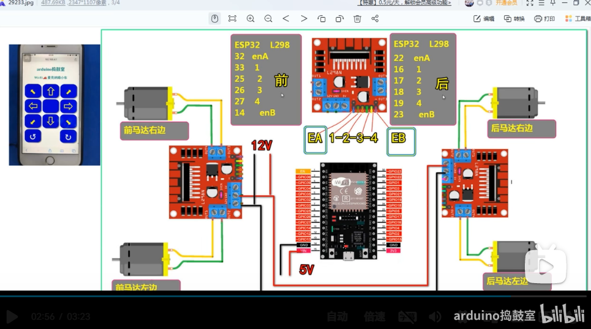

电路图和"esp-now手势IMU控制麦克纳姆小车"项目中的基本一样，唯一区别是本案例中，驱动的使能引脚要短路，因为用不到。



```c++


//B站找 ：arduino捣鼓室 欢迎大家评论区一起交流！如有不足请大家指正 共同进步！网址：https://space.bilibili.com/307396549
//根据需要下载要的库 可以根据编译查看结果
//所有的库打包在这个连接下方 https://www.bilibili.com/video/BV1r34y147SL?spm_id_from=333.999.0.0 

//需要安装的库

#include <Arduino.h>
#ifdef ESP32
#include <WiFi.h>
#include <AsyncTCP.h>
#elif defined(ESP8266)
#include <ESP8266WiFi.h>
#include <ESPAsyncTCP.h>
#endif
#include <ESPAsyncWebServer.h>

#define UP 1
#define DOWN 2
#define LEFT 3
#define RIGHT 4
#define UP_LEFT 5
#define UP_RIGHT 6
#define DOWN_LEFT 7
#define DOWN_RIGHT 8
#define TURN_LEFT 9
#define TURN_RIGHT 10
#define STOP 0

#define FRONT_RIGHT_MOTOR 0
#define BACK_RIGHT_MOTOR 1
#define FRONT_LEFT_MOTOR 2
#define BACK_LEFT_MOTOR 3

#define FORWARD 1
#define BACKWARD -1

struct MOTOR_PINS
{
  int pinIN1;
  int pinIN2;    
};

std::vector<MOTOR_PINS> motorPins = 
{
  {16, 17},  //FRONT_RIGHT_MOTOR
  {18, 19},  //
  {27, 26},  //
  {25, 33},  //BACK_LEFT_MOTOR   
};

// 手机软连接，默认访问地址是192.168.4.1
const char* ssid     = "WIFI名";
const char* password = "WIFI密码";

AsyncWebServer server(80);
AsyncWebSocket ws("/ws");

// 网页确实可以提前设计好，然后复制过来
const char* htmlHomePage PROGMEM = R"HTMLHOMEPAGE(
<!DOCTYPE html>
<html>
  <head>
  <meta charset="UTF-8">
  <meta name="viewport" content="width=device-width, initial-scale=1, maximum-scale=1, user-scalable=no">
    <style>
    .arrows {
      font-size:70px;
      color:yellow ;
    }
    .circularArrows {
      font-size:80px;
      color:white ;
    }
    td {
      background-color:mediumblue;
      border-radius:25%;
      box-shadow: 5px 5px #888888;
    }
    td:active {
      transform: translate(5px,5px);
      box-shadow: none; 
    }

    .noselect {
      -webkit-touch-callout: none; /* iOS Safari */
        -webkit-user-select: none; /* Safari */
         -khtml-user-select: none; /* Konqueror HTML */
           -moz-user-select: none; /* Firefox */
            -ms-user-select: none; /* Internet Explorer/Edge */
                user-select: none; /* Non-prefixed version, currently
                                      supported by Chrome and Opera */
    }
    </style>
  </head>
  <body class="noselect" align="center" style="background-color:white">
     
    <h1 style="color: teal;text-align:center;">arduino捣鼓室</h1>
    <h2 style="color: teal;text-align:center;">Wi-Fi &#128663; 麦克纳姆小车</h2>
    
    <table id="mainTable" style="width:400px;margin:auto;table-layout:fixed" CELLSPACING=10>
      <tr>
        <td ontouchstart='onTouchStartAndEnd("5")' ontouchend='onTouchStartAndEnd("0")'><span class="arrows" >&#11017;</span></td>
        <td ontouchstart='onTouchStartAndEnd("1")' ontouchend='onTouchStartAndEnd("0")'><span class="arrows" >&#8679;</span></td>
        <td ontouchstart='onTouchStartAndEnd("6")' ontouchend='onTouchStartAndEnd("0")'><span class="arrows" >&#11016;</span></td>
      </tr>
      
      <tr>
        <td ontouchstart='onTouchStartAndEnd("3")' ontouchend='onTouchStartAndEnd("0")'><span class="arrows" >&#8678;</span></td>
        <td></td>    
        <td ontouchstart='onTouchStartAndEnd("4")' ontouchend='onTouchStartAndEnd("0")'><span class="arrows" >&#8680;</span></td>
      </tr>
      
      <tr>
        <td ontouchstart='onTouchStartAndEnd("7")' ontouchend='onTouchStartAndEnd("0")'><span class="arrows" >&#11019;</span></td>
        <td ontouchstart='onTouchStartAndEnd("2")' ontouchend='onTouchStartAndEnd("0")'><span class="arrows" >&#8681;</span></td>
        <td ontouchstart='onTouchStartAndEnd("8")' ontouchend='onTouchStartAndEnd("0")'><span class="arrows" >&#11018;</span></td>
      </tr>
    
      <tr>
        <td ontouchstart='onTouchStartAndEnd("9")' ontouchend='onTouchStartAndEnd("0")'><span class="circularArrows" >&#8634;</span></td>
        <td style="background-color:white;box-shadow:none"></td>
        <td ontouchstart='onTouchStartAndEnd("10")' ontouchend='onTouchStartAndEnd("0")'><span class="circularArrows" >&#8635;</span></td>
      </tr>
    </table>

    <script>
      var webSocketUrl = "ws:\/\/" + window.location.hostname + "/ws";
      var websocket;
      
      function initWebSocket() 
      {
        websocket = new WebSocket(webSocketUrl);
        websocket.onopen    = function(event){};
        websocket.onclose   = function(event){setTimeout(initWebSocket, 2000);};
        websocket.onmessage = function(event){};
      }

      function onTouchStartAndEnd(value) 
      {
        websocket.send(value);
      }
          
      window.onload = initWebSocket;
      document.getElementById("mainTable").addEventListener("touchend", function(event){
        event.preventDefault()
      });      
    </script>
    
  </body>
</html> 

)HTMLHOMEPAGE";


void rotateMotor(int motorNumber, int motorDirection)
{
  if (motorDirection == FORWARD)
  {
    digitalWrite(motorPins[motorNumber].pinIN1, HIGH);
    digitalWrite(motorPins[motorNumber].pinIN2, LOW);    
  }
  else if (motorDirection == BACKWARD)
  {
    digitalWrite(motorPins[motorNumber].pinIN1, LOW);
    digitalWrite(motorPins[motorNumber].pinIN2, HIGH);     
  }
  else
  {
    digitalWrite(motorPins[motorNumber].pinIN1, LOW);
    digitalWrite(motorPins[motorNumber].pinIN2, LOW);       
  }
}

void processCarMovement(String inputValue)
{
  Serial.printf("Got value as %s %d\n", inputValue.c_str(), inputValue.toInt());  
  switch(inputValue.toInt())
  {

    case UP:
      rotateMotor(FRONT_RIGHT_MOTOR, FORWARD);
      rotateMotor(BACK_RIGHT_MOTOR, FORWARD);
      rotateMotor(FRONT_LEFT_MOTOR, FORWARD);
      rotateMotor(BACK_LEFT_MOTOR, FORWARD);                  
      break;
  
    case DOWN:
      rotateMotor(FRONT_RIGHT_MOTOR, BACKWARD);
      rotateMotor(BACK_RIGHT_MOTOR, BACKWARD);
      rotateMotor(FRONT_LEFT_MOTOR, BACKWARD);
      rotateMotor(BACK_LEFT_MOTOR, BACKWARD);   
      break;
  
    case LEFT:
      rotateMotor(FRONT_RIGHT_MOTOR, FORWARD);
      rotateMotor(BACK_RIGHT_MOTOR, BACKWARD);
      rotateMotor(FRONT_LEFT_MOTOR, BACKWARD);
      rotateMotor(BACK_LEFT_MOTOR, FORWARD);   
      break;
  
    case RIGHT:
      rotateMotor(FRONT_RIGHT_MOTOR, BACKWARD);
      rotateMotor(BACK_RIGHT_MOTOR, FORWARD);
      rotateMotor(FRONT_LEFT_MOTOR, FORWARD);
      rotateMotor(BACK_LEFT_MOTOR, BACKWARD);  
      break;
  
    case UP_LEFT:
      rotateMotor(FRONT_RIGHT_MOTOR, FORWARD);
      rotateMotor(BACK_RIGHT_MOTOR, STOP);
      rotateMotor(FRONT_LEFT_MOTOR, STOP);
      rotateMotor(BACK_LEFT_MOTOR, FORWARD);  
      break;
  
    case UP_RIGHT:
      rotateMotor(FRONT_RIGHT_MOTOR, STOP);
      rotateMotor(BACK_RIGHT_MOTOR, FORWARD);
      rotateMotor(FRONT_LEFT_MOTOR, FORWARD);
      rotateMotor(BACK_LEFT_MOTOR, STOP);  
      break;
  
    case DOWN_LEFT:
      rotateMotor(FRONT_RIGHT_MOTOR, STOP);
      rotateMotor(BACK_RIGHT_MOTOR, BACKWARD);
      rotateMotor(FRONT_LEFT_MOTOR, BACKWARD);
      rotateMotor(BACK_LEFT_MOTOR, STOP);   
      break;
  
    case DOWN_RIGHT:
      rotateMotor(FRONT_RIGHT_MOTOR, BACKWARD);
      rotateMotor(BACK_RIGHT_MOTOR, STOP);
      rotateMotor(FRONT_LEFT_MOTOR, STOP);
      rotateMotor(BACK_LEFT_MOTOR, BACKWARD);   
      break;
  
    case TURN_LEFT:
      rotateMotor(FRONT_RIGHT_MOTOR, FORWARD);
      rotateMotor(BACK_RIGHT_MOTOR, FORWARD);
      rotateMotor(FRONT_LEFT_MOTOR, BACKWARD);
      rotateMotor(BACK_LEFT_MOTOR, BACKWARD);  
      break;
  
    case TURN_RIGHT:
      rotateMotor(FRONT_RIGHT_MOTOR, BACKWARD);
      rotateMotor(BACK_RIGHT_MOTOR, BACKWARD);
      rotateMotor(FRONT_LEFT_MOTOR, FORWARD);
      rotateMotor(BACK_LEFT_MOTOR, FORWARD);   
      break;
  
    case STOP:
      rotateMotor(FRONT_RIGHT_MOTOR, STOP);
      rotateMotor(BACK_RIGHT_MOTOR, STOP);
      rotateMotor(FRONT_LEFT_MOTOR, STOP);
      rotateMotor(BACK_LEFT_MOTOR, STOP);    
      break;
  
    default:
      rotateMotor(FRONT_RIGHT_MOTOR, STOP);
      rotateMotor(BACK_RIGHT_MOTOR, STOP);
      rotateMotor(FRONT_LEFT_MOTOR, STOP);
      rotateMotor(BACK_LEFT_MOTOR, STOP);    
      break;
  }
}

void handleRoot(AsyncWebServerRequest *request) 
{
  request->send_P(200, "text/html", htmlHomePage);
}

void handleNotFound(AsyncWebServerRequest *request) 
{
    request->send(404, "text/plain", "File Not Found");
}


void onWebSocketEvent(AsyncWebSocket *server, 
                      AsyncWebSocketClient *client, 
                      AwsEventType type,
                      void *arg, 
                      uint8_t *data, 
                      size_t len) 
{                      
  switch (type) 
  {
    case WS_EVT_CONNECT:
      Serial.printf("WebSocket client #%u connected from %s\n", client->id(), client->remoteIP().toString().c_str());
      //client->text(getRelayPinsStatusJson(ALL_RELAY_PINS_INDEX));
      break;
    case WS_EVT_DISCONNECT:
      Serial.printf("WebSocket client #%u disconnected\n", client->id());
      processCarMovement("0");
      break;
    case WS_EVT_DATA:
      AwsFrameInfo *info;
      info = (AwsFrameInfo*)arg;
      if (info->final && info->index == 0 && info->len == len && info->opcode == WS_TEXT) 
      {
        std::string myData = "";
        myData.assign((char *)data, len);
        processCarMovement(myData.c_str());       
      }
      break;
    case WS_EVT_PONG:
    case WS_EVT_ERROR:
      break;
    default:
      break;  
  }
}

void setUpPinModes()
{
  for (int i = 0; i < motorPins.size(); i++)
  {
    pinMode(motorPins[i].pinIN1, OUTPUT);
    pinMode(motorPins[i].pinIN2, OUTPUT);  
    rotateMotor(i, STOP);  
  }
}


void setup(void) 
{
  setUpPinModes();
  Serial.begin(115200);

  WiFi.softAP(ssid, password);
  IPAddress IP = WiFi.softAPIP();
  Serial.print("AP IP address: ");
  Serial.println(IP);

  server.on("/", HTTP_GET, handleRoot);
  server.onNotFound(handleNotFound);
  
  ws.onEvent(onWebSocketEvent);
  server.addHandler(&ws);
  
  server.begin();
  Serial.println("HTTP server started");
}

void loop() 
{
  ws.cleanupClients(); 
}
```

