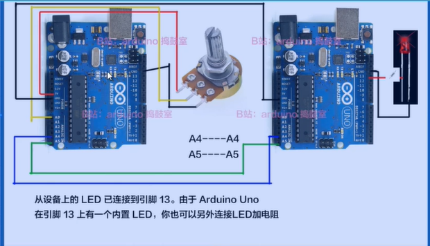

参考这个视频[【学会I2C在两个arduino之间通信控制】中级篇](https://www.bilibili.com/video/BV1SQ4y1q7hU)

也可以参考[Arduino – Wire 库 – 太极创客 (taichi-maker.com)](http://www.taichi-maker.com/homepage/reference-index/arduino-library-index/wire-library/#两块UNO通过IIC进行板间通讯)

使用的Arduino库：SoftwareWire

连线图



左侧为主开发板，右侧为从开发板；主机连接了电位器，来控制从机的LED闪烁

Arduino Uno自带 `A4为SDA，A5为SCL`

> 主机代码

```c++
// 包括用于 I2C 的 Arduino Wire 库
#include <Wire.h>

// 定义从 I2C 地址
#define SLAVE_ADDR 9

// 电位器的模拟引脚
int analogPin = 0;

//保存电位器值的整数
int val = 0;

void setup() {

  // 将 I2C 通信初始化为 Master
  Wire.begin();
  
}

void loop() {
  delay(50);
  
  // 映射到 1-255 范围内的闪光率
    val = map(analogRead(analogPin), 0, 1023, 255, 1);
    
  // 向 Slave 写入一个字符
  Wire.beginTransmission(SLAVE_ADDR);
  Wire.write(val);
  Wire.endTransmission();

}

//  Wire 线库有几个使用 I2C 的有用函数。

//begin() – 这将启动库并将 Arduino 设置为主机或从机。
//requestFrom() – 主机使用此函数从从机请求数据。
//beginTransmission() – 主机使用此函数将数据发送到指定的从机。
//endTransmission() – 主机使用此函数来结束由 beginTransmission 函数开始的传输。
//write() – 主机和从机使用它在 I2C 总线上发送数据。
//available() – 主机和从机使用它来确定它们接收的数据中的字节数。
//read() – 从 I2C 总线读取一个字节的数据。
//SetClock() – 主机使用它来设置特定的时钟频率。
//onReceive() – 由从设备用于指定从主设备接收数据时调用的函数。
//onRequest() – 从站使用它来指定在主站请求数据时调用的函数。
```

> 从机代码
>

`Wire.begin(address)`

address（可选）: 7位从机的地址（也就是他的身份，他的家）； 如果这个参数未指定，则默认以主机身份加入总线。

**注**: 地址从**0到7 被保留了**, 因此您在**开发的时候请不要使用它们**!!! 可以**从8开始使用**。

```c++
#include <Wire.h>

// Define Slave I2C Address
#define SLAVE_ADDR 9 // 目前只知道不能用0~7，可以用 >8 的 

// Define LED Pin
int LED = 13;

// 接收数据的变量
int rd;

// 眨眼率变量
int br;

void setup() {

  pinMode(LED, OUTPUT);
  
  // 将 I2C 通信初始化为从设备
  Wire.begin(SLAVE_ADDR); 
   
  // 从master接收到数据时运行的函数
  Wire.onReceive(receiveEvent);
  
  // 设置串行监视器
  Serial.begin(9600);
  Serial.println("I2C Slave Demonstration");
}


void receiveEvent() {
  // 从 I2C 读取一个字符
  rd = Wire.read();
  // 打印传入数据的值
  Serial.println(rd);
    
}
void loop() {
   delay(50);
 
  // 计算闪烁值
  br = map(rd, 1, 255, 100, 2000);
 
  digitalWrite(LED, HIGH);
  delay(br);
  digitalWrite(LED, LOW);
  delay(br);

}
```

