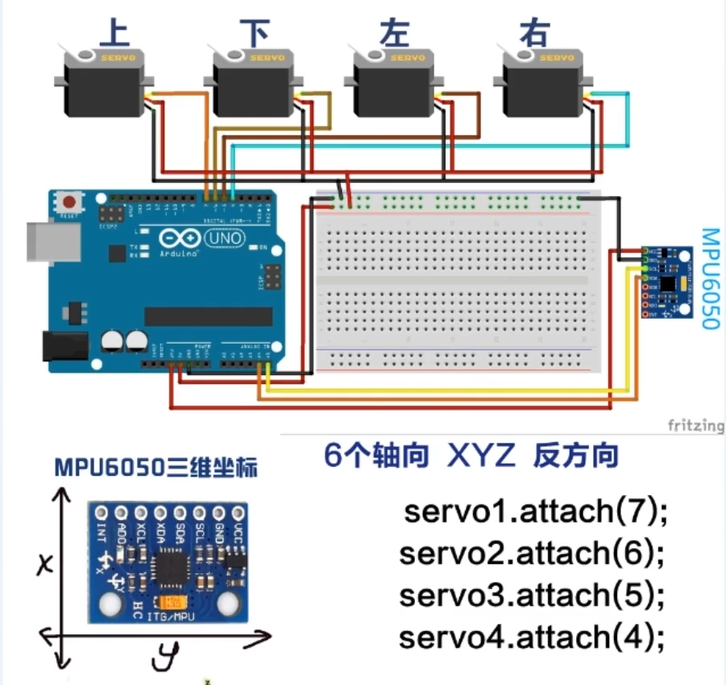

### 舵机 Steering Gear

##### 基础演示



```c++
#include <Adafruit_MPU6050.h>
#include <Adafruit_Sensor.h>
#include <Wire.h>
#include <Servo.h>

Adafruit_MPU6050 mpu;
// 加速度三轴的值
int x = 0;
int y = 0;
int z = 0;

Servo servo1; // 上
Servo servo2; // 下
Servo servo3; // 左
Servo servo4; // 右

int value = 0;

void setup() {

  Serial.begin(115200);
  
  if (!mpu.begin()) {
    Serial.println("Failed to fin MPU6050 chip");
    while (1) {
      delay(10);
      }
    }

   Serial.println("MPU6050 Found!");

    // 设置范围
   mpu.setAccelerometerRange(MPU6050_RANGE_8_G);
   mpu.setGyroRange(MPU6050_RANGE_500_DEG);
   mpu.setFilterBandwidth(MPU6050_BAND_21_HZ);
   
   Serial.println("");
   delay(100);

    // 设置各个舵机的控制引脚
   servo1.attach(7); // 上
   servo2.attach(6); // 下
   servo3.attach(5); // 左
   servo4.attach(4); // 右
   
    // 舵机默认状态，全部不转动
   servo1.write(0);
   servo2.write(0);
   servo3.write(0);
   servo4.write(0);

}

void loop() {
  // 监听 加速度计、陀螺仪和温度计
  sensors_event_t a, g, temp;
  // 用mpu这个对象获得这个事件
  mpu.getEvent(&a, &g, &temp);

  // 监听的加速度计的值，赋值给变量
  x = a.acceleration.x;
  y = a.acceleration.y;
  z = a.acceleration.z;

  // 这里上下左右就是按照上图所示的IMU放置方式判断的
  if (x < 10 && x > 0 && y < 4 && y > -4){
    Serial.println("up");
    value = map(x, 0, 10, 0, 180);
    servo1.write(value);
    Serial.print(value);
    }
  else if( x>-10 && x<0 && y < 4 && y > -4){
    Serial.println("down");
    value = map(x, -10, 0, 180, 0);
    servo2.write(value);
    Serial.print(value);
    }

  if (y < 10 && y > 0 && x < 4 && x > -4){
    Serial.println("right");
    value = map(y, 0, 10, 0, 180);
    servo3.write(value);
    Serial.print(value);
    }
  else if( y>-10 && y<0 && x < 4 && x > -4){
    Serial.println("left");
    value = map(y, -10, 0, 180, 0);
    servo4.write(value);
    Serial.print(value);
    }

}
```

