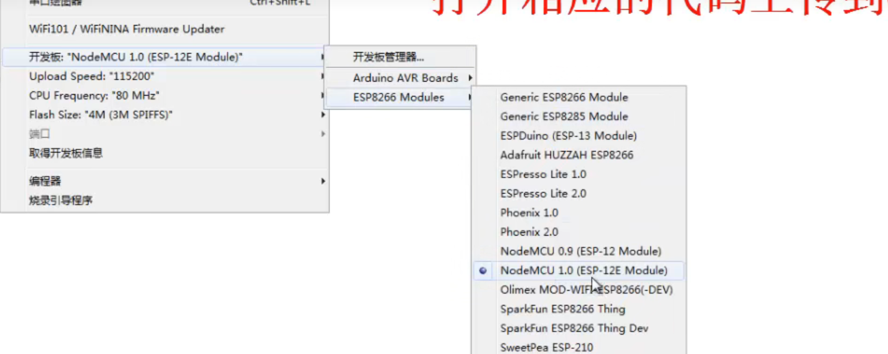
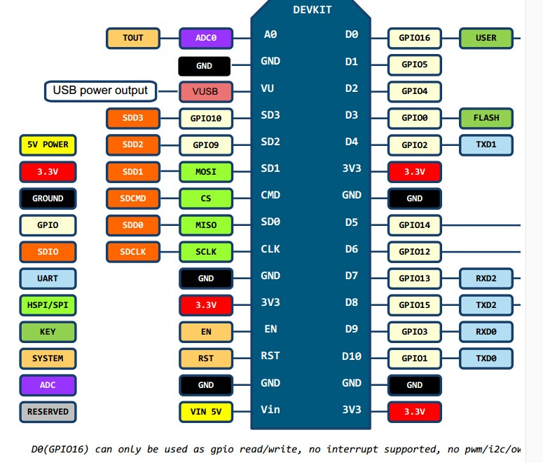
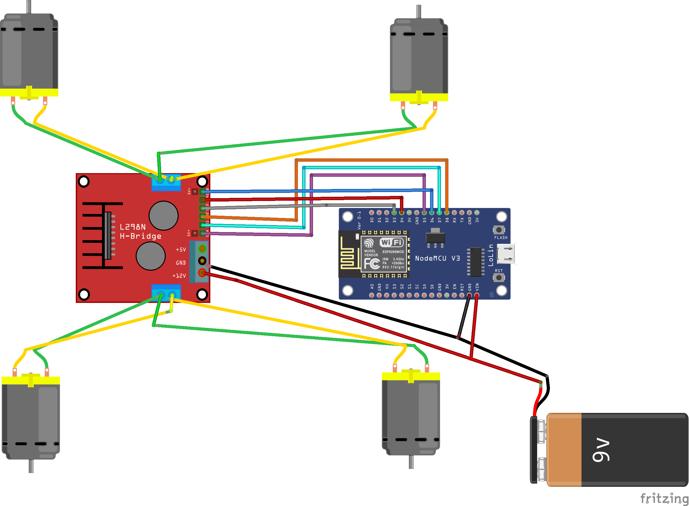
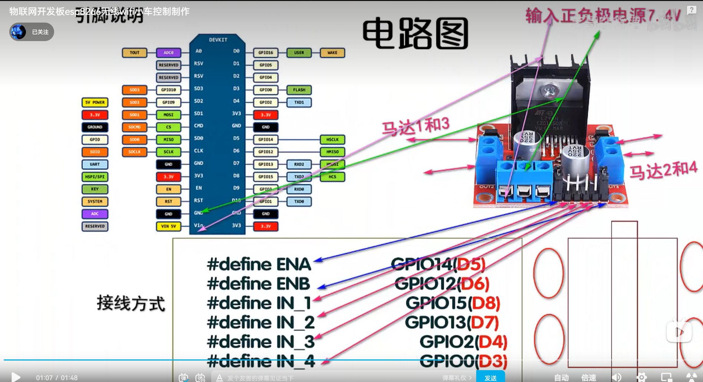
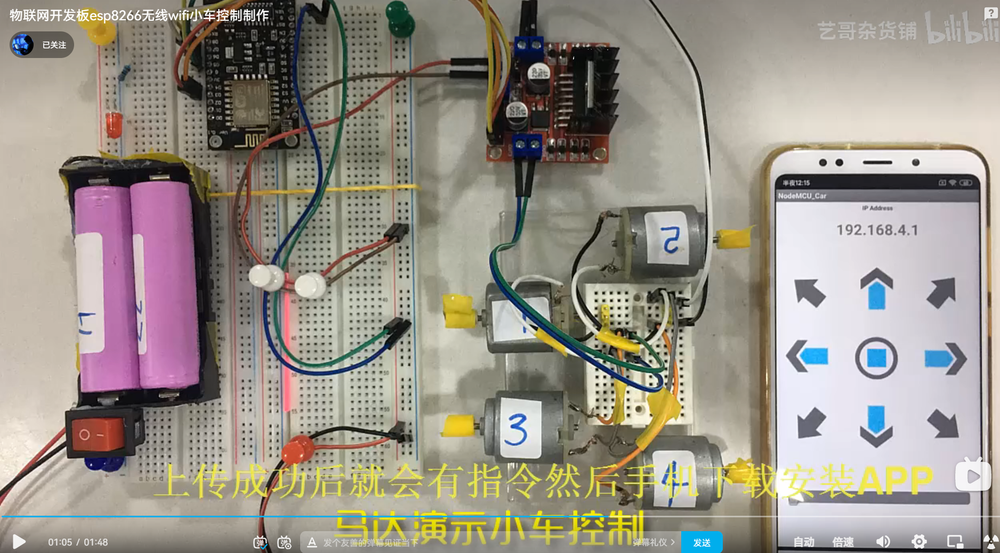

参考视频[物联网开发板esp8266无线wifi小车控制制作](https://www.bilibili.com/video/BV1v44y1x7ZT)

开发板选择




引脚图



电路图



电路图



这是作者的一张连线图

（app的下方滑块儿是调节速度的）



> 小车代码

```c++
// 这里是马达的驱动连接板子的引脚注意看引脚图

#define ENA   14          // 马达速度 右边     GPIO14(D5)
#define ENB   12          //  马达速度 左边        GPIO12(D6)
#define IN_1  15          // L298N 1 motors Right         GPIO15(D8)
#define IN_2  13          // L298N 2 motors Right         GPIO13(D7)
#define IN_3  2           // L298N 3 motors Left          GPIO2(D4)
#define IN_4  0           // L298N 4 motors Left         GPIO0(D3)

#include <ESP8266WiFi.h>
#include <WiFiClient.h> 
#include <ESP8266WebServer.h>

String command;             //String to store app command state.
int speedCar = 800;         // 400 - 1023.
int speed_Coeff = 3;

const char* ssid = "设定一个你自己的名称";
ESP8266WebServer server(80);

void setup() {
 
 pinMode(ENA, OUTPUT);
 pinMode(ENB, OUTPUT);  
 pinMode(IN_1, OUTPUT);
 pinMode(IN_2, OUTPUT);
 pinMode(IN_3, OUTPUT);
 pinMode(IN_4, OUTPUT); 
  
 Serial.begin(115200);
  
// Connecting WiFi

  WiFi.mode(WIFI_AP);
  WiFi.softAP(ssid);

  IPAddress myIP = WiFi.softAPIP();
  Serial.print("AP IP address: ");
  Serial.println(myIP);
 
 // Starting WEB-server 
     server.on ( "/", HTTP_handleRoot );
     server.onNotFound ( HTTP_handleRoot );
     server.begin();    
}

void goAhead(){ 

      digitalWrite(IN_1, LOW);
      digitalWrite(IN_2, HIGH);
      analogWrite(ENA, speedCar);

      digitalWrite(IN_3, LOW);
      digitalWrite(IN_4, HIGH);
      analogWrite(ENB, speedCar);
  }

void goBack(){ 

      digitalWrite(IN_1, HIGH);
      digitalWrite(IN_2, LOW);
      analogWrite(ENA, speedCar);

      digitalWrite(IN_3, HIGH);
      digitalWrite(IN_4, LOW);
      analogWrite(ENB, speedCar);
  }

void goRight(){ 

      digitalWrite(IN_1, HIGH);
      digitalWrite(IN_2, LOW);
      analogWrite(ENA, speedCar);

      digitalWrite(IN_3, LOW);
      digitalWrite(IN_4, HIGH);
      analogWrite(ENB, speedCar);
  }

void goLeft(){

      digitalWrite(IN_1, LOW);
      digitalWrite(IN_2, HIGH);
      analogWrite(ENA, speedCar);

      digitalWrite(IN_3, HIGH);
      digitalWrite(IN_4, LOW);
      analogWrite(ENB, speedCar);
  }

void goAheadRight(){
      
      digitalWrite(IN_1, LOW);
      digitalWrite(IN_2, HIGH);
      analogWrite(ENA, speedCar/speed_Coeff);
 
      digitalWrite(IN_3, LOW);
      digitalWrite(IN_4, HIGH);
      analogWrite(ENB, speedCar);
   }

void goAheadLeft(){
      
      digitalWrite(IN_1, LOW);
      digitalWrite(IN_2, HIGH);
      analogWrite(ENA, speedCar);

      digitalWrite(IN_3, LOW);
      digitalWrite(IN_4, HIGH);
      analogWrite(ENB, speedCar/speed_Coeff);
  }

void goBackRight(){ 

      digitalWrite(IN_1, HIGH);
      digitalWrite(IN_2, LOW);
      analogWrite(ENA, speedCar/speed_Coeff);

      digitalWrite(IN_3, HIGH);
      digitalWrite(IN_4, LOW);
      analogWrite(ENB, speedCar);
  }

void goBackLeft(){ 

      digitalWrite(IN_1, HIGH);
      digitalWrite(IN_2, LOW);
      analogWrite(ENA, speedCar);

      digitalWrite(IN_3, HIGH);
      digitalWrite(IN_4, LOW);
      analogWrite(ENB, speedCar/speed_Coeff);
  }

void stopRobot(){  

      digitalWrite(IN_1, LOW);
      digitalWrite(IN_2, LOW);
      analogWrite(ENA, speedCar);

      digitalWrite(IN_3, LOW);
      digitalWrite(IN_4, LOW);
      analogWrite(ENB, speedCar);
 }

void loop() {
    server.handleClient();
    
      command = server.arg("State");
      if (command == "F") goAhead();
      else if (command == "B") goBack();
      else if (command == "L") goLeft();
      else if (command == "R") goRight();
      else if (command == "I") goAheadRight();
      else if (command == "G") goAheadLeft();
      else if (command == "J") goBackRight();
      else if (command == "H") goBackLeft();
      else if (command == "0") speedCar = 400;
      else if (command == "1") speedCar = 470;
      else if (command == "2") speedCar = 540;
      else if (command == "3") speedCar = 610;
      else if (command == "4") speedCar = 680;
      else if (command == "5") speedCar = 750;
      else if (command == "6") speedCar = 820;
      else if (command == "7") speedCar = 890;
      else if (command == "8") speedCar = 960;
      else if (command == "9") speedCar = 1023;
      else if (command == "S") stopRobot();
}

void HTTP_handleRoot(void) {

if( server.hasArg("State") ){
       Serial.println(server.arg("State"));
  }
  server.send ( 200, "text/html", "" );
  delay(1);
}

```

